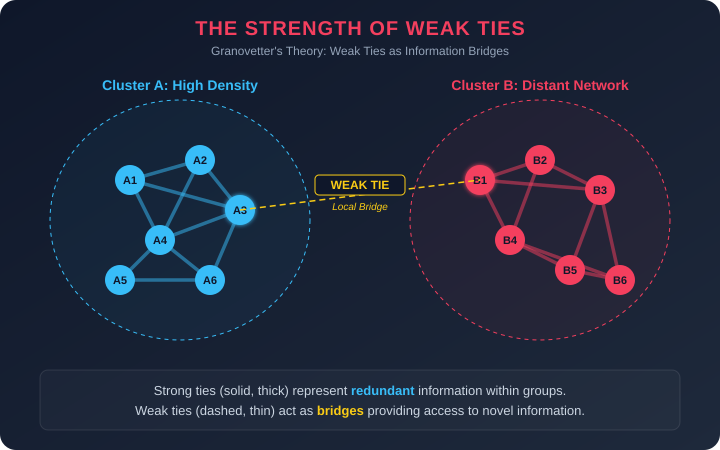
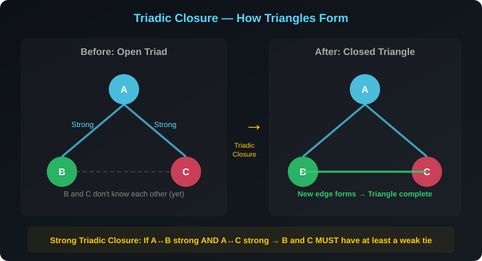
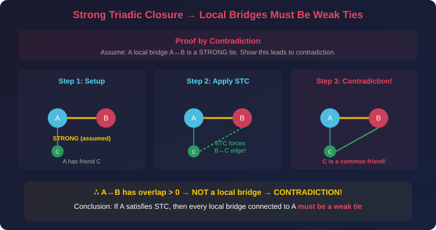
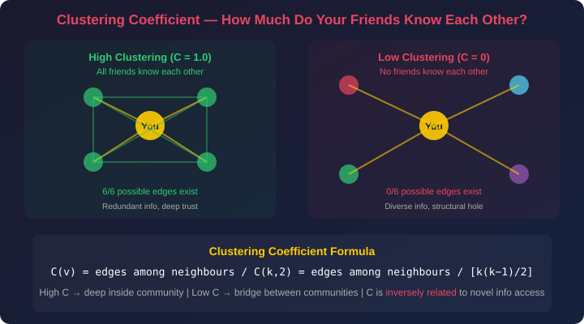
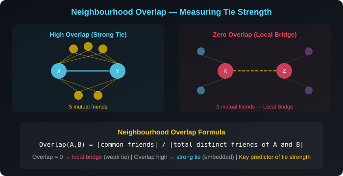

# Granovetter's Strength of Weak Ties — Plain Language Notes

> **What this covers:** Why are your acquaintances more valuable than your best friends for finding jobs, ideas, and opportunities? How does the structure of a social network determine who has access to novel information? What are triads, triadic closure, and the Strong Triadic Closure Property? How does the clustering coefficient measure community embeddedness? What is neighbourhood overlap, and why does overlap = 0 define a local bridge? How does the proof work that local bridges must be weak ties? What is the difference between embeddedness and structural holes, and when is each advantageous? How did the 2007 cell phone study validate Granovetter's 1973 theory? This file covers Granovetter's original study, the paradox of weak ties, triads and triadic closure, the Strong Triadic Closure Property and its proof, the clustering coefficient formula, neighbourhood overlap, local bridges vs embeddedness, structural holes, digital tie typology, the 2007 cell phone validation study, and connections to all other course topics.

---

## Part 1 — The Paradox That Started It All

### Granovetter's 1973 Study

Mark Granovetter, a sociologist at Stanford, conducted one of the most influential studies in network science. He surveyed professionals who had recently found new jobs through personal contacts, and asked a simple question: **"How close were you to the person who told you about this job?"**

**The stunning result:**

| Relationship to job source | Percentage of respondents |
|---|---|
| **Close friend / strong tie** | ~17% |
| **Acquaintance / weak tie** | **~83%** |

Over **83% of people** got their jobs through someone they described as an acquaintance — not a close friend, not a family member, but someone they saw only occasionally or rarely.

### Why This Is Paradoxical

Intuitively, you'd expect your closest friends to be the most helpful. They know you best. They care about you. They'd go out of their way to help. So why are acquaintances — people you barely talk to — so much more valuable for finding opportunities?

The answer lies in **information diversity**:

```
YOUR CLOSE FRIENDS
┌─────────────────────────────────┐
│ • Live in your neighbourhood    │
│ • Work in your field            │
│ • Read the same news            │
│ • Know the same people          │
│ • Hear about the same openings  │
│                                 │
│ → They have the SAME            │
│   information you already have  │
└─────────────────────────────────┘

YOUR ACQUAINTANCES
┌─────────────────────────────────┐
│ • Live in different cities      │
│ • Work in different industries  │
│ • Travel in different circles   │
│ • Know completely different     │
│   people                        │
│                                 │
│ → They have NOVEL information   │
│   you can't get any other way   │
└─────────────────────────────────┘
```

> **The fundamental insight:** Your close friends are precious for emotional support, trust, and collaboration — but they are **informationally redundant**. Your acquaintances are informationally valuable precisely **because** they operate in different social worlds.

---

### The Mechanism: Why Weak Ties Carry Novel Information

This isn't just a statistical curiosity — there's a structural explanation rooted in network architecture:

1. **Strong ties cluster.** If you're close friends with Alice and close friends with Bob, then Alice and Bob are very likely also friends with each other (triadic closure — explained in Part 2). This means your strong ties form a **tight, overlapping cluster** where everyone knows everyone.

2. **Weak ties bridge.** Your acquaintances, by definition, are NOT part of your local cluster. They connect you to **entirely different regions** of the social network — regions where different information circulates.

3. **Novel information travels across bridges, not within clusters.** A job opening in your friend's company? You probably already heard about it from three other mutual friends. A job opening in your acquaintance's company? You'd NEVER hear about it without that acquaintance, because no one else in your circle has any connection to that world.

> **Granovetter's core theorem (informal):** The ties that are socially weakest are often structurally the most important, because they serve as the only conduits between otherwise disconnected communities.



---

## Part 2 — Triads and Triadic Closure

### What Is a Triad?

A **triad** is the simplest non-trivial social structure: **three people** and the relationships between them.

Given three people A, B, and C, there are four possible triad configurations:

| Configuration | Edges | Description |
|---|---|---|
| **Empty triad** | 0 edges | None of them know each other |
| **Single edge** | 1 edge | Only one pair is connected |
| **Open triad** | 2 edges | Two pairs connected, one pair NOT (e.g., A-B and A-C exist, but B-C does not) |
| **Closed triad (triangle)** | 3 edges | All three pairs connected — a complete triangle |

The **open triad** is the most interesting configuration, because it creates **structural tension** — a pressure for the missing edge to form.

---

### Triadic Closure: Why the Missing Edge Tends to Form

**Triadic closure** is the empirically observed tendency: if person A is friends with both B and C, then B and C will eventually become friends too.

**Why does this happen?** Multiple reinforcing mechanisms:

| Mechanism | How it works |
|---|---|
| **Opportunity** | B and C meet through A — they're physically or socially introduced |
| **Trust transfer** | If A trusts both B and C, B and C inherit some baseline trust in each other |
| **Activity overlap** | If A hangs out with B and separately with A hangs out with C, B and C end up at the same events |
| **Homophily** | Since A chose both B and C as friends, B and C are likely similar to A — and therefore to each other |
| **Social pressure** | A may actively introduce B and C, or B and C may connect to maintain standing with A |

**The result:** Over time, open triads tend to "close" into triangles. This is the primary mechanism through which social networks become **clustered** — dense groups of mutually connected people.



### The Probability of Closure Increases with Common Friends

If nodes B and C share $k$ common friends, the probability of them forming a tie increases with $k$, but with **diminishing marginal returns**:

$$
P(\text{B-C edge forms}) \approx 1 - (1 - p)^k
$$

Where $p$ is the baseline probability that any single common friend introduces B and C.

| Common friends $k$ | Probability ($p = 0.1$) | Marginal increase |
|---|---|---|
| 0 | 0.00 | — |
| 1 | 0.10 | +0.10 |
| 2 | 0.19 | +0.09 |
| 5 | 0.41 | — |
| 10 | 0.65 | — |
| 20 | 0.88 | — |

> **Key observation:** The first common friend matters most. Going from 0 → 1 common friends produces the largest jump in probability. Going from 10 → 11 barely changes anything. This is diminishing returns in action.

---

## Part 3 — The Strong Triadic Closure Property (STC)

### Definition

The **Strong Triadic Closure Property** is a stronger version of triadic closure that specifically involves **strong ties**:

> **STC Property:** If node A has **strong** ties to both B and C, then B and C **must** have at least some tie between them (whether weak or strong). They **cannot** be complete strangers.

In other words: if you are very close friends with Alice AND very close friends with Bob, then Alice and Bob **must** know each other — at least casually. It would be psychologically and structurally implausible for your two best friends to have never met.

### Why STC Makes Sense

Think about your own life:
- Your two best friends have almost certainly met at your birthday party, at group dinners, or through shared activities
- Even if they didn't become close, they at minimum **know of each other**
- It would be bizarre for you to maintain two deep friendships in complete isolation from each other

**The mechanism is triadic closure amplified by tie strength:** Strong ties imply frequent interaction. If A frequently interacts with both B and C, then B and C will inevitably encounter each other through A's social sphere.

### What STC Does NOT Say

| What STC says | What STC does NOT say |
|---|---|
| Strong-Strong → at least one tie between B and C | Nothing about weak ties — if A has a weak tie to B, STC makes no prediction |
| B-C must have **some** connection | B-C must have a **strong** connection (they could be mere acquaintances) |
| Applies when BOTH A-B and A-C are strong | Applies when only ONE of them is strong |

---

### The Key Theorem: Local Bridges Must Be Weak Ties

This is the central theoretical result of this topic — the mathematical proof that connects weak ties to bridges:

> **Theorem:** If node A satisfies the Strong Triadic Closure Property, then any **local bridge** connected to A must be a **weak tie**.

**In plain language:** If you maintain STC (your close friends all know each other), then any connection that serves as a bridge to another community MUST be a weak tie — it can't be a strong tie.

### The Proof (By Contradiction)

This proof is elegant and frequently tested:

**Assume the opposite:** Suppose A has a local bridge to B, and this bridge is a **strong** tie.

**Step 1:** Since A-B is a local bridge, by definition A and B have **zero** common friends (overlap = 0).

**Step 2:** Now pick any other friend C of A (not B). Consider the triad {A, B, C}.
- A has a strong tie to B (our assumption)
- A has some tie to C (C is A's friend)
- If A's tie to C is also strong, then by STC → B and C must have at least a weak tie

**Step 3:** But if B and C have a tie → C is a common friend of A and B → the overlap between A and B is > 0.

**Step 4:** This contradicts Step 1 (overlap = 0, which is required for A-B to be a local bridge).

**Conclusion:** Our assumption was wrong. The local bridge A-B **cannot** be a strong tie. Therefore, **it must be a weak tie.** ∎



> [!IMPORTANT]
> **Why this theorem matters:** It provides the **structural explanation** for Granovetter's empirical finding. Weak ties aren't just correlated with novel information — they MUST be weak because local bridges (the conduits for novel information) are **structurally forced** to be weak ties if STC holds. It's not a coincidence; it's a mathematical necessity.

---

## Part 4 — Clustering Coefficient

### What Does It Measure?

The **clustering coefficient** of a node $v$ measures how densely interconnected $v$'s friends are among themselves. In plain terms: **do your friends know each other?**

$$
\boxed{C(v) = \frac{\text{number of edges among neighbors of } v}{\binom{k_v}{2}} = \frac{\text{actual triangles through } v}{\text{maximum possible triangles through } v}}
$$

Where:
- $k_v$ = degree of node $v$ (number of friends)
- $\binom{k_v}{2} = \frac{k_v(k_v - 1)}{2}$ = maximum possible edges among those friends (if every pair knew each other)

### Interpreting the Clustering Coefficient

| Value of $C(v)$ | What it means | Structural position |
|---|---|---|
| $C(v) = 0$ | None of your friends know each other | **Bridge position** — you connect disparate groups |
| $C(v) = 0.15$ | 15% of possible friend-pairs are connected | **Diverse network** — access to varied information |
| $C(v) = 0.50$ | Half of possible friend-pairs are connected | **Mixed** — some clustering, some diversity |
| $C(v) = 0.95$ | Nearly all friend-pairs are connected | **Deep inside a community** — redundant information |
| $C(v) = 1.0$ | ALL friends know each other (complete clique) | **Maximum embeddedness** — most redundant |



---

### Worked Example 1: Perfect Clustering

A person has 15 friends, and every pair of those friends also knows each other.

**Maximum possible edges:**

$$
\binom{15}{2} = \frac{15 \times 14}{2} = 105
$$

**Actual edges:** All 105 pairs are connected.

$$
C(v) = \frac{105}{105} = \mathbf{1.00}
$$

**Interpretation:** This person is deeply embedded in a single, tightly-knit group. Every friend knows every other friend. Information within this group is completely redundant — everyone hears the same gossip, the same job openings, the same news.

### Worked Example 2: Computing Edges from Clustering Coefficient

A user has **400 connections** and a clustering coefficient of **0.25**. How many pairs of their friends are also friends?

$$
\binom{400}{2} = \frac{400 \times 399}{2} = 79{,}800 \text{ maximum possible edges}
$$

$$
\text{Actual edges among friends} = 0.25 \times 79{,}800 = \mathbf{19{,}950 \text{ edges}}
$$

> [!NOTE]
> **Assignment rounding note:** Some assignment formats may list the answer as approximately **19,900** due to rounding conventions. Both 19,950 and 19,900 are acceptable depending on whether the question uses $k(k-1)/2$ or an approximation. Read the options carefully.

### Worked Example 3: A Bridge Node

A person has 8 friends from 4 different groups (2 friends per group). Friends within the same group know each other, but friends from different groups don't.

$$
\binom{8}{2} = \frac{8 \times 7}{2} = 28 \text{ maximum possible edges}
$$

Actual edges: 4 (one per group, connecting the 2 friends within each group).

$$
C(v) = \frac{4}{28} = \mathbf{0.143}
$$

Low clustering coefficient = this person bridges multiple disconnected communities. They have access to **diverse information** from four different social circles.

---

### Network-Level Clustering Coefficient

The **average clustering coefficient** of an entire network is the mean over all nodes:

$$
\bar{C} = \frac{1}{n} \sum_{v=1}^{n} C(v)
$$

| Network type | Typical $\bar{C}$ | Why? |
|---|---|---|
| Random network $G(n, p)$ | $\bar{C} \approx p$ (usually very low) | No structural clustering — edges form independently |
| Real social networks | $\bar{C} \gg p$ (much higher than random) | Triadic closure drives abundant triangle formation |
| Lattice/grid | Very high | Neighbors are neighbors of neighbors by construction |

> **Why real networks have high clustering:** Homophily (Topic 4) and triadic closure make friends-of-friends become friends. This produces far more triangles than a random network of the same size and density. This excess clustering is the **structural signature** of community formation.

---

### The Inverse Relationship: Clustering vs. Information Access

This is one of the most important practical implications of the theory:

| Property | High Clustering | Low Clustering |
|---|---|---|
| **Your friends know each other?** | Yes — dense mutual connections | No — friends from different worlds |
| **Information you receive** | Redundant — same info from many paths | Novel — unique info from each path |
| **Job opportunities** | Same openings circulate within the group | Diverse openings from multiple fields |
| **Trust level** | Very high — mutual accountability | Variable — no shared accountability |
| **Structural position** | Deep inside one community | Bridging multiple communities |

> **The paradox of embeddedness:** Being deeply embedded in a group provides emotional security and trust, but it comes at the cost of **informational isolation**. The most informationally powerful position is to be **loosely connected across multiple groups** — high access to novel information, but low social support from any single group.

---

## Part 5 — Neighbourhood Overlap

### Definition

Neighbourhood overlap measures the **structural embeddedness** of a specific edge (friendship) between two people. It quantifies how many friends they share relative to their combined social circle.

$$
\boxed{\text{Overlap}(A, B) = \frac{|\text{common friends of A and B}|}{|\text{total distinct friends of A and B} \text{ (excluding A and B themselves)}|}}
$$

More formally: if $N(A)$ = neighbours of A and $N(B)$ = neighbours of B:

$$
\text{Overlap}(A, B) = \frac{|N(A) \cap N(B)|}{|N(A) \cup N(B)| - 2}
$$

(We subtract 2 because A and B themselves are not counted as part of the overlap calculation in some formulations. The exact convention may vary — check assignment wording carefully.)

### Interpreting Overlap

| Overlap value | What it means | Tie type |
|---|---|---|
| **0** | Zero common friends — completely separate social worlds | **Local bridge** (almost always a weak tie) |
| **0.01 – 0.10** | Very few mutual friends — mostly separate circles | Likely a weak tie |
| **0.10 – 0.30** | Some mutual friends — moderate social overlap | Could be either |
| **0.30 – 0.60** | Many mutual friends — significant shared social world | Likely a strong tie |
| **0.60 – 1.0** | Most/all friends are shared — nearly identical circles | Definitely a strong tie |



---

### Worked Example: Computing Overlap

**Setup:** Contact X has 20 total friends. Contact Y has 25 total friends. They share 8 common friends.

$$
\text{Total distinct friends} = 20 + 25 - 8 = 37
$$

$$
\text{Overlap}(X, Y) = \frac{8}{37} \approx \mathbf{0.216}
$$

**Interpretation:** Moderate overlap — X and Y share about 22% of their combined social circle. This suggests a moderately embedded relationship — probably not a pure bridge (would be 0) but not deeply embedded either.

### Worked Example 2: A Local Bridge

**Setup:** Person P has 30 friends. Person Q has 45 friends. They share **0** common friends.

$$
\text{Total distinct friends} = 30 + 45 - 0 = 75
$$

$$
\text{Overlap}(P, Q) = \frac{0}{75} = \mathbf{0.00}
$$

**Interpretation:** This is a **local bridge** — P and Q exist in completely separate social worlds. The P-Q connection is the ONLY pathway linking P's cluster to Q's cluster. This edge carries maximum novel information and is structurally critical.

> **What happens if this local bridge gains mutual friends over time?** If P and Q develop shared friends (through triadic closure or repeated interaction), the overlap increases from 0 and the edge **loses its local bridge status**. It becomes more embedded — more trustworthy, but carrying less novel information. The bridge is "closing."

---

## Part 6 — Local Bridges vs. Embeddedness: The Structural Tradeoff

### Local Bridges (Low/Zero Embeddedness)

A **local bridge** is a tie between two people who share **no** common friends (overlap = 0). It represents the ONLY direct pathway between two otherwise disconnected regions of the network.

**Properties of local bridges:**
- Almost always **weak ties** (by the STC theorem)
- Carry **novel information** — the only channel for information to flow between two communities
- Structurally **fragile** — remove this one edge and the two communities lose their direct connection
- Tend to have **short call durations** / low interaction frequency (validated by the 2007 study)

### Embeddedness (High Overlap)

**Embeddedness** is the raw number of mutual friends two people share. High embeddedness implies deep integration into a shared social structure.

**Properties of embedded ties:**
- Almost always **strong ties**
- Carry **redundant information** — the same information arrives through multiple paths
- Structurally **resilient** — removing one path doesn't disconnect the pair (many alternative paths exist)
- Provide **trust and accountability** — misbehaviour has social consequences because mutual friends will hear about it

---

### When Is Each Advantageous?

| Scenario | Best Strategy | Why |
|---|---|---|
| **Finding a new job** | Low embeddedness (weak ties / bridges) | Novel information about openings in distant fields |
| **Resolving a dispute** | High embeddedness (strong ties / mutual friends) | Mutual friends can mediate and apply social pressure |
| **Business monopoly** | Low embeddedness (structural hole) | You're the only connection between groups — irreplaceable |
| **Building deep trust** | High embeddedness | Many mutual friends create accountability |
| **Innovation and creativity** | Low embeddedness (diverse connections) | Exposure to different ideas, disciplines, perspectives |
| **Emotional support** | High embeddedness (close-knit group) | Deep relationships with people who know you well |

### Structural Holes — The Power of Being the Bridge

A **structural hole** is a gap between two groups that have no connections to each other. The person who fills this gap — who connects two otherwise disconnected groups — occupies a position of extraordinary power.

**Example — The Neighbourhood Caterer:**

```
    [Block A families]          [Block B families]
    ┌──────────────┐            ┌──────────────┐
    │ Family 1     │            │ Family 5     │
    │ Family 2     │            │ Family 6     │
    │ Family 3     │────YOU────│ Family 7     │
    │ Family 4     │  (caterer) │ Family 8     │
    └──────────────┘            └──────────────┘
    
    Block A families don't know Block B families.
    YOU are the ONLY connection between them.
    → You occupy a STRUCTURAL HOLE.
    → Your clients can't easily find alternatives
       through their existing social circles.
```

**Advantages of occupying a structural hole:**
1. **Information broker** — you see what both sides are doing, but neither side sees the other
2. **Competitive advantage** — clients can't discover alternatives through their existing networks
3. **Negotiation leverage** — each side depends on you for access to the other

**Disadvantages:**
- **Low trust** — the person at the structural hole has no mutual friends with clients on either side, making business relationships less trust-backed
- **Social discomfort** — without shared connections, interactions lack the social lubrication that mutual friends provide

> [!TIP]
> **Assignment question pattern:** When asked about structural holes, remember that they're **advantageous for the person IN the hole** (monopoly power, information brokerage) but **disadvantageous for the people on either side** (limited options, limited trust). The perspective matters.

---

## Part 7 — Digital Typology of Relationships

### How Digital Media Redefines Tie Strength

Modern social media creates new categories of relationships that didn't exist in Granovetter's 1973 world. Research on digital communication patterns identifies three distinct tiers:

| Tier | Type | Description | Cognitive Limit | Example |
|---|---|---|---|---|
| **1** | **Mutual Communication** | Active, two-way dialogue — you write, they reply, you discuss | ~**50** relationships | Regular texting, calling, video chatting |
| **2** | **Maintained Relationships** | Passive upkeep via small digital gestures | ~**150** relationships (Dunbar's number) | Likes, reactions, birthday wishes, occasional comments |
| **3** | **Passive Engagement** | One-way — you observe without interacting, or you reach out but get no response | **Essentially unlimited** | Following someone's Instagram, reading someone's blog |

### Why This Matters for Network Size

**Tier 2 (Maintained Relationships)** is the key discovery:

These low-effort digital gestures — liking a post, reacting to a story, sending a quick birthday message — allow you to **maintain far more weak ties than was possible before social media**. In Granovetter's era, maintaining a weak tie required phone calls, letters, or in-person meetings. Today, a single "like" keeps the connection alive.

**Consequence:** Digital social networks are much **larger** than pre-digital networks, not because people have more close friends (Tier 1 is still capped at ~50), but because the number of maintained weak ties (Tier 2) has exploded.

> **Granovetter's theory, amplified:** If weak ties are the primary source of novel information and opportunities, and digital platforms massively increase the number of weak ties a person can maintain, then the information-access advantage of being well-networked has **dramatically increased** in the digital era.

### Dunbar's Number and Cognitive Limits

Robin Dunbar proposed that humans have a cognitive upper limit of approximately **150 meaningful social relationships** — known as **Dunbar's number**. This constraint applies regardless of technology:

| Level | Typical size | Relationship quality |
|---|---|---|
| **Inner circle** | ~5 | Intimate — deep emotional support |
| **Close friends** | ~15 | Strong ties — regular, meaningful interaction |
| **Active network** | ~50 | Mutual communication — active two-way contact |
| **Full network** | ~150 | Maintained relationships — you'd recognise them, know their name, have some context |
| **Extended network** | ~500–1,500 | Faces you recognise; names you might recall |

Social media doesn't increase the inner layers — it expands the **outer layers**, creating a vast periphery of weak ties that serve as bridges to distant social worlds.

---

## Part 8 — Validating Weak Ties: The 2007 Cell Phone Study

### Why Re-Validation Was Needed

Granovetter's original 1973 study relied on **subjective surveys** — people self-reported who told them about their job and how close that person was. This methodology has known weaknesses:

| Limitation | Risk |
|---|---|
| **Memory bias** | People may misrecollect who actually told them |
| **Social desirability** | People may overstate the role of acquaintances to appear well-networked |
| **Subjective classification** | "Close friend" vs "acquaintance" is ambiguous |
| **Small sample** | Original study covered a limited population |

### The 2007 Study: Objective, Large-Scale Validation

In 2007, researchers analysed massive **cell phone call records** over **18 weeks**, covering millions of users and their calling patterns. This was a landmark study because it replaced subjective reports with **objective, behavioral data**.

**How tie strength was measured:**

Instead of asking people "Is this person a close friend?", the researchers used **observable behavioral proxies:**

| Proxy | Rationale |
|---|---|
| **Call duration** | Longer calls = stronger relationship |
| **Call frequency** | More calls = stronger relationship |
| **Reciprocity** | Both parties calling each other = stronger tie |

**Key findings:**

| Finding | Significance |
|---|---|
| Local bridges had **shorter call durations** | Validates: weak ties (measured objectively by low call time) ARE the bridges between communities |
| Local bridges had **low neighbourhood overlap** | Validates: bridges connect people from different social worlds with few mutual contacts |
| **~85%** of nodes in a single giant connected component | The network is highly connected — consistent with "six degrees" / small-world effect |
| Overlap = 0 edges had **minimum call duration** | The most "bridging" edges were also the weakest — perfect structural-behavioral alignment |

### What This Proved

The 2007 study definitively established that Granovetter's theory is not just a survey artifact — it reflects **actual human behavior** in massive communication networks:

1. **Tie strength** (measured by call duration) is **inversely correlated** with **bridging function** (measured by neighbourhood overlap)
2. **Weak ties** (short, infrequent calls) are **structurally** the bridges between communities
3. **Strong ties** (long, frequent calls) are **structurally** embedded within communities
4. The pattern holds across millions of people over months of observation

> [!IMPORTANT]
> **For assignments:** The 2007 cell phone study is important because it provides **objective validation** of a theory originally based on subjective surveys. When asked "Why is the 2007 study more reliable than Granovetter's original?", the answer is: objective behavioral measures (call duration, frequency) vs. self-reported survey data (memory bias, subjectivity).

---

## Part 9 — Key Concepts Summary Table

| Concept | Definition | Key Property |
|---|---|---|
| **Strength of Weak Ties** | Acquaintances provide more novel information than close friends | Bridges between communities are weak ties |
| **Triad** | Group of three nodes and their connections | Can be open (2 edges) or closed (3 edges = triangle) |
| **Triadic Closure** | If A-B and A-C exist, B-C tends to form over time | Drives clustering within communities |
| **Strong Triadic Closure (STC)** | If A has strong ties to B and C, then B-C must have at least a weak tie | Foundation of the local bridge theorem |
| **Clustering Coefficient** | Fraction of neighbour-pairs that are connected: $C(v) = \text{edges}/\binom{k}{2}$ | High inside communities, low at bridge nodes |
| **Neighbourhood Overlap** | Common friends ÷ total distinct friends | Overlap = 0 → local bridge. High overlap → embedded tie |
| **Local Bridge** | Edge with overlap = 0 — no shared friends | The structural conduit for novel information |
| **Embeddedness** | Number of mutual friends shared by a pair | High embeddedness → trust but redundancy |
| **Structural Hole** | Gap between disconnected groups | Person filling it gains brokerage power |
| **Dunbar's Number** | ~150 meaningful social relationships | Cognitive upper limit regardless of technology |

---

## Part 10 — Formulas and Equations Cheat Sheet

### Clustering Coefficient of Node $v$

$$
C(v) = \frac{\text{edges among neighbors of } v}{\binom{k_v}{2}} = \frac{2 \times \text{edges among neighbors}}{k_v(k_v - 1)}
$$

### Edges Among Neighbours (from Clustering Coefficient)

$$
\text{Edges among neighbors} = C(v) \times \frac{k_v(k_v - 1)}{2}
$$

### Network Average Clustering Coefficient

$$
\bar{C} = \frac{1}{n} \sum_{v=1}^{n} C(v)
$$

### Neighbourhood Overlap

$$
\text{Overlap}(A, B) = \frac{|N(A) \cap N(B)|}{|N(A) \cup N(B)|}
$$

Where $N(A)$ and $N(B)$ are the neighbour sets (excluding A and B themselves in some formulations).

### Triadic Closure Probability (with $k$ common friends)

$$
P(\text{edge forms}) \approx 1 - (1 - p)^k
$$

### Local Bridge Condition

$$
\text{Overlap}(A, B) = 0 \quad \Leftrightarrow \quad A\text{-}B \text{ is a local bridge}
$$

---

## Part 11 — Common Traps and Misconceptions

> [!WARNING]
> **Misconception 1: "Weak ties are unimportant because the relationship is superficial"**
>
> **Reality:** Weak ties are the **most important** links for accessing novel information. Their superficial social nature is exactly what makes them structurally powerful — they bridge disconnected communities.

> [!WARNING]
> **Misconception 2: "High clustering coefficient means the person is popular"**
>
> **Reality:** Clustering coefficient measures how interconnected your friends are — NOT how many friends you have. A person with 3 friends who all know each other has $C = 1.0$, but they're not "popular." A celebrity with 10,000 followers who don't know each other has $C \approx 0$, but they're extremely popular.

> [!WARNING]
> **Misconception 3: "Strong Triadic Closure says if A knows B and A knows C, then B must know C"**
>
> **Reality:** STC requires BOTH A-B and A-C to be **strong** ties. If either is weak, STC makes **no prediction**. Also, STC says B and C must have at least **some** tie — it doesn't say they must be close friends.

> [!WARNING]
> **Misconception 4: "A local bridge that gains mutual friends becomes a stronger bridge"**
>
> **Reality:** The exact **opposite**. When a local bridge acquires mutual friends, its overlap increases from 0, and it **loses its local bridge status**. It becomes more embedded and carries LESS novel information, not more.

> [!WARNING]
> **Misconception 5: "Bridging two communities is always better than being embedded in one"**
>
> **Reality:** It depends on the goal. For **information access and job seeking**, bridges are better. For **trust, mediation, and emotional support**, embeddedness is better. Neither is universally superior.

| ❌ Wrong Statement | ✅ Correct Understanding |
|---|---|
| "Close friends help most with job finding" | Acquaintances (weak ties) provide ~83% of job leads |
| "Overlap = 0 means the tie is useless" | Overlap = 0 means local bridge — the MOST valuable for novel info |
| "Digital media increases close friendships" | It increases the number of MAINTAINED WEAK TIES, not close friendships |
| "2007 study used surveys like Granovetter" | 2007 study used objective call duration data — no surveys |
| "Clustering coefficient measures popularity" | It measures how much your friends know EACH OTHER |
| "All triads eventually close" | Only triads with strong ties on two sides have pressure to close (STC) |
| "Structural holes are bad for the person in them" | They're ADVANTAGEOUS — the bridge person has monopoly power |

---

## Part 12 — Connections to Other Topics in This Course

| This topic | Connection to Strength of Weak Ties |
|---|---|
| **Emergence of Connectedness** | Weak ties are the edges that connect the giant component. Without them, the network fragments into isolated clusters. The threshold for a giant component requires enough cross-cluster edges — which are weak ties. |
| **Community Detection** | The inter-community edges that Girvan-Newman removes (highest betweenness) are **exactly** the weak ties / local bridges. Removing weak ties = splitting communities. Edge betweenness is highest at bridges = at weak ties. |
| **Homophily & Social Influence** | Homophily is WHY strong ties cluster (you befriend similar people → your friends are similar → they befriend each other). Weak ties break the homophily bubble by connecting you to dissimilar people. |
| **Schelling Model** | Segregated clusters form when homophily is strong. Weak ties between segregated clusters are the only connections across group boundaries — exactly the bridges Granovetter describes. |
| **Structural Balance** | Balanced triads tend to have all three edges of the same sentiment. An unbalanced open triad creates pressure for closure — similar to triadic closure but with signed (+/-) edges. |
| **PageRank & Web Graph** | High-PageRank nodes receive "authority flow" from many sources. Nodes that bridge communities (weak tie holders) can have high PageRank because they channel flow between otherwise disconnected regions. |
| **Diffusion & Cascades** | Information cascades spread FAST within communities (strong ties, high clustering) but SLOWLY across boundaries (weak ties). The Cluster Density Theorem shows when cascades are blocked at boundary edges — which are weak ties. |
| **Small World Effect** | Milgram's "six degrees" works because weak ties create long-range shortcuts between clusters. The Watts-Strogatz model's "rewired edges" are mathematically equivalent to weak ties — a few random long-range links (weak ties) dramatically reduce average path length. |
| **Power Law & Preferential Attachment** | Hub nodes (power-law tail) often serve as "super bridges" connecting many communities. Their high degree means many of their ties are necessarily weak — they can't maintain strong ties with thousands of people. |
| **Epidemics** | Diseases spread rapidly within communities (dense contacts from strong ties) and jump between communities via weak ties. Weak ties enable pandemics — without cross-community bridges, epidemics stay local. |
| **Viral Diffusion & Influence Maximization** | Pseudo-core users identified by K-core decomposition are effective seeds precisely because they occupy bridge-like positions across multiple communities — they are the modern equivalent of Granovetter's weak tie holders. |

---

## Part 13 — Practice Questions (Self-Test)

1. **Why do acquaintances provide better job leads than close friends?**
   - Answer: Close friends operate in the same social circle — they have the same information you already have (redundant). Acquaintances operate in different social circles, giving them access to novel opportunities and information you'd never hear about otherwise.

2. **A person has 10 friends. Among those friends, 12 friendships exist. What is their clustering coefficient?**
   - Answer: Max possible edges = $\binom{10}{2} = 45$. Clustering coefficient = $12/45 = 0.267$.

3. **Node A has strong ties to B and C. Node A satisfies STC. What can we conclude about B and C?**
   - Answer: B and C must have at least a weak tie between them. They cannot be strangers. (STC guarantees this when both A-B and A-C are strong.)

4. **Contact X has 20 friends, Contact Y has 25 friends, they share 8 common friends. What is their overlap?**
   - Answer: $\text{Overlap} = 8 / (20 + 25 - 8) = 8/37 \approx 0.216$.

5. **If a local bridge between X and Y develops 3 mutual friends over time, what happens to the bridge?**
   - Answer: The overlap increases from 0 to some positive value. The edge **loses its local bridge status** and carries less novel information. It becomes more embedded — more trustworthy but less informationally valuable.

6. **Why does a low clustering coefficient indicate access to diverse job opportunities?**
   - Answer: Low clustering means your friends DON'T know each other → they come from different social circles → each friend brings unique information from different domains. High clustering means your friends all know each other → they all have the same information → redundant.

7. **A user has 400 connections and clustering coefficient 0.25. How many edges exist among their friends?**
   - Answer: $\binom{400}{2} = 79{,}800$ max. Actual edges = $0.25 \times 79{,}800 = 19{,}950$.

8. **Why was the 2007 cell phone study more reliable than Granovetter's 1973 study?**
   - Answer: The 2007 study used **objective behavioral data** (call duration, call frequency) measured over 18 weeks across millions of users. Granovetter's study relied on **subjective self-reported surveys** susceptible to memory bias and social desirability effects.

9. **Can a strong tie be a local bridge if STC is satisfied? Prove it.**
   - Answer: No. Proof by contradiction: assume strong tie A-B is a local bridge (overlap = 0). Pick any friend C of A. If A-C is strong, STC → B-C must exist → A and B share common friend C → overlap > 0 → contradiction with "local bridge" (which requires overlap = 0). Therefore the tie must be weak. ∎

10. **What is a structural hole and who benefits from it?**
    - Answer: A structural hole is a gap between two disconnected groups. The person who bridges this gap benefits from: (1) information brokerage — seeing both sides, (2) monopoly power — being the only connection, (3) negotiation leverage. The groups on either side are disadvantaged because they have limited alternatives.
