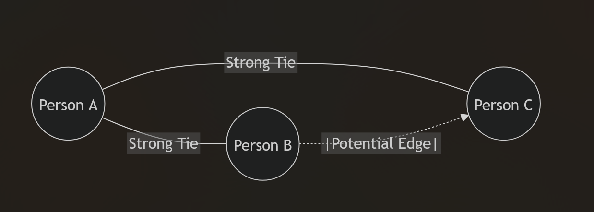

# Granovetter's Strength of Weak Ties

## The Phenomenon
Mark Granovetter's influential 1973 sociological theory states that human interactions and opportunities are powered heavily by "weak ties". In his original study, Granovetter surveyed professionals and found that when asking people who recommended them for their current job, up to 90% stated it was a relatively distant acquaintance—not a close friend or family member.

Why does this happen? People who are strictly close to us (our "strong ties") operate in the exact same social circles, meaning they generally possess the identical information that we do. They hear about the same job openings, news, and ideas. Acquaintances ("weak ties"), however, operate in completely different circles. They act as distinct bridges to novel information and external resources that our core group lacks access to.

## Key Network Concepts

### Triads and Triadic Closure
- **Triad**: A group of three interconnected nodes (representing people).
- **Triadic Closure**: If person `A` knows person `B`, and person `A` knows person `C`, there is a high likelihood that `B` and `C` will eventually meet and become interconnected themselves.

### Strong Triadic Closure Property
This property dictates: If `A` has **strong** ties to both `B` and `C`, then we can confidently guess that there is at least a **weak** tie between `B` and `C`. Without it, psychological and structural tension exists.

### Clustering Coefficient
This measures how densely interconnected a person's friends are among themselves.
- **Formula**: `(Number of actual connections between your friends) / (Total possible connections between your friends)`
- A coefficient of `1` means all your friends are friends with each other.
- A coefficient of `0` means none of your friends know each other.
- *Sociological Insight*: Studies (such as Bearman and Moody's) observed that individuals (like teenagers) who exhibit extremely low clustering coefficients within their networks are structurally isolated and statistically more prone to negative mental health events, including suicide.

### Neighborhood Overlap
We can define the strength of a friendship between `A` and `B` dynamically by observing their shared connections.

$$
\text{Overlap} = \frac{\text{Common Friends of } A \text{ and } B}{\text{Total Friends of } A \text{ and } B}
$$

A high overlap indicates a strong tie heavily embedded in a single community, while a near-zero overlap indicates a weak tie acting as a local bridge.
### Local Bridges vs Embdeddedness
- **Local Bridge**: A tie (connection) between two nodes that do not share any triadic closure (they have zero mutual friends). Such bridges are almost always weak ties, and they act as primary highways between entirely different graph communities.
- **Embeddedness**: The raw number of mutual friends two people share. High embeddedness implies a highly secure, trusting relationship. 

You should not heavily isolate yourself in *strictly* high embeddedness friendships. To grow socially and maintain access to diverse information, you fundamentally need low embeddedness friends (acquaintances) who live essentially in "different worlds".

## Social Capital & Tie Diversity 

To maximize overall "social capital" to ensure friendships benefit everyone:
- **Closure**: Fosters strong, trusting, well-supported environments (the friend's friend becomes a friend).
- **Brokerage**: Fosters structural diversity by connecting with people who don't have mutual friends.

## Digital Typology of Relationships 
Modern digital media redefines interaction formats into specific tied categories:
1. **Passive Engagement**: Not keeping in touch directly, but knowing what is happening in their life through ambient updates.
2. **One-way Relationship**: Reaching out (e.g., messaging on WhatsApp) but receiving no reciprocal reply.
3. **Reciprocal Relationship**: Active, two-way communication.
4. **Maintained Relationship**: Characterized by small symbolic gestures (keeping on liking posts) without dense dialogue. Most modern social media relationships heavily skew to this type.

> **Cell Phone Data Validation**: Empirical cell phone call data validates Granovetter's hypothesis structurally. Ties exhibiting the "highest conversation time/depth" (strong ties) were systematically observed to have *fewer* or *no* local bridges in the wider communications graph.
