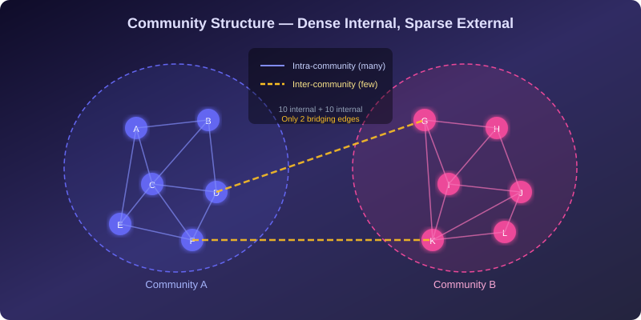
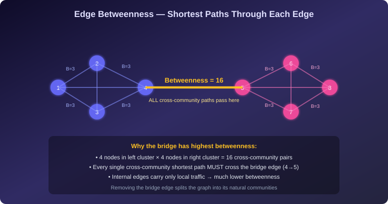
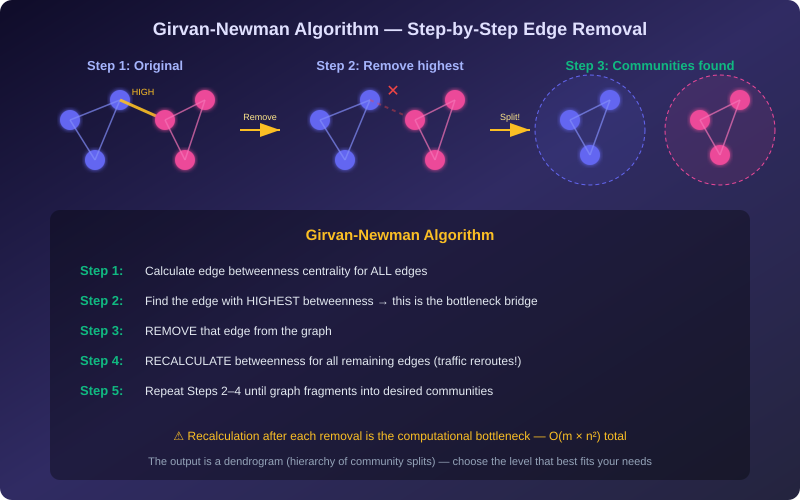
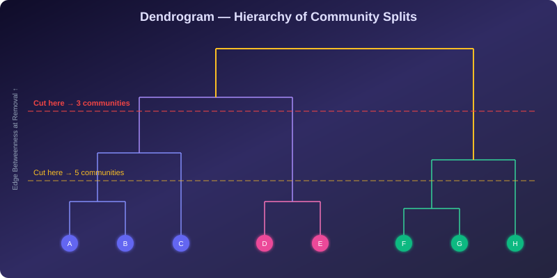
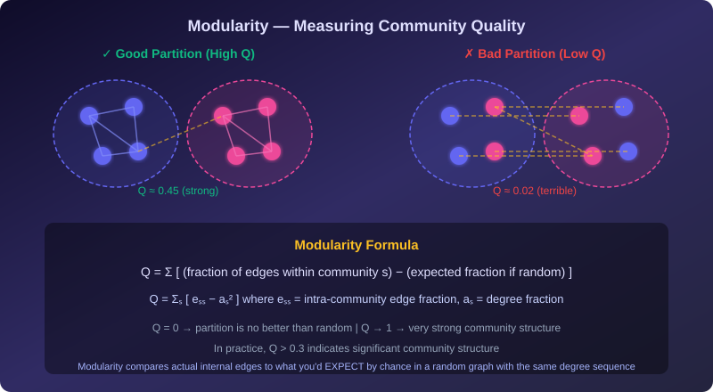

# Community Detection — Plain Language Notes

> **What this covers:** How do we find meaningful groups hidden inside large networks? This file explains the concept of communities, the mathematical framework for evaluating partitions, the brute-force combinatorial explosion, edge betweenness centrality and how it reveals weak points, the Girvan-Newman algorithm, modularity as a quality metric, dendrograms for hierarchical community structure, clustering coefficients and triadic closure, and worked examples for every calculation. All concepts are tied to the broader course (weak ties, homophily, diffusion) and connected to assignment-style problems.

---

## Part 1 — What Is a Community?

### The Intuition

Think of a large social network — millions of people, billions of friendships. If you zoom in, the network is not uniform. You see **dense patches** of people who are heavily interconnected, separated by **thin channels** of connections between patches. Each dense patch is a **community**.

**Formal definition:** A community is a subset of nodes in a graph where:
- **Intra-community edges** (edges *within* the group) are **dense** — members are heavily connected to each other
- **Inter-community edges** (edges *between* groups) are **sparse** — few connections point outward

This is the core principle: **many edges inside, few edges outside.**

### Why Communities Matter

| Application | What the community represents |
|---|---|
| **Social networks** | Friend groups, professional circles, families |
| **Biology** | Protein complexes, metabolic pathways |
| **Web** | Topically related pages, content clusters |
| **Communication** | Email groups, messaging clusters |
| **Infrastructure** | Power grid regions, traffic zones |

> **Key insight:** Communities are not just visual patterns — they have functional meaning. Nodes within the same community share behavior, information, or function. Detecting communities reveals the **organizational backbone** of a network.

---

### Evaluating a Partition: Intra vs. Inter Ratio

A **partition** is a specific way to divide the graph's nodes into groups. Not all partitions are equal — we need a way to measure quality.

**The simplest metric:** Count the ratio of total intra-community edges to inter-community edges.

> **Worked Example:**
>
> Given a network partitioned into two communities:
> - Community 1 has **8 internal edges**
> - Community 2 has **15 internal edges**
> - There are **3 edges bridging** the two communities
>
> $$\text{Intra/Inter ratio} = \frac{8 + 15}{3} = \frac{23}{3} = \mathbf{7.67}$$
>
> A ratio of 7.67 means there are nearly **8× more internal connections than bridging ones** — this is a strong community structure.

**Rule of thumb:**
- Ratio ≫ 1 → strong community structure (good partition)
- Ratio ≈ 1 → edges are equally distributed inside and outside (terrible partition — barely better than random)
- Ratio < 1 → more edges between groups than within them (the partition is wrong — you've cut through communities instead of between them)



---

## Part 2 — Why Not Just Try Everything? (Brute-Force Detection)

### The Exhaustive Search Idea

The mathematically perfect approach to community detection: try **every possible partition**, compute a quality metric for each one, and pick the best. This guarantees the optimal answer.

**But it's computationally impossible for any non-trivial network.**

### The Combinatorial Explosion

#### Splitting $n$ nodes into two groups

Each node independently goes to Group A or Group B. That's 2 choices per node.

$$\text{Total partitions} = 2^n$$

| Network size ($n$) | Number of partitions ($2^n$) | Time at 1 billion partitions/second |
|---|---|---|
| 10 | 1,024 | Instant |
| 20 | ~1 million | <1 second |
| 50 | ~$10^{15}$ | ~11.5 days |
| 100 | ~$10^{30}$ | ~$10^{13}$ years |
| 5,000 | $2^{5000}$ | Longer than the universe has existed |

> **Assignment Example:** To divide exactly 5,000 platform users into two communities, algorithms must evaluate **$2^{5000}$** independent partitions. For perspective, the number of atoms in the observable universe is approximately $10^{80}$, which is incomprehensibly smaller than $2^{5000} \approx 10^{1505}$.

#### Selecting a subgroup of fixed size

Choosing a specific community of size $k$ from $n$ nodes requires:

$$\binom{n}{k} = \frac{n!}{k! \times (n - k)!}$$

> **Worked Example:** Selecting a sub-community of 6 individuals from 16 users:
>
> $$\binom{16}{6} = \frac{16!}{6! \times 10!} = \frac{16 \times 15 \times 14 \times 13 \times 12 \times 11}{6 \times 5 \times 4 \times 3 \times 2 \times 1} = \mathbf{8{,}008} \text{ possible selections}$$

This is manageable for $n = 16$, but for real networks with thousands or millions of nodes, exact search is hopeless.

> [!IMPORTANT]
> **Why brute force matters conceptually:** Even though we can't run brute force in practice, understanding it clarifies what we're optimizing — we're searching for the partition that maximizes internal density and minimizes external connections. All practical algorithms are **approximations** to this ideal.

---

### Subgraph-Induced Methods

Since brute force is infeasible, practical approaches use **subgraph-induced methods** — algorithms that:
1. Evaluate community quality **locally** (looking at edges within and around a subset)
2. Use **heuristics** to navigate the exponential search space efficiently
3. Count intra-community edges using the **subgraph induced by the community** (the subgraph containing only the community's nodes and the edges between them)

This is why algorithms like Girvan-Newman don't search all partitions — they use structural clues (like edge betweenness) to make intelligent guesses about where communities end.

---

## Part 3 — Edge Betweenness Centrality

### The Core Idea: Finding Weak Points

If communities are dense clusters connected by thin channels, then the **edges forming those thin channels** are the structural weak points. Remove them, and the network naturally fractures into its communities.

**But how do we find these bridge edges?** By measuring how much "traffic" flows through each edge.

### Formal Definition

**Edge Betweenness Centrality** of an edge $e$ is the **number of shortest paths between all pairs of nodes** that pass through $e$.

$$\text{Betweenness}(e) = \sum_{s \neq t} \frac{\sigma_{st}(e)}{\sigma_{st}}$$

Where:
- $\sigma_{st}$ = total number of shortest paths between nodes $s$ and $t$
- $\sigma_{st}(e)$ = number of those shortest paths that pass through edge $e$

### Why Bridge Edges Have High Betweenness

Consider two clusters of 4 nodes each, connected by a single bridge edge:

- There are $4 \times 4 = 16$ cross-community node pairs
- **Every single cross-community shortest path** must use the bridge
- So the bridge edge's betweenness = 16 (at minimum)

Meanwhile, edges *inside* a cluster carry only local traffic — a much smaller number of shortest paths pass through them.

> **This is the fundamental insight:** Bridge edges act as **bottlenecks** for information flow. All cross-community traffic is forced through them, inflating their betweenness far above internal edges.

### Detailed Betweenness Calculation Example

**Setup:** Edge $E$ connects two clusters. We analyze all 20 source-destination pairs:

| Scenario | Node pairs | Shortest paths through $E$ | Contribution |
|---|---|---|---|
| $E$ is the **only** shortest path | 12 pairs | $12 \times \frac{1}{1} = 12$ | Full credit per pair |
| $E$ is **one of 2** equally short paths | 4 pairs | $4 \times \frac{1}{2} = 2$ | Half credit (shared) |
| $E$ is **not** on any shortest path | 4 pairs | $4 \times 0 = 0$ | No contribution |

$$\text{Betweenness}(E) = 12 + 2 + 0 = \mathbf{14.00}$$

> [!TIP]
> **When multiple shortest paths exist:** If there are $k$ equally short paths between $s$ and $t$, and $j$ of them use edge $e$, the contribution is $j/k$, not $j$. Edge $e$ shares credit proportionally among all equally short alternatives.



---

### Computing Betweenness: BFS-Based Algorithm

For each node $s$ in the graph:
1. Run **BFS from $s$** to find shortest path distances and counts to all other nodes
2. Process nodes in **reverse BFS order** (farthest first)
3. For each edge $(u, v)$ where $v$ is one level deeper than $u$, accumulate the fraction of shortest paths from $s$ that flow through $(u, v)$

**Time complexity:** $O(n \cdot m)$ per full computation — where $n$ = nodes, $m$ = edges. This is the bottleneck of the Girvan-Newman algorithm, because it must be repeated after every edge removal.

---

## Part 4 — The Girvan-Newman Algorithm

### The Algorithm

The Girvan-Newman algorithm exploits edge betweenness to **divisively** reveal community structure:

```
Algorithm: GIRVAN-NEWMAN COMMUNITY DETECTION
─────────────────────────────────────────────
Input: Graph G

1. Calculate edge betweenness centrality for EVERY edge in G

2. Find the edge with the HIGHEST betweenness score
   (this is the most critical bottleneck bridge)

3. REMOVE that edge from G

4. RECALCULATE betweenness for ALL remaining edges
   ⚠ This step is essential — removing an edge changes
   all traffic patterns throughout the network

5. Repeat steps 2–4 until:
   - The graph splits into the desired number of components, OR
   - All edges have been removed (producing a full dendrogram)
```

### Why Recalculation Is Essential

After removing a bridge edge, the traffic patterns change dramatically:
- Paths that used the removed bridge must now find **alternative routes**
- These alternative routes may pass through **different edges**, changing their betweenness
- A previously low-betweenness edge might become the new bottleneck
- Without recalculation, the algorithm would make incorrect removal decisions

> [!WARNING]
> **The most expensive step:** The computational bottleneck of Girvan-Newman is **Step 4 — recalculating betweenness after each removal**. Each recalculation costs $O(n \cdot m)$, and we perform up to $m$ removals, giving a total complexity of $O(m^2 \cdot n)$. For large networks, this is very slow.



---

### The Dendrogram: A Hierarchy of Splits

The Girvan-Newman algorithm doesn't just find *one* partition — it produces a **complete hierarchy** of community structures, visualized as a **dendrogram** (tree diagram).

**How to read a dendrogram:**

- **Bottom:** Each node starts as its own leaf
- **Moving up:** Nodes that were in the same community when their connecting edge was removed are merged into branches
- **Top:** All nodes are in one giant community (the original graph)
- **Cutting horizontally** at any level gives you a specific partition into communities

**Choosing the right level:**
- Cut **low** → many small, tight communities
- Cut **high** → few large, loose communities
- The **best cut** is the level that maximizes **modularity** (see Part 5)



> **Key insight for assignments:** The Girvan-Newman algorithm produces a hierarchy, not a single answer. You choose the number of communities by selecting where to "cut" the dendrogram. The modularity metric (Part 5) helps you decide the optimal cut level.

---

## Part 5 — Modularity: Measuring Partition Quality

### The Problem with Simple Ratios

The intra/inter edge ratio from Part 1 is intuitive but has a fatal flaw: it doesn't account for what you'd **expect by chance**. A partition might have many internal edges simply because the network is dense — not because the partition is good.

### Modularity: Actual vs. Expected

**Modularity ($Q$)** compares the observed number of intra-community edges to the number you'd **expect in a random graph** with the same degree sequence.

$$Q = \sum_{s} \left[ e_{ss} - a_s^2 \right]$$

Where:
- The sum is over all communities $s$
- $e_{ss}$ = fraction of all edges that fall **within** community $s$
- $a_s$ = fraction of edge endpoints that belong to community $s$ (i.e., $a_s = \sum_t e_{st}$)
- $a_s^2$ = the **expected** fraction of edges within $s$ if edges were randomly distributed

### Interpreting Modularity

| Value of $Q$ | Meaning |
|---|---|
| $Q = 0$ | Partition is no better than random — internal edges match random expectation |
| $Q > 0$ | More internal edges than expected — genuine community structure detected |
| $Q > 0.3$ | Strong community structure (commonly used threshold) |
| $Q \to 1$ | Perfect communities — all edges are internal, none cross boundaries |
| $Q < 0$ | Fewer internal edges than expected — the partition is **worse** than random |

### Worked Example: Computing Modularity

Consider a graph with 12 edges, partitioned into two communities:

| | Community 1 | Community 2 | Total |
|---|---|---|---|
| **Edges from C1** | 5 (internal) | 1 (to C2) | 6 |
| **Edges from C2** | 1 (to C1) | 5 (internal) | 6 |
| **Total** | 6 | 6 | 12 |

Converting to fractions of total edges:

$$e_{11} = \frac{5}{12}, \quad e_{22} = \frac{5}{12}, \quad e_{12} = e_{21} = \frac{1}{12}$$

$$a_1 = e_{11} + e_{12} = \frac{5}{12} + \frac{1}{12} = \frac{6}{12} = 0.5$$

$$a_2 = e_{21} + e_{22} = \frac{1}{12} + \frac{5}{12} = \frac{6}{12} = 0.5$$

$$Q = (e_{11} - a_1^2) + (e_{22} - a_2^2) = \left(\frac{5}{12} - 0.25\right) + \left(\frac{5}{12} - 0.25\right)$$

$$Q = (0.417 - 0.25) + (0.417 - 0.25) = 0.167 + 0.167 = \mathbf{0.333}$$

A modularity of 0.333 indicates meaningful community structure — above the 0.3 threshold.



---

## Part 6 — Clustering Coefficient and Triadic Closure

### What Is the Clustering Coefficient?

The **clustering coefficient** of a node $v$ measures how interconnected $v$'s neighbors are — do your friends know each other?

$$C(v) = \frac{\text{number of edges among neighbors of } v}{\binom{k_v}{2}} = \frac{\text{actual triangles through } v}{\text{maximum possible triangles through } v}$$

Where $k_v$ is the degree (number of neighbors) of node $v$, and $\binom{k_v}{2} = \frac{k_v(k_v - 1)}{2}$ is the maximum possible edges among those neighbors.

### Interpreting Clustering Coefficient

| Value of $C(v)$ | Meaning |
|---|---|
| $C(v) = 0$ | None of $v$'s friends know each other |
| $C(v) = 0.5$ | Half of all possible friendships among $v$'s friends exist |
| $C(v) = 1.0$ | All of $v$'s friends know each other (complete clique) |

### Why Clustering Coefficients Reveal Communities

- **Inside a community:** nodes tend to have HIGH clustering coefficients (your friends are also friends with each other — the group is tightly knit)
- **Between communities:** nodes that bridge communities tend to have LOWER clustering coefficients (your contacts in different groups don't know each other)

> This is directly connected to **triadic closure** (from the Weak Ties topic): within communities, if A knows B and A knows C, there's strong pressure for B-C to form — completing the triangle. Between communities, this pressure doesn't exist.

---

### Extrapolating Maximum Triadic Linkages

When given a node's degree and clustering coefficient, you can compute how many actual edges exist among its neighbors:

$$\text{Edges among neighbors} = C(v) \times \binom{k_v}{2} = C(v) \times \frac{k_v(k_v - 1)}{2}$$

> **Worked Example:**
> A user has **400 connections** and a clustering coefficient of **0.25**.
>
> Maximum possible edges among their friends:
> $$\binom{400}{2} = \frac{400 \times 399}{2} = 79{,}800$$
>
> Actual edges among their friends:
> $$0.25 \times 79{,}800 = \mathbf{19{,}950 \text{ edges}}$$
>
> This means 19,950 pairs of this user's friends are also friends with each other.

> [!NOTE]
> **Assignment formatting note:** Some algorithmic testing formats may list the answer as approximately **19,900** due to rounding conventions. Both 19,950 and 19,900 are acceptable depending on whether the question uses $k(k-1)/2$ or approximates differently. Read the options carefully.

---

### Network-Level Clustering Coefficient

The **average clustering coefficient** of the entire network is simply the mean over all nodes:

$$\bar{C} = \frac{1}{n} \sum_{v=1}^{n} C(v)$$

| Network type | Typical $\bar{C}$ |
|---|---|
| Random network $G(n, p)$ | $\bar{C} \approx p$ (low for sparse networks) |
| Real social networks | $\bar{C} \gg p$ (much higher than random) |
| Lattice/grid | Very high (neighbors are neighbors of neighbors) |

> **Why real networks have high clustering:** Homophily and triadic closure ensure that within communities, triangles form abundantly. This is exactly the structural signature that distinguishes real networks from random ones — and it's what makes the Watts-Strogatz small-world model work (see File 12).

---

## Part 7 — Other Community Detection Approaches (Beyond Girvan-Newman)

### Modularity Optimization (Greedy Agglomerative)

Instead of divisively removing edges (top-down like Girvan-Newman), **agglomerative approaches** build communities bottom-up:

1. Start with every node as its own community
2. Repeatedly merge the pair of communities whose merger produces the **largest increase in modularity**
3. Stop when no merger improves $Q$

**Advantage:** Much faster than Girvan-Newman for large networks.
**Disadvantage:** Greedy choices can miss the global optimum (resolution limit problem).

### Spectral Methods

Use the **eigenvectors of the graph's Laplacian matrix** to embed nodes in a low-dimensional space, then apply standard clustering (like k-means).

- **Laplacian matrix:** $L = D - A$ (degree matrix minus adjacency matrix)
- **Fiedler vector:** The eigenvector associated with the second-smallest eigenvalue of $L$ — its sign pattern reveals a natural 2-way split

### Label Propagation

Each node starts with a unique label. Iteratively, each node adopts the **most common label** among its neighbors. Communities emerge as groups of nodes that converge to the same label.

**Advantage:** Near-linear time complexity — very fast.
**Disadvantage:** Non-deterministic — different runs can give different results.

---

## Part 8 — Key Concepts Summary Table

| Concept | Definition | Key Property |
|---|---|---|
| **Community** | Dense subgroup with sparse external connections | Many edges inside, few outside |
| **Partition** | Assignment of every node to a community | Quality measured by modularity or intra/inter ratio |
| **Edge Betweenness** | Number of shortest paths passing through an edge | Bridge edges have highest betweenness |
| **Girvan-Newman** | Iteratively remove highest-betweenness edge | Produces hierarchical dendrogram |
| **Dendrogram** | Tree showing hierarchy of community merges/splits | Cut at different levels for different granularity |
| **Modularity ($Q$)** | Actual internal edges minus expected internal edges | $Q > 0.3$ = strong communities |
| **Clustering Coefficient** | Fraction of neighbor pairs that are connected | High within communities, low at bridges |
| **Triadic Closure** | If A-B and A-C exist, B-C likely forms | Drives high clustering inside communities |
| **Brute-Force Search** | Try all $2^n$ partitions | Guaranteed optimal but computationally impossible |

---

## Part 9 — Formula Cheat Sheet

### Edge Betweenness Centrality

$$\text{Betweenness}(e) = \sum_{s \neq t} \frac{\sigma_{st}(e)}{\sigma_{st}}$$

### Binomial Coefficient (Subgroup Selection)

$$\binom{n}{k} = \frac{n!}{k!(n-k)!}$$

### Clustering Coefficient of Node $v$

$$C(v) = \frac{\text{edges among neighbors of } v}{\binom{k_v}{2}} = \frac{2 \times \text{edges among neighbors}}{k_v(k_v - 1)}$$

### Edges Among Neighbors (from Clustering Coefficient)

$$\text{Edges among neighbors} = C(v) \times \frac{k_v(k_v - 1)}{2}$$

### Modularity

$$Q = \sum_{s} \left[ e_{ss} - a_s^2 \right]$$

### Number of Possible 2-Way Partitions

$$\text{Partitions} = 2^n$$

### Girvan-Newman Complexity

$$O(m^2 \cdot n)$$

where $m$ = edges, $n$ = nodes. The $m$ factor comes from removing up to $m$ edges, and each removal requires $O(m \cdot n)$ for betweenness recalculation.

---

## Part 10 — Common Traps and Misconceptions

| ❌ Wrong Statement | ✅ Correct Understanding |
|---|---|
| "Brute force is slow but still practical for small networks" | For $n > 30$, $2^n > 10^9$ — even "small" networks are infeasible for brute force |
| "Remove the edge with lowest betweenness" | **HIGHEST** betweenness — the bridge carrying the most traffic |
| "You don't need to recalculate betweenness after each removal" | You **MUST** recalculate — removing an edge redirects traffic through different edges |
| "Modularity close to 1 is always achievable" | Real networks typically max out at $Q \approx 0.3$–$0.7$. Values near 1 only occur in perfectly separable graphs |
| "High clustering coefficient = the node is a bridge" | The **opposite** — bridges tend to have LOW clustering (their contacts don't know each other). High clustering = embedded deep within a community |
| "Girvan-Newman always finds the best partition" | Girvan-Newman is a heuristic. It finds a *good* hierarchy but is not guaranteed to find the modularity-maximizing partition |
| "More communities is always better" | Splitting too finely reduces modularity. There's an optimal number of communities for each network |
| "Edge betweenness is the same as node betweenness" | Edge betweenness counts paths through an **edge**; node betweenness counts paths through a **node**. Related but distinct concepts |

---

## Part 11 — Connections to Other Course Topics

| This topic | Connection to Community Detection |
|---|---|
| **Strength of Weak Ties (Granovetter)** | Weak ties are exactly the inter-community bridge edges that Girvan-Newman targets for removal. Removing weak ties = splitting communities. |
| **Homophily & Social Influence** | Homophily is *why* communities form — similar people cluster together. Community detection *finds* these homophily-driven clusters. |
| **Small World Effect** | Communities are the "dense local clusters" in the small-world model. The few edges between communities are the "shortcuts" that make the world small. |
| **Diffusion & Cascades** | Information cascades spread rapidly *within* communities (dense connections) but slowly *between* them (few bridges). Community structure determines cascade boundaries. |
| **PageRank** | Nodes with high PageRank often sit at the center of communities or bridge multiple communities. Community structure affects the flow of PageRank "credit." |
| **Power Law & Hubs** | Hub nodes often serve as community centers or bridges. Removing hubs (targeted attack) can shatter community structure — connecting to network resilience. |
| **Epidemics** | Disease spreads rapidly within a community (dense contacts) and jumps between communities via bridge edges. Community structure determines epidemic reach. |

---

## Part 12 — Practice Questions (Self-Test)

1. **A network has 20 nodes. How many ways can you split it into two groups?**
   - Answer: $2^{20} = 1{,}048{,}576$ possible partitions.

2. **An edge has betweenness centrality 0. What does this mean?**
   - Answer: No shortest path between any pair of nodes passes through this edge. This typically means both endpoints are in the same "neighborhood" and there are always alternative shortest routes that bypass this edge.

3. **After removing the highest-betweenness edge, the graph splits into two components of sizes 7 and 13. What is the maximum possible betweenness the removed edge could have had?**
   - Answer: $7 \times 13 = 91$. Every node in one component must pass through the bridge to reach every node in the other component.

4. **A user has 50 friends and a clustering coefficient of 0.6. How many pairs of their friends are also friends?**
   - Answer: $\binom{50}{2} \times 0.6 = \frac{50 \times 49}{2} \times 0.6 = 1225 \times 0.6 = 735$ friend pairs.

5. **Why can't you just remove all low-betweenness edges to find communities?**
   - Answer: Low-betweenness edges are the *internal* edges that hold communities together. Removing them would destroy the communities, not reveal them. You remove *high*-betweenness edges — the bridges between communities.

6. **A partition has modularity $Q = -0.1$. What does this tell you?**
   - Answer: The partition is *worse* than random — there are fewer internal edges than you'd expect by chance. The groups are poorly chosen; they cut through natural communities rather than separating them.

7. **In the Girvan-Newman algorithm, why is recalculating betweenness after each edge removal crucial?**
   - Answer: Because removing an edge changes the shortest path structure of the entire network. Traffic that previously flowed through the removed edge must now find alternative routes, potentially making other edges the new bottleneck. Without recalculation, the algorithm would target stale edges.

---

> See [`code/03_girvan_newman.py`](code/03_girvan_newman.py) for a Python implementation of the Girvan-Newman algorithm using NetworkX, including betweenness calculation and community visualization.
