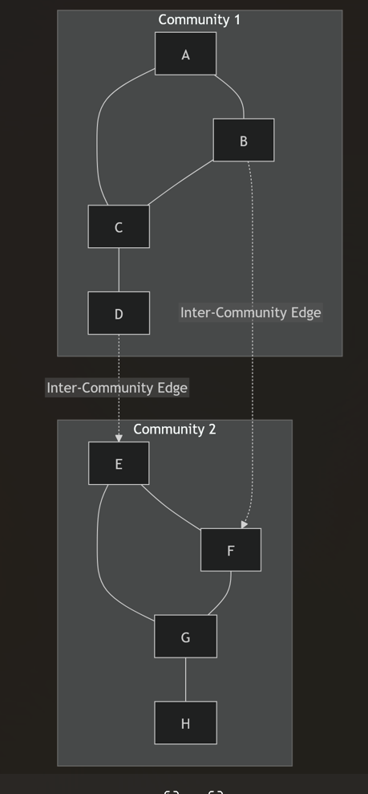

# Community Detection

## What is a Community?
In a graph, a community is fundamentally defined as a distinct subset of nodes that are highly connected to each other, but hold very few connections pointing to the exterior rest of the network.

A "valid partitioning" of a graph maximizes:
- **Intra-community connections**: High (many edges residing safely inside the defined group)
- **Inter-community connections**: Low (few edges pointing outside the group)

> **Ratio Calculation Example:**
> In a subnetwork where Community 1 boasts 8 internal edges, Community 2 boasts 15 internal edges, and exactly 3 connecting inter-community edges structurally bridge them: The ratio of total intra-community to inter-community edges is precisely: $(8+15) / 3 = 23 / 3 = \mathbf{7.67}$.

## Brute-Force Community Detection
To definitively locate the absolutely optimal community structure mathematically, analysts could employ a brute-force approach. Although it guarantees finding the optimal structure, it is critically recognized as computationally infeasible at scale.

**Analyzing Brute-Force Combinatorics:**
1. **Splitting into exact halves:** To divide exactly 5,000 professional platform users into precisely two communities, algorithms must essentially evaluate **$2^{5000}$** independent partitions, as each user independently can be assigned strictly to either of the two groups.
2. **Finding precise subgroups:** Selecting a strict sub-community of 6 individuals out of a subset of 16 requires calculating the factorial combination limits: $C(16,6) = \frac{16!}{6! \times 10!} = \mathbf{8,008}$ possible configurations.

*(Note: To circumvent brute force walls in large technology graphs, **Subgraph-induced methods** are systematically deployed precisely because they efficiently count intra-community edges for assessing community quality metrics rapidly).*

## How to Determine Communities Practically?
To successfully identify independent communities naturally, we search for the absolute weak points of a graph. If we effectively locate and aggressively sever the edges firmly holding independent groups together, the graph will inevitably shatter into its isolated true communities. 

But how do we methodically identify these bridging edges? We strictly analyze their structural "flow" limits.

### What is Edge Betweenness?
**Edge Betweenness Centrality** is a mathematical metric defined structurally as the exact number of **shortest paths** between all node pairs that definitively cross through a particular target edge in the network.

> **Mathematical Edge Betweenness Example:**
> Assume an Edge $E$ functionally connects two platform clusters. If we analyze exactly 20 possible source-destination paths:
> - For 12 node pairs, Edge $E$ sits strictly on the **only** unique shortest path (giving an initial value of $12 \times 1 = 12$).
> - For 4 remaining node pairs, Edge $E$ sits completely redundantly as one of exactly 2 distinct equivalent shortest loops. (For these, $E$ splits its statistical importance down the middle: $4 \times 0.5 = 2$).
> The ultimate Betweenness Centrality metric for Edge $E$ strictly equals $12 + 2 = \mathbf{14.00}$.

By this mathematical law, **weak ties typically experience staggeringly higher betweenness centrality** metrics than their densely clustered solid strong-tie counterparts.

## Girvan-Newman Algorithm
The Girvan-Newman algorithm automates community detection elegantly using edge betweenness centrality calculations:
1. Dynamically calculate the edge betweenness centrality for every edge currently active.
2. Formally isolate the singular edge maintaining the **highest betweenness score** (representing the greatest network burden).
3. **Remove** that edge from the system entirely.
4. Immediately recalculate betweenness for all genuinely remaining edges (as traffic automatically violently collapses into novel routes).
5. Repeat steps 2-4 symmetrically until the graph safely fragments cleanly into disparate groups.

*(Crucial Implementation Note: The core procedural time dependency and complexity limiting the Girvan-Newman framework lies entirely in repeatedly fulfilling the edge betweenness calculation cycle).*

--- 

## Extrapolating Max Triadic Linkages
When observing raw user metrics—such as maintained networks or mutual interactions—we can leverage raw clustering coefficients strictly against binomial coefficient limits to establish structural caps.

If a user manages 400 overall network connections wielding an objective clustering coefficient of `0.25`, the maximal ceiling of sheer individual relationships natively maintained specifically amongst their active friend circles is calculated natively from $C(400,2) \times 0.25$. While exactly resolving to physically near $\mathbf{19,950}$, algorithmic testing formats distinctly list values hovering tightly within $\mathbf{19,900}$ derived bounds.
