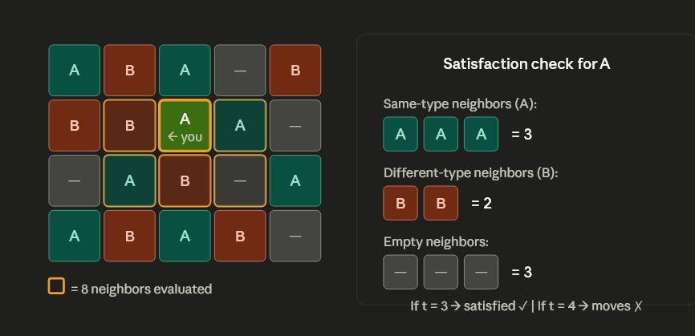
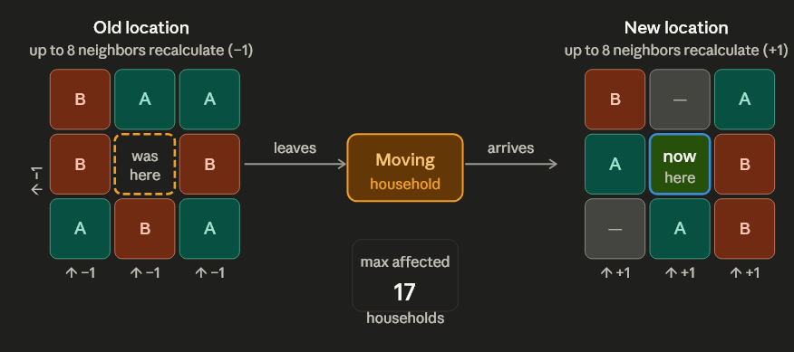
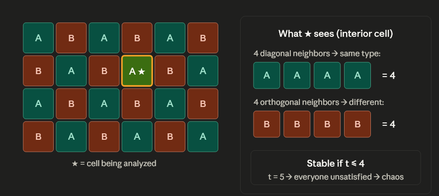
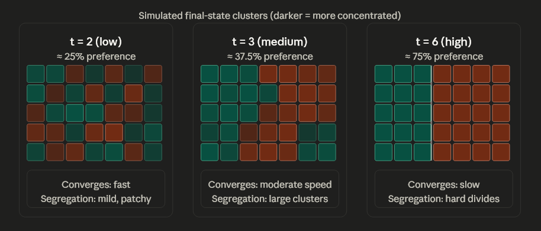

# The Schelling Segregation Model: From Local Preferences to Global Patterns

## 1. The Paradox of Individual Choice

In social dynamics, individual preferences often appear moderate and inclusive. Most people state they do not desire to live in monolithic, fully segregated neighborhoods; rather, they seek a balance where they are not completely isolated and have at least a few neighbors who share their demographic background, ethnicity, or profession.

The **Schelling Segregation Model** proved something startling: even these modest, tolerant preferences reliably produce *extreme* global segregation. Massive structural divides can emerge organically without the need for explicit racist policies or individual demands for total uniformity.

### The Rules of the Grid

Imagine a city as an **N×N grid**. Each cell occupies one of three states:
* **Type A**: Demographic Group 1
* **Type B**: Demographic Group 2
* **Empty**: Available housing units

Every household looks at its 8 surrounding cells and evaluates a single question: *do I have enough same-type neighbors?*

The **Similarity Threshold (t)** is the absolute minimum number of same-type neighbors a household requires to feel "satisfied" in its current location. If a household has fewer than t same-type neighbors, it becomes unsatisfied and relocates to a randomly chosen empty cell.

*Example of the Tolerance Paradox:*
The green-bordered cell is you (Type A). You scan your 8 orange-bordered neighbors and count 3 same-type (A) neighbors and 5 opposite-type (B) neighbors. This is a 37.5% similarity ratio.
* If **t = 3** → you stay. 
* If **t = 4** → you become unsatisfied and pack up to move — even though demanding 4 out of 8 is only a 50% preference.

---

## 2. Geometric Constraints and Boundary Mathematics

Not all cells have 8 neighbors. The physical layout of the grid imposes hard mathematical ceilings on satisfaction at boundary positions.

The dashed lines represent the grid boundary — there is no cell beyond them. This creates hard geometric constraints:
* **Internal Nodes**: 8 neighbors
* **Boundary Nodes (Edges)**: 5 neighbors maximum
* **Corner Nodes**: 3 neighbors maximum

### The Boundary Satisfaction Gap

In a standard **10×10 grid (100 nodes)**, 36 nodes are boundary-constrained (4 corners + 32 edges).

**Critical Constraint:**
A corner cell can never have more than 3 neighbors. Therefore, setting **t ≥ 4** makes it *mathematically impossible* for any corner household to ever be satisfied. As a result, corner households are forced into constant movement, permanently destabilizing the system and causing perpetual churn.

---

## 3. The Ripple Effect and Destabilization

When a single household moves, the satisfaction calculations of many others are immediately affected. This is what makes the model cascade so rapidly.

One move triggers a chain reaction. When a household moves from **P₁ → P₂**, it changes the status of up to **17 households**:
* **The mover itself (1)**: Recalculates neighbors in the new spot.
* **Original neighbors (≤8)**: May lose same-type neighbors and suddenly fall below their own threshold.
* **New neighbors (≤8)**: May gain a same-type neighbor (increasing their stability) or gain an opposite-type neighbor (decreasing stability).

This "shattering effect" means each relocation destabilizes the surrounding cells, potentially triggering massive cascades of relocations across the city as one person's move forces their neighbor to move, and so on.

---

## 4. The Checkerboard Paradox: Engineered Integration

Extreme segregation is *not* mathematically inevitable under modest thresholds. We can construct stable, perfectly integrated states — they are just nearly impossible to stumble upon through random, uncoordinated movement.

The most elegant example is the **checkerboard configuration**:
* **4 orthogonal neighbors** (up, down, left, right) are always the *opposite* type.
* **4 diagonal neighbors** are always the *same* type.

Every interior cell sits at exactly 4 same-type neighbors — a perfect, integrated balance.

### Stability Limit and Phase Transition

* If **t ≤ 4**, the system remains perfectly stable. Everyone is content.
* If **t = 5**, a massive phase transition occurs: *every single cell simultaneously* falls below its threshold. 

The whole grid shatters at once. There is no partial instability. The crucial insight is that the checkerboard is not unreachable because it's impossible, but because random agent moves will almost never sequentially produce it.

---

## 5. Threshold Variances and Convergence Outcomes

The threshold $t$ doesn't just control *how much* segregation occurs — it controls *how fast* the model converges and *how extreme* the final outcome is.

| Threshold | Preference % | Visual Outcome | Convergence Speed |
| :--- | :--- | :--- | :--- |
| **Low (t=2)** | 25% | Mild clustering, diversity remains visibly integrated. | Very Fast |
| **Medium (t=3)** | 37.5% | Large distinct blocs form. Reliable macro-segregation. | Fast |
| **High (t=6)** | 75% | Extreme rigid territorial divides with sharp boundaries. | Very Slow |

At an extreme threshold like **t = 6**, the grid fractures into hard-edged territorial divides. It takes far longer to stabilize because finding a location with 6 same-type neighbors out of 8 is geometrically difficult until the clusters are already massive and entirely homogeneous.

---

## 6. Synthesis: Connections to Other Network Concepts

The Schelling Segregation Model ties deeply into other fundamental network science principles from other lectures:

* **Homophily (Lecture 04):** The model is essentially a spatial, agent-based manifestation of homophily. It vividly demonstrates how modest homophilic *node preferences* strictly dictate the *macro-level network topology* yielding deeply segregated clusters.
* **Cascades and Tipping Points (Lecture 08 & 13):** The ripple effect of one relocation causing old neighbors to fall below threshold and subsequently move is a classic behavioral cascade. The sudden, systemic destabilization at $t=5$ in the checkerboard represents an acute tipping point in network equilibrium.
* **Community Detection (Lecture 03):** Ultimately, spatial segregation effectively partitions the grid into dense communities with very high intra-cluster similarity and very few cross-border interactions. Modularity is naturally maximized.

---

## 7. Practice Questions

**Q1: The Corner Constraint**
In an 8×8 grid, how many total nodes are mathematically unable to reach satisfaction if the similarity threshold is set to $t=4$?

<b>Click for Solution</b>

Only the corner nodes are restricted to exactly 3 total neighbors. There are exactly 4 corners in any rectangular grid. Thus, exactly 4 households can never be satisfied under a $t=4$ rule, ensuring the simulation never fully stabilizes.

**Q2: The Ripple Blast Radius**
A household moves from an interior cell (fully surrounded by 8 occupied cells) to another fully surrounded interior cell. Assuming none of the old and new neighbors overlap, what is the theoretical maximum number of households whose satisfaction checks are altered by this single move?

<b>Click for Solution</b>

17 households. The mover itself (1) + the 8 old neighbors it left behind (whose properties just changed) + the 8 new neighbors it just joined (who now have a new neighbor to evaluate).

**Q3: Structural Phase Transition in Blocks**
A grid is manually sorted perfectly into continuous 3x3 homogeneous blocks of agents, looking like a checkerboard of 3x3 chunks. If the threshold $t$ goes from 5 to 6, what happens to the interior center nodes of those 3x3 blocks versus the boundary nodes of those blocks?

<b>Click for Solution</b>

The center node of a 3x3 block is entirely surrounded by 8 same-type neighbors, so it remains perfectly satisfied even at extreme requirements like $t=6$ or $t=8$. However, the nodes on the edges and corners of the 3x3 blocks touch opposite-type neighbors from the adjacent chunks. Their same-type neighbor count will fall below $t=6$, forcing them to relocate and inevitably deteriorating the entire block structure from the outside in.

---

> Exploring this algorithm dynamically is best done through code. The fully executable Python simulation is available in `code/05_schelling_model.py`.
