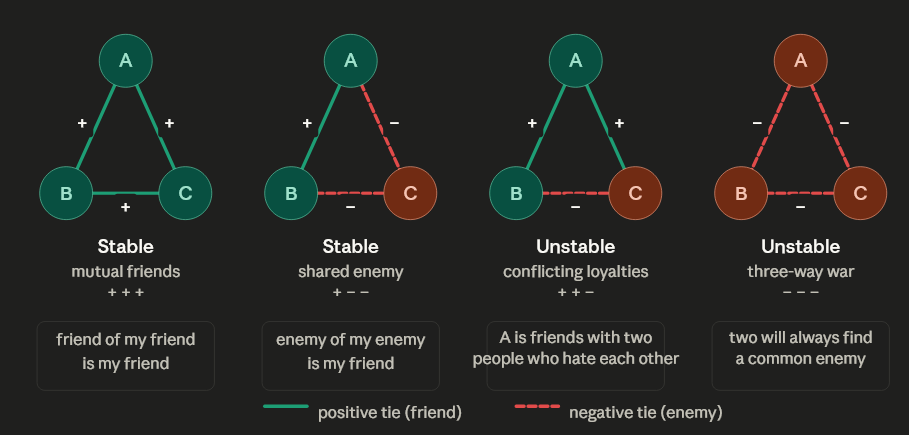
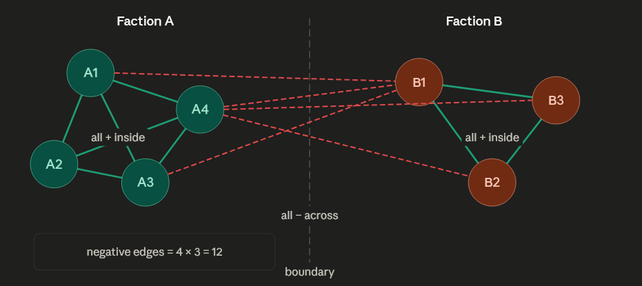
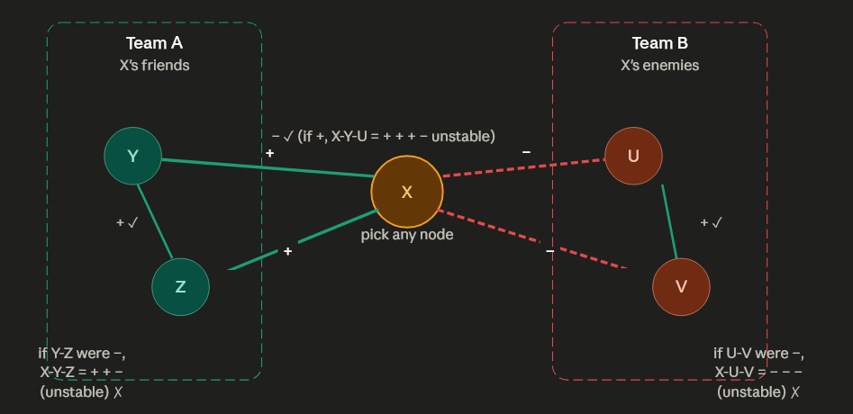
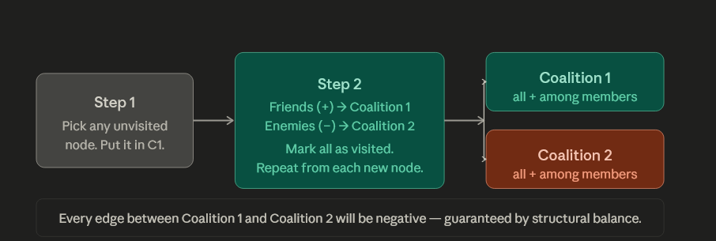

# Structural Balance Theory

## 1. Introduction to Signed Complete Graphs

To model faction dynamics — in workplaces, friend groups, or international diplomacy — we represent relationships as a **complete signed network**: every pair of nodes is connected, and every connection carries either a positive ($+$) or negative ($-$) sign. Positive ties mean friendship or alliance; negative ties mean hostility or enmity.

## 2. Triadic Stability: The Psychological Tension

The fundamental unit of analysis is the **triangle** — any three nodes and the three edges connecting them. There are exactly four possible sign combinations, and each is either stable or unstable based on a simple psychological rule.

The quick rule for stability: **count the negative edges**. A triangle is stable if it has 0 or 2 negatives — never 1 or 3. The "friend of my friend" and "enemy of my enemy" principles are both satisfied. With 1 negative ($+ + -$), one person is caught between two enemies they both like — the "choose me" pressure. With 3 negatives ($- - -$), all three hate each other, but two will inevitably recognize a shared opponent and flip one edge to positive.

---

## 3. The Balance Theorem

These local triadic rules produce a remarkable global consequence. If a complete signed graph contains **zero unstable triangles**, the entire network must split into exactly one or two groups.

Inside each faction, every pair is friends (all green). Across the divide, every pair is enemies (all red dashed). Any triangle you draw will either be entirely within one faction ($+ + +$) or straddle the divide with exactly two members from one side ($+ - -$). Both are stable — zero unstable triangles anywhere. This is why large conflicts are almost always **bipolar** rather than three-way: a three-way mutual hostility ($- - -$) is unstable and rapidly collapses into two sides.

For the case study: a company of 30 splitting into Faction A (18) vs Faction B (12) produces:

$$
18 \times 12 = 216 \text{ negative edges}
$$

---

## 4. The Proof of the Balance Theorem

How do we *prove* any balanced complete graph must produce exactly two factions? The argument is elegant — you only need to pick one node and let logic do the rest.

The proof works in three forced steps:

**Step 1 — Inside Team A:** X is friends with both Y and Z. If Y and Z were enemies, triangle X-Y-Z would be ($+ + -$) — unstable. So Y and Z *must* be friends. Team A is universally positive internally.

**Step 2 — Inside Team B:** X is enemies with both U and V. If U and V were also enemies, triangle X-U-V would be ($- - -$) — unstable. So U and V *must* be friends. Team B is also universally positive internally.

**Step 3 — Across teams:** X is friends with Y ($+$) and enemies with U ($-$). If Y and U were friends, triangle X-Y-U would be ($+ + -$) — unstable. So Y and U *must* be enemies. All cross-faction edges are negative.

Since X was chosen arbitrarily, this logic applies from any starting node. The result is always the same: two clean hostile camps with no exceptions.

---

## 5. Identifying Coalitions in Code

Given a finalized stable graph, extracting the two factions is a simple modified BFS:

The BFS terminates with two perfectly separated coalitions. Because the graph is structurally balanced, the algorithm never encounters a contradiction — no node will be assigned to both coalitions simultaneously. The guarantee from the theorem ensures this will always cleanly resolve into exactly two groups.

> The full Python implementation — building the complete signed graph, iteratively resolving unstable triangles, and extracting the two factions — is in `code/06_structural_balance.py`.

# Structural Balance Theory: Modeling Social and Political Coalitions

## 1. Introduction to Signed Complete Graphs

To understand the complex dynamics of factions in communities, workplaces, or international diplomacy, we utilize a **complete signed network** model. 

* **Complete Graph:** A network where every single node is connected to every other node, representing a environment where everyone is aware of or has a relationship with everyone else.
* **Signed Network:** Each edge in the network is assigned a positive ($+$) or negative ($-$) value.
    * **Positive Ties ($+$):** Represent friendship, collaboration, trust, or alliances.
    * **Negative Ties ($-$):** Represent hostility, avoidance, distrust, or enmity.

---

## 2. Triadic Stability: The Psychological Tension

The fundamental unit of analysis in this theory is the **triangle**—any group of three nodes and the three edges connecting them. Structural balance depends on whether these triangles are psychologically **stable** or **unstable**.

> **The Quick Rule for Stability:** Count the negative edges. A triangle is stable if it has **0 or 2 negative edges**. It is unstable if it has **1 or 3 negative edges**.

### The Four Triangular States

#### 1. The Mutual Friends (Stable)
* **Edges:** $+ + +$ (0 negatives)
* **Logic:** "The friend of my friend is my friend." This configuration creates zero psychological friction, as everyone in the triad supports one another.

#### 2. The Shared Enemy (Stable)
* **Edges:** $+ - -$ (2 negatives)
* **Logic:** "The enemy of my enemy is my friend." Two friends are bonded together by their mutual opposition to a third party. No tension exists within this alliance because the hostility is directed outward.

#### 3. Conflicting Loyalties (Unstable)
* **Edges:** $+ + -$ (1 negative)
* **Logic:** Two enemies share a common friend. This is the classic "choose me" scenario. The central person faces intense pressure to either mediate the conflict between their friends or side with one and drop the other.

#### 4. The Three-way War (Unstable)
* **Edges:** $- - -$ (3 negatives)
* **Logic:** Three mutual enemies. In high-tension environments, this state is volatile. Eventually, two entities will recognize that they share a common opponent, leading them to form an alliance. This flips one ($-$) edge to a ($+$), stabilizing the triangle into the "Shared Enemy" state.

---

## 3. The Balance Theorem

Local rules of triadic stability dictate the global structure of the entire network.

**The Balance Theorem states:** If a signed complete graph is structurally balanced (containing **zero** unstable triangles), then the entire network must mathematically partition into exactly one of two configurations:
1.  **A single unified coalition** where every edge is positive.
2.  **Exactly two opposing factions.**

This explains why massive group conflicts almost exclusively evolve into **bipolar wars** (Faction A vs. Faction B) rather than sustained three-way or four-way conflicts. 

### Faction Mathematics: Case Study
Inside a faction, every pair is a friend (positive edges). Between factions, every pair is an enemy (negative edges). Any triangle drawn will either be entirely within one faction ($+ + +$) or straddle the divide with two members on one side and one on the other ($+ - -$).

If a company of 30 employees splits into **Faction A (18 employees)** and **Faction B (12 employees)**, the total number of negative edges required for perfect balance is:

$$\text{Total Negative Edges} = 18 \times 12 = 216$$

---

## 4. The Proof of the Balance Theorem

The proof that a balanced complete graph forces a partition into two hostile camps can be demonstrated in three forced logical steps. Pick an arbitrary node, **X**, and categorize all other nodes as either its Friends (**Team A**) or its Enemies (**Team B**).

### Step 1: Inside Team A (Friends of X)
Take two nodes, $Y$ and $Z$, from Team A. Because X is friends with both, the edges X-Y and X-Z are positive. If $Y$ and $Z$ were enemies (negative), the triangle X-Y-Z would be $+ + -$, which is unstable. Therefore, **$Y$ and $Z$ must be friends**. Team A is universally positive internally.

### Step 2: Inside Team B (Enemies of X)
Take two nodes, $U$ and $V$, from Team B. X is enemies with both. If $U$ and $V$ were also enemies, the triangle X-U-V would be $- - -$, which is unstable. For the triangle to be stable ($+ - -$), **$U$ and $V$ must be friends**. Team B is universally positive internally.

### Step 3: Across the Divide
Take $Y$ (from Team A) and $U$ (from Team B). X is friends with $Y$ ($+$) and enemies with $U$ ($-$). If $Y$ and $U$ were friends ($+$), the triangle X-Y-U would be $+ + -$, which is unstable. Therefore, **$Y$ and $U$ must be enemies**. All cross-faction edges are negative.

This logic applies regardless of which node is chosen as X, proving that a stable system always resolves into two clean, hostile camps.

---

## 5. Identifying Coalitions in Code

Extracting these factions from a stable graph can be achieved using a modified **Breadth-First Search (BFS)** logic:

1.  **Initialize:** Pick a random starting node and assign it to **Coalition 1**.
2.  **Traverse Friends:** Assign all nodes connected to the starting node by a positive edge directly into **Coalition 1**.
3.  **Traverse Enemies:** Assign all nodes connected to the starting node by a negative edge directly into **Coalition 2**.
4.  **Resolve:** Because the graph is structurally balanced, the algorithm will never encounter a contradiction (a node belonging to both sides).

> The full Python implementation—constructing the complete signed graph, iteratively resolving unstable triangles, and extracting the two final factions—is documented in `code/06_structural_balance.py`.