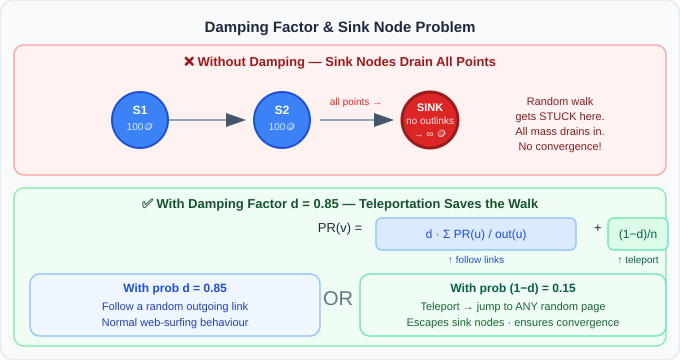
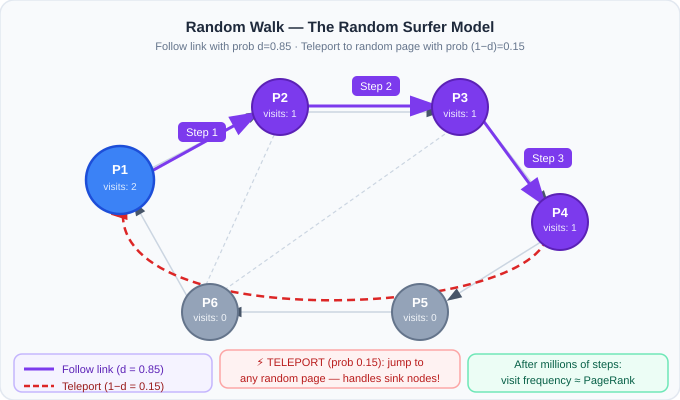
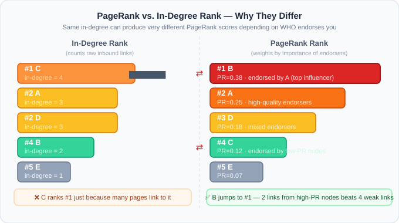

# PageRank & The Web Graph

## 1. The Problem: Reliability in a Sea of Pages

> **Imagine it's 1995.** The internet exists. Hyperlinks exist—clicking one transports you to a completely different webpage. Now there are **millions** of webpages. How do you know which result is *reliable* when you search for anything?

**Naive Solution 1 — Hire People:** Pay human editors to manually rate every page. This is the approach early directories like Yahoo! used. It **quickly becomes unfeasible** because:
- The web grows faster than any team can review it.
- It costs hundreds of thousands of dollars annually (TrendHub case: $500,000/year for 100 analysts).
- Ratings become stale and inconsistent.

**The Breakthrough Idea:** Let the structure of the web itself vote on reliability. If Page A links to Page B, Page A is **endorsing** Page B. A page that is endorsed by many other important pages must itself be important. This is the core insight behind **Google's PageRank**.

---

## 2. The Web Graph

The internet can be modeled as a **directed graph**:
- **Nodes** = webpages (or content creators, research papers, basketball teams…)
- **Directed Edges** = hyperlinks (or endorsements, citations, game losses)

```
Page A ──links to──► Page B
Page C ──links to──► Page B  
Page B ──links to──► Page D
```

Page B has **in-degree 2** (two pages link to it) and **out-degree 1** (it links to one page).

> **Key Insight:** A page's importance is NOT just how many links it receives (in-degree), but also from *whom* it receives them. An endorsement from an already-important page is worth more.


---

## 3. How Long Does a Random Walk Take? — The n log n Rule

### The Random Walk Concept

A **random walk** on a graph: start at any node, randomly follow an outgoing edge, repeat. The question is: **how many steps** are needed before you've visited *most* of the graph?

For a graph with **n nodes**, the expected number of steps to visit nearly all nodes is approximately:

$$\text{Steps} \approx n \ln n$$

where $\ln$ is the natural logarithm.

### Why n log n?

This arises from the **Coupon Collector's Problem**: imagine you need to collect n different coupons where each draw is random. The expected number of draws is $n \cdot H_n \approx n \ln n$, where $H_n$ is the $n$-th Harmonic number. Each "new node visited" is like collecting a new coupon.

### Worked Example (Assignment Q1 — TrendHub, 8,000 creators)

$$\text{Steps} \approx 8000 \times \ln(8000) = 8000 \times 8.987 \approx 71,898 \approx \textbf{72,000}$$

> ✅ **Answer: Approximately 72,000 random walk steps** are required for comprehensive mapping.

---

## 4. The Social Graph Intuition: Coin Dropping

Before we formalize PageRank mathematically, here's the intuition through a thought experiment:

### Setup
- You have **30 people** (nodes) with a friendship graph.
- You want to find **who is the most important person**.
- Give each person **100 coins**.

### The Rules (Iteration)
At each round, every person **distributes all their coins equally** among their neighbours (the people they are connected to / endorse).

- If Alice has 200 coins and is connected to Bob and Carol, she gives 100 to Bob and 100 to Carol.
- Repeat this for many rounds.
- After the system **converges** (values stop changing significantly), the person with the **most coins is the most important**.

### Why This Works
People who are endorsed by many important people accumulate more coins. The coins "flow" through the network and naturally pool at the most central nodes.


> **Key Property:** This iterative coin-dropping converges to the same result as **PageRank**. The two methods are mathematically equivalent.

---

## 5. Google PageRank: Formal Definition

### The PageRank Score

For a node $v$ in a directed graph, PageRank is defined **recursively**:

$$PR(v) = \sum_{u \to v} \frac{PR(u)}{|N^+(u)|}$$

Where:
- The sum is over all nodes $u$ that have an edge **pointing to** $v$
- $|N^+(u)|$ is the **out-degree** of node $u$ (how many edges it sends out)
- $PR(u)$ is the PageRank of the endorsing node

**In words:** Your PageRank equals the sum of fractions of PageRank you receive from each person who endorses you. If someone with high PageRank endorses only 5 people, you get $\frac{1}{5}$ of their score — much more valuable than if they endorse 500 people (where you'd only get $\frac{1}{500}$).

### The Recursive Nature

This is a **self-referential** definition:
> You are influential if influential people say you are influential.

This must be solved **iteratively** — start with equal scores, apply the formula repeatedly until convergence.

---

## 6. Method 1 — Points Distribution (Power Iteration)

### Algorithm

1. **Initialize:** Give every node $N$ points (e.g., 100 points each, or $\frac{1}{n}$ normalized).
2. **Iterate:** Each node distributes ALL its current points equally among its outgoing neighbours.
3. **Repeat** until scores stabilize (converge).
4. **Rank** nodes by final point totals.

### Concrete Example

Graph with 4 pages: A, B, C, D

```
A ──► B
A ──► C
B ──► D
C ──► D
D ──► A
```

**Iteration 0 (initial):** A=100, B=100, C=100, D=100

**Iteration 1:**
- A sends 50 to B, 50 to C → A gives away all 100
- B sends all 100 to D
- C sends all 100 to D
- D sends all 100 to A

After Iter 1: A=100 (from D), B=50 (from A), C=50 (from A), D=200 (from B+C)

**After convergence**, D will rank highest because it receives from both B and C.

### NCAA Basketball Application (Case Study 2)

In basketball PageRank:
- **Nodes** = teams
- **Edge direction**: If Team A **defeats** Team B → edge goes **from B to A** (loser "vouches for" winner's superiority)
- So winning teams accumulate **incoming edges** (get points); losing teams distribute their points to whoever beat them

**Example from assignment:** Team Alpha has 240 points and lost to exactly 3 opponents.
$$\text{Points each opponent receives} = \frac{240}{3} = \textbf{80 points}$$

**Multi-team calculation (Assignment):**
- Team A: 500 pts, lost to B and C → B gets $\frac{500}{2} = 250$, C gets $\frac{500}{2} = 250$
- Team D: 300 pts, lost only to B → B gets $\frac{300}{1} = 300$
- Team E: 200 pts, lost to B, C, D → B gets $\frac{200}{3} \approx 66.67$

$$\text{Total for Team B} = 250 + 300 + 66.67 \approx \textbf{617}$$

---

## 7. The Damping Factor: Handling Sink Nodes

### The Problem — Sink Nodes

A **sink node** is a node with **no outgoing edges** (e.g., a webpage with no links, a recent research paper with no citations). In the iterative algorithm, sink nodes **absorb** all points and never re-distribute them. Eventually, all points pool at sinks and the algorithm breaks.



### The Solution — Damping Factor ($s$ or $d$)

Introduce a **damping factor** $d$ (typically 0.85 or 0.8):

$$PR_{new}(v) = \frac{1-d}{n} + d \cdot \sum_{u \to v} \frac{PR(u)}{|N^+(u)|}$$

**What this means:**
- With probability $d$: follow a random outgoing link (normal walk)
- With probability $(1-d)$: **teleport** to a completely random node

For the **points distribution method** with damping factor $s = 0.8$:
- Each node **retains $s = 80\%$** of its current points.
- The remaining $20\%$ is **redistributed uniformly** across ALL nodes.

### Worked Example (Case Study 3 — Research Papers)

A paper has **250 points**, $s = 0.8$, network has $n = 500$ papers each starting at 100 pts.

Total points in system = $500 \times 100 = 50,000$

**Step 1 — Retain:**
$$250 \times 0.8 = \textbf{200 points retained}$$

**Step 2 — Redistribution pool:**
$$50,000 \times (1 - 0.8) = 50,000 \times 0.2 = 10,000 \text{ total redistributed}$$

$$\text{Each paper receives} = \frac{10,000}{500} = \textbf{10 points}$$

> ✅ **Answer: 200 points retained + 10 points from redistribution = 210 total**

---

## 8. Method 2 — Random Walk (Monte Carlo Simulation)

### The Intuition

A **random surfer** starts on any page and randomly:
- **With probability $d$:** clicks a random outgoing hyperlink
- **With probability $(1-d)$:** teleports to a completely random page (handles sinks!)

Running millions of such journeys and counting **how often each page is visited** gives the PageRank distribution.

### Why It's Equivalent to Coin Dropping

Both methods converge to the **same ranking** because:
- Coin dropping = **deterministic** iteration of the PageRank equation
- Random walk = **stochastic sampling** of the same stationary distribution

The random walk's long-run visit frequency = the PageRank score.



### Worked Example (TrendHub — Assignment Q4)

TrendHub ran 100,000 random discovery journeys. Creator Jordan was visited **3,500 times**.

$$\text{Percentage} = \frac{3500}{100000} \times 100 = \textbf{3.5\%}$$

> ✅ **Answer: 3.5**

---

## 9. PageRank vs. Degree Rank (In-Degree)

### Why They Differ

| Metric | What it measures | Limitation |
|---|---|---|
| **In-Degree Rank** | Total number of incoming links | Treats all endorsements equally — 500 endorsements from nobodies ranks same as 5 from influencers |
| **PageRank** | Weighted recursive importance | Accounts for WHO endorses you, not just how many |

### The Critical Distinction

A node CAN have:
- **High in-degree, Low PageRank**: Many low-quality endorsements from unimportant nodes. Example: 2020 survey paper with 320 citations from obscure venues → ranked 67th in PageRank.
- **Low in-degree, High PageRank**: Few but high-quality endorsements. Example: 1995 neural networks paper with only 45 direct citations but endorsed by seminal papers → ranked 3rd in PageRank.

### The Ratio Test (Case Study 3 Assignment Calculation)

Paper 1: $\text{in-degree} = 5$, $PR = 0.0087$ → ratio = $\frac{0.0087}{5} = 0.00174$

Paper 2: $\text{in-degree} = 150$, $PR = 0.0031$ → ratio = $\frac{0.0031}{150} = 0.0000207$

$$\frac{\text{ratio}_1}{\text{ratio}_2} = \frac{0.00174}{0.0000207} \approx \textbf{84.00}$$



---

## 10. The Recursive "Importance" Definition

PageRank enforces a **recursive definition of importance**:

> A creator is influential **if and only if** influential creators endorse them.

### Why Selectivity Matters

Consider two scenarios for Creator Lisa vs. Creator Mike:

| | Lisa | Mike |
|---|---|---|
| Endorsers | 8 mega-influencers | 200 micro-influencers |
| Quality of endorsers | Each has 50+ endorsements from verified high-quality creators | Average reach |
| Each endorser endorses | Only 5 people each | Many people |
| Points received from each endorser | High (concentrated: $\frac{PR_{mega}}{5}$, large numerator, small denominator) | Low (diluted: $\frac{PR_{micro}}{many}$, small numerator) |

> ✅ **Lisa ranks higher** because quality AND selectivity of endorsements carry weight.

### The Thin Distribution Problem

Creator A with 1M followers who endorses 500 others → distributes points across 500 recipients → each receives a **tiny fraction** ($\frac{PR_A}{500}$).

Creator B with 200K followers who endorses only 10 → each recipient gets $\frac{PR_B}{10}$ → much higher per-endorsement value if $PR_B$ is significant.

---

## 11. Real-World Applications of PageRank

PageRank's core insight — **importance from connection quality, not quantity** — transfers across many domains:

| Domain | Nodes | Edges | Insight |
|---|---|---|---|
| **Web Search** | Webpages | Hyperlinks | Original PageRank |
| **Social Media** | Content creators | Endorsements/mentions | TrendHub case |
| **Academic Citations** | Research papers | Citations | Papers cited by high-impact papers rank higher |
| **Sports Analytics** | Teams | Game results (loser→winner) | Transitive strength validation |
| **Biology (GeneRank)** | Genes | Biological interactions | Identifies critical genes in pathways |
| **Environmental Science** | Chemical compounds | Ecosystem transfer | Maps toxic accumulation chains |
| **Finance** | Companies/stocks | Supply chain & board membership | Identifies market-leading stocks |
| **Tennis** | Players | Match results | Jimmy Connors ranks highest by historical graph |

---

## 12. PageRank in NCAA Basketball (Case Study 2 Deep Dive)

### Setup
- 5,000+ games → directed graph
- If A beats B: edge **B → A** (loser endorses winner)
- Start: each team with 100 points
- Damping: 0.85 (addresses sink problems)

### Transitive Validation
Duke beats UNC; UNC beats Kentucky → Duke gains **indirect validation** from Kentucky's strength even without playing them directly. This captures **conference quality effects**.

### Limitations
1. **Damping factor sensitivity**: 0.5 vs 0.85 vs 0.9 produce different top-10 orderings
2. **Cannot account for**: injuries, momentum, coaching adjustments, fatigue
3. **Conference bias**: Teams from stronger conferences accumulate more validation, even if weaker in cross-conference play
4. **Margin of victory ignored**: A 1-point win and 30-point win are treated identically

### Why Edges Go Loser → Winner
This creates **network flow where losers distribute authority to winners** — exactly mirroring how hyperlinks distribute PageRank from the linking page to the linked page. The loser "vouches for" the winner's superiority.

---

## 13. Assignment Answer Reference Sheet

| Question | Answer | Key Formula |
|---|---|---|
| TrendHub n=8,000 walk steps | **72,000** | $8000 \times \ln(8000) \approx 71,898$ |
| Creator A influence point distribution | **Thin (÷ 500 recipients)** | Each gets $\frac{PR_A}{500}$ |
| Creator B vs A despite fewer followers | **B can rank higher** | Quality + selectivity of endorsers matters |
| Creator B's selectivity value | **More valuable endorsements** | Small out-degree → large fraction received |
| Lisa vs. Mike | **Lisa ranks higher** | Quality × selectivity > raw count |
| Jordan 3500/100000 | **3.5%** | Direct division |
| Alpha 240 pts ÷ 3 opponents | **80 pts each** | $\frac{240}{3}$ |
| Team B total from A+D+E | **617** | $250 + 300 + 66.67 \approx 617$ |
| Paper 250 pts, s=0.8, n=500 | **200 retained + 10 redistributed** | $250 \times 0.8 = 200$; $\frac{50000 \times 0.2}{500} = 10$ |
| PR/in-degree ratio | **84.00** | $\frac{0.00174}{0.0000207}$ |
| Why teleportation is needed | **Sinks accumulate all mass** | Without it, random walk terminates/stalls at sinks |
| Why graph ranking > follower count | **Recursive validation + fake follower resistance** | PageRank is recursively validated; follower counts can be bought |

---

## 14. Common Exam Misconceptions

> [!WARNING]
> **Misconception 1:** "More endorsements always = higher PageRank"
> 
> **Reality:** An endorsement from a low-PageRank node with many outgoing edges contributes almost nothing. An endorsement from a high-PageRank selective node can be game-changing.

> [!WARNING]
> **Misconception 2:** "In-degree and PageRank are linearly correlated"
> 
> **Reality:** The scatter plot of in-degree vs PageRank is non-linear with notable outliers in both directions. High in-degree can mean LOW PageRank if all endorsers are low-quality.

> [!WARNING]
> **Misconception 3:** "Random walk and points distribution give different answers"
> 
> **Reality:** They converge to the **same stationary distribution** — they are two equivalent views of the same mathematical object.

> [!NOTE]
> **Why slight differences occur in practice (Case Study 3):**
> 1. Two papers may have **nearly identical true PageRank values**, causing rank ambiguity
> 2. 1,000,000 iterations may be **insufficient** for complete convergence to exact values
> 3. Random walk introduces **stochastic variation** (it's probabilistic sampling)
> Note: NetworkX using 0.85 damping vs Rajesh's 0.80 does NOT explain ordering differences between ranked-15th and 16th papers — that's a damping difference that shifts the entire distribution.

> The full Python implementation is in `code/07_pagerank.py`.
