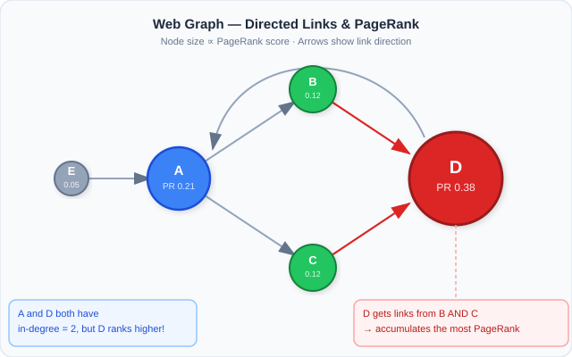
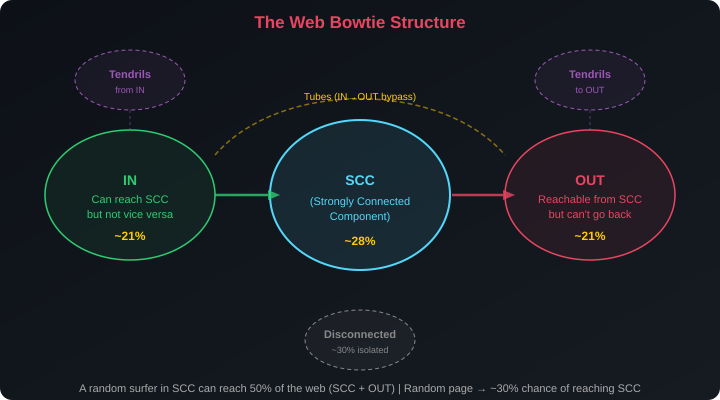
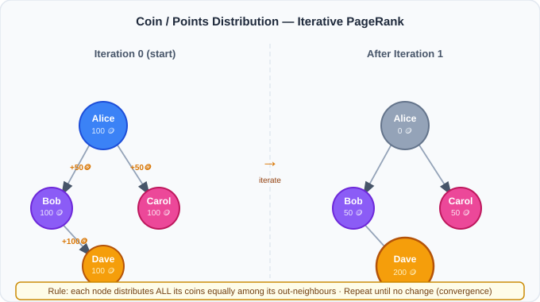
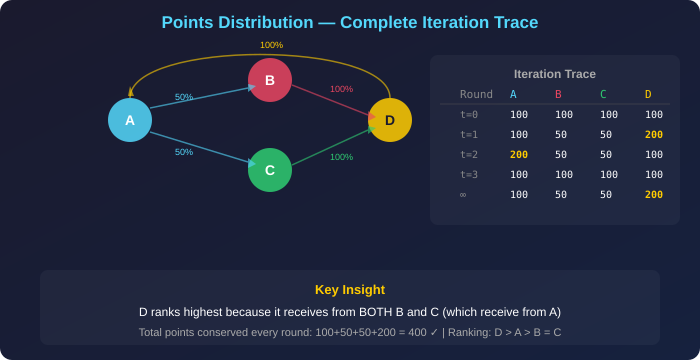

# PageRank & The Web Graph — Plain Language Notes

> **What this covers:** Why was finding reliable information on the early web so hard, and how did Google solve it? What is the web graph and what does its structure look like at global scale? What is the bowtie model and why does it matter for search engines? How does the "coin dropping" thought experiment capture the core idea of PageRank? What is the formal PageRank equation and how do you compute it step-by-step? What are sink nodes and spider traps, and how does the damping factor fix them? How does the random walk interpretation connect to the matrix formulation? Why does PageRank disagree with simple in-degree ranking? How do you adapt PageRank for basketball, citation networks, and social platforms? This file covers the web graph model, the bowtie structure, random walks and the $n \ln n$ rule, the coin-dropping intuition, the formal PageRank equation and its recursive nature, power iteration with worked examples, the damping factor and teleportation, sink nodes and spider traps, PageRank vs in-degree ranking, the selectivity principle, real-world applications, and all three assignment case studies fully solved.

---

## Part 1 — The Problem: Reliability in a Sea of Pages

### The Landscape in 1995

> **Imagine it's 1995.** The internet exists. Hyperlinks exist — clicking one transports you across the world to a completely different page. There are **millions** of webpages. When you search for "flu symptoms," you get thousands of results. How do you know which result is **reliable**?

The web had no built-in quality signal. Anyone could create a page claiming anything. Search engines before Google simply matched keywords and counted how often the search term appeared on a page (term frequency). This was trivially gameable — just repeat "flu symptoms" a thousand times on your page and you'd rank #1.

### Why Naive Approaches Fail

| Approach | How it works | Why it fails |
|---|---|---|
| **Hire human editors** | Pay people to manually rate every page (e.g., early Yahoo!) | Web grows faster than humans can review; costs $500K+/year for 100 analysts (TrendHub case); ratings go stale |
| **Keyword frequency** | Rank pages by how often they mention the query term | Trivially gameable — spammers just repeat keywords |
| **Count incoming links** | Rank by how many other pages link to you (raw in-degree) | Treats all links equally — 500 links from spam sites count the same as 5 links from universities |

### The Breakthrough Idea

**Let the structure of the web itself vote on reliability.**

If Page A links to Page B, then Page A is **endorsing** Page B. This endorsement is more valuable if Page A itself is highly endorsed by others. A page endorsed by many important pages must itself be important.

This recursive insight — **you are important if important pages say you are important** — is the core of **Google's PageRank**, invented by Larry Page and Sergey Brin in 1998 at Stanford.

> **Why "PageRank"?** Named after Larry **Page** (co-founder of Google), not after "web pages." Though the pun is convenient.

---

## Part 2 — The Web Graph

### Modeling the Internet as a Directed Graph

The web can be modeled as a **directed graph** (digraph):
- **Nodes** = webpages (or creators, research papers, basketball teams — any entity)
- **Directed Edges** = hyperlinks (or endorsements, citations, game results)

```
Page A ──links to──► Page B      (A endorses B)
Page C ──links to──► Page B      (C also endorses B)
Page B ──links to──► Page D      (B endorses D)
```

**Key terminology:**

| Term | Definition | Example |
|---|---|---|
| **In-degree** of node $v$ | Number of edges **pointing TO** $v$ | Page B above has in-degree 2 (from A and C) |
| **Out-degree** of node $v$ | Number of edges **going FROM** $v$ | Page A has out-degree 1 (to B only) |
| **Strongly connected** | Every node can reach every other node by following directed edges | A cycle: A→B→C→A |
| **Sink node** | Node with out-degree 0 (no outgoing edges) | A webpage with no hyperlinks |
| **Source node** | Node with in-degree 0 (no incoming edges) | A brand-new page nobody has linked to yet |

> **Key Insight:** A page's importance is NOT just how many links it receives (in-degree), but **from WHOM** it receives them. An endorsement from an already-important page is worth more than a hundred links from obscure pages.



---

### The Bowtie Structure of the Web

In the year 2000, researchers from AltaVista, IBM, and Compaq crawled over 200 million pages and discovered that the web has a distinctive **bowtie-shaped** macro-structure:

| Component | Description | Approximate Size |
|---|---|---|
| **SCC (Strongly Connected Component)** | A giant core where any page can reach any other by following links | ~28% of all pages |
| **IN** | Pages that can reach the SCC by following links, but the SCC cannot reach them (one-way streets going IN) | ~21% |
| **OUT** | Pages reachable FROM the SCC, but that can't link back to it (one-way streets going OUT) | ~21% |
| **Tendrils** | Pages hanging off IN or OUT that can't reach (or be reached from) the SCC at all | ~21% |
| **Disconnected** | Completely isolated pages with no path to/from the SCC | ~9% |
| **Tubes** | Direct shortcuts from IN to OUT that bypass the SCC entirely | Small |

**Why this matters for PageRank:**

1. Pages in the **SCC** are the richest in PageRank — they can share authority circularly
2. Pages in **OUT** receive PageRank flow from the SCC but don't send it back — they tend to be content consumers (end-user pages)
3. Pages in **IN** send links toward the SCC but don't receive from it — they're trying to be discovered
4. **Disconnected** pages have essentially zero PageRank (no flow reaches them without teleportation)



> [!TIP]
> **For assignments:** If asked "What fraction of the web can a random surfer starting in the SCC eventually visit?", the answer is SCC + OUT ≈ 28% + 21% = **~49%** (following only directed links). With teleportation (damping factor), the surfer can eventually reach any page.

---

### Properties of Real Web Graphs

Real-world web graphs have several characteristic properties that distinguish them from random graphs:

| Property | What it means | Why it matters for PageRank |
|---|---|---|
| **Power-law degree distribution** | A few pages have millions of links; most have very few | Hub pages receive enormous PageRank; the distribution is extremely skewed |
| **Small diameter** | Any page can reach most others in ~19 clicks | PageRank information propagates quickly through the network |
| **High clustering** | Pages about similar topics tend to link to each other | PageRank accumulates in topical clusters |
| **Community structure** | Dense groups of related pages with sparse connections between | PageRank can get "trapped" in communities without damping |

---

## Part 3 — How Long Does a Random Walk Take? The $n \ln n$ Rule

### The Random Walk Concept

A **random walk** on a graph works like this: start at any node, randomly follow an outgoing edge, arrive at a new node, randomly follow one of its outgoing edges, and repeat. The question is: **how many steps** are needed before you've visited nearly every node at least once?

### The Coupon Collector's Problem

This question is equivalent to the famous **Coupon Collector's Problem**: if you need to collect $n$ different coupons, and each draw gives you a uniformly random coupon, how many draws until you have them all?

The expected number of draws is:

$$
E[\text{draws}] = n \cdot H_n \approx n \ln n
$$

Where $H_n = 1 + \frac{1}{2} + \frac{1}{3} + \cdots + \frac{1}{n}$ is the $n$-th Harmonic number, and $\ln$ is the natural logarithm.

**The intuition:** The first few coupons are easy to find (most draws give you something new). But the last few are extremely hard to collect — you keep getting duplicates. The $\ln n$ factor captures this: most of the time is spent hunting for the final uncollected nodes.

### Why This Applies to Web Graphs

Each "new node visited" during a random walk is like collecting a new coupon. The random walk must visit approximately $n \ln n$ nodes total to ensure nearly all $n$ distinct nodes have been hit at least once.

### Worked Example (Assignment Q1 — TrendHub, 8,000 creators)

$$
\text{Steps} \approx 8{,}000 \times \ln(8{,}000) = 8{,}000 \times 8.987 \approx 71{,}898 \approx \mathbf{72{,}000}
$$

> ✅ **Answer: Approximately 72,000 random walk steps** are required for comprehensive mapping.

### More Examples for Intuition

| Network size $n$ | Steps needed ($n \ln n$) | Observation |
|---|---|---|
| 100 | $100 \times 4.6 = 460$ | Small network — few hundred steps |
| 1,000 | $1{,}000 \times 6.9 = 6{,}900$ | ~7x the nodes means ~15x the steps |
| 10,000 | $10{,}000 \times 9.2 = 92{,}000$ | Notice: 10x the nodes → ~13x the steps |
| 1,000,000 | $1{,}000{,}000 \times 13.8 = 13{,}800{,}000$ | Large network but still manageable |

> **The $n \ln n$ growth rate** is barely faster than linear — making random walks practical even on large networks. This is why PageRank (which is, at its core, based on random walk visit frequencies) is computationally feasible on the web's billions of pages.

---

## Part 4 — The Social Graph Intuition: Coin Dropping

### The Thought Experiment

Before formalizing PageRank mathematically, this intuitive thought experiment captures the core idea:

**Setup:**
- 30 people (nodes) connected by a friendship graph
- Goal: find **who is the most important person**
- Give each person **100 coins** to start

**The Rules (each round):**
1. Every person **distributes ALL their coins equally** among their neighbours
2. A person with 200 coins and 4 neighbours gives 50 coins to each neighbour
3. Repeat for many rounds
4. After convergence (values stop changing), the person with the **most coins is the most important**

### Why This Works

The mechanism is self-reinforcing:
- People who are endorsed by many others **receive** more coins
- People who receive from **important** people receive **heavy** coins (because the giver had many coins to share)
- Over time, coins pool at the structurally central nodes — exactly the nodes that should rank highest

### The Conservation Property

After every round, the **total number of coins** in the system stays exactly the same. If Alice gives 50 to Bob and 50 to Carol, Alice loses 100 but Bob gains 50 and Carol gains 50. Net change = 0.

$$
\text{Total coins at time } t = \text{Total coins at time } 0 = \text{constant (always)}
$$

This conservation is what guarantees the system converges to a stable distribution rather than exploding or collapsing.

> **Key Property:** This iterative coin-dropping converges to the **same result** as the formal PageRank equation. The two methods are mathematically equivalent — coin-dropping is the deterministic version, random walk is the stochastic version.



---

## Part 5 — Google PageRank: Formal Definition

### The PageRank Equation

For a node $v$ in a directed graph, PageRank is defined **recursively**:

$$
\boxed{PR(v) = \sum_{u \to v} \frac{PR(u)}{|N^+(u)|}}
$$

Where:
- The sum is over all nodes $u$ that have a directed edge **pointing to** $v$
- $|N^+(u)|$ is the **out-degree** of node $u$ (how many edges it sends out)
- $PR(u)$ is the PageRank of the endorsing node $u$

### Breaking Down Each Component

| Symbol | Meaning | Effect on $v$'s PageRank |
|---|---|---|
| $PR(u)$ | How important is the endorser? | Higher = more valuable endorsement |
| $\|N^+(u)\|$ | How many OTHER things does the endorser also endorse? | Higher = each endorsement is diluted (less valuable) |
| $\frac{PR(u)}{\|N^+(u)\|}$ | The actual "contribution" of endorser $u$ to node $v$ | The endorsement amount = importance ÷ selectivity |

**In plain English:** Your PageRank equals the sum of fractions of PageRank you receive from each endorser. If someone with high PageRank endorses only 5 people, you get $\frac{1}{5}$ of their score — much more valuable than if they endorse 500 people (where you'd only get $\frac{1}{500}$).

### The Recursive Nature — Why Iteration Is Required

The definition is **self-referential:**

> You are influential **if and only if** influential people say you are influential.

This creates a system of simultaneous equations where every node's score depends on every other node's score. You can't solve Node A's score without knowing Node B's, but you can't solve Node B's without knowing Node C's, and so on.

**The solution: iterate.** Start with a guess (equal scores for everyone), apply the formula to update all scores simultaneously, repeat until the scores stop changing (converge). This is called **power iteration**.

---

## Part 6 — Method 1: Points Distribution (Power Iteration)

### The Algorithm

```
ALGORITHM: PageRank via Power Iteration
═══════════════════════════════════════

INITIALIZATION:
  Give every node N points (e.g., 100 each, or 1/n normalized)

EACH ITERATION:
  For every node u with out-degree d(u):
    Distribute u's current points equally to its d(u) outgoing neighbours
    Each neighbour receives: points(u) / d(u)
  
  After ALL nodes have distributed:
    Each node's new score = sum of all points received
    
  (Total points across all nodes remains constant)

REPEAT until scores stabilize (differences < threshold ε)

RANK nodes by final point totals
```

### Worked Example 1: 4-Node Network

**Graph:** A → B, A → C, B → D, C → D, D → A

```
     A ──► B
     │      │
     ▼      ▼
     C ──► D ──► A (cycle back)
```

**Iteration 0 (initial):** A=100, B=100, C=100, D=100 (total = 400)

**Iteration 1:**
- A has out-degree 2 (links to B and C) → sends 50 to B, 50 to C
- B has out-degree 1 (links to D) → sends 100 to D
- C has out-degree 1 (links to D) → sends 100 to D
- D has out-degree 1 (links to A) → sends 100 to A

**After Iteration 1:** A=100 (from D), B=50 (from A), C=50 (from A), D=200 (from B+C)

**Iteration 2:**
- A sends 50 to B, 50 to C
- B sends 50 to D
- C sends 50 to D
- D sends 200 to A

**After Iteration 2:** A=200, B=50, C=50, D=100

The scores oscillate but eventually converge. The **ranking is stable even during oscillation:** D consistently receives from two sources (B and C), making it the most important node.



### Why D Ranks Highest

D receives contributions from **two** nodes (B and C), each of which serves as a funnel for A's points. A funnels 50% of its value to B and 50% to C, who each pass 100% onward to D. D acts as a **convergence point** — a structural sink for authority flow.

### Worked Example 2: NCAA Basketball Application (Case Study 2)

In basketball PageRank:
- **Nodes** = teams
- **Edge direction**: If Team A **defeats** Team B → directed edge goes **from B to A** (the loser "vouches for" the winner's superiority)
- Winning teams accumulate **incoming edges** (gain points); losing teams distribute their points to whoever beat them

**Why edges go loser → winner:** This creates the exact same flow as hyperlinks on the web. A webpage that links OUT to another page is saying "that page has authority." A team that LOSES to another team is saying "that team is better than me." The loser endorses the winner, just as a webpage endorses the page it links to.

**Example from assignment:** Team Alpha has 240 points and lost to exactly 3 opponents.

$$
\text{Points each opponent receives} = \frac{240}{3} = \mathbf{80 \text{ points}}
$$

**Multi-team calculation (Assignment):**
- Team A: 500 pts, lost to B and C → B gets $\frac{500}{2} = 250$, C gets $\frac{500}{2} = 250$
- Team D: 300 pts, lost only to B → B gets $\frac{300}{1} = 300$
- Team E: 200 pts, lost to B, C, D → B gets $\frac{200}{3} \approx 66.67$

$$
\text{Total for Team B} = 250 + 300 + 66.67 \approx \mathbf{617}
$$

### Transitive Validation — Why PageRank Captures Indirect Strength

Duke beats UNC; UNC beats Kentucky. Duke never played Kentucky. But through PageRank:

1. Kentucky loses → distributes points to UNC
2. UNC (now enriched) loses → distributes points to Duke
3. Duke gains **indirect validation** from Kentucky's strength — even without playing them directly

This captures the **conference quality effect**: teams from stronger conferences accumulate more authority because their opponents themselves have more authority to distribute.

---

## Part 7 — Problems with Basic PageRank: Sinks and Traps

### Problem 1: Sink Nodes

A **sink node** is a node with **zero outgoing edges** (e.g., a webpage with no hyperlinks, a recently published paper with no citations yet).

**What goes wrong:**
- The sink node receives points from its incoming neighbours every round
- But it **never distributes** them (no outgoing edges)
- Points accumulate at the sink and are permanently removed from circulation
- After many rounds, ALL points pool at sink nodes → the rest of the graph converges to 0
- The ranking becomes meaningless — the sink node "wins" by default

### Problem 2: Spider Traps

A **spider trap** is a group of nodes (or even a single self-linking node) where once the random walk enters, it **never leaves**.

**Example:** Node A has only one outgoing edge — to itself (a self-loop). Once the random walk reaches A, it stays at A forever. All the probability mass concentrates at A.

**Even without self-loops:** A tightly connected cluster with no outgoing edges to the rest of the graph acts as a spider trap. Points flow in but never flow out.

### Why These Break the Algorithm

Both problems violate the **conservation property** that makes PageRank work:

| Problem | What it means mathematically | Effect |
|---|---|---|
| **Sink node** | Column in transition matrix sums to 0 (not 1) → NOT a valid Markov matrix | Probability "leaks" out, total mass decreases each round |
| **Spider trap** | All outgoing edges stay within the trap → probability concentrates | Other nodes lose all rank; trap node(s) get everything |


---

## Part 8 — The Damping Factor: Teleportation

### The Fix

Introduce a **damping factor** $d$ (Google's default: $d = 0.85$):

$$
\boxed{PR(v) = \frac{1-d}{n} + d \cdot \sum_{u \to v} \frac{PR(u)}{|N^+(u)|}}
$$

### What This Means: The Random Surfer Model

Imagine a random web surfer:

- **With probability $d = 0.85$:** follow a random outgoing hyperlink (normal browsing)
- **With probability $1-d = 0.15$:** get bored, open a completely random webpage (teleport)

This teleportation has three critical effects:

1. **Escapes sink nodes:** Even at a dead end with no links, the surfer teleports to a random page and continues (no more probability leak)
2. **Escapes spider traps:** Even inside a closed cycle, the surfer occasionally teleports out (no more permanent trapping)
3. **Guarantees ergodicity:** Every node can eventually reach every other node (because teleportation can reach any page), which mathematically guarantees convergence to a unique stable distribution

### Breaking Down the Formula

| Term | Value with $d=0.85$ | Meaning |
|---|---|---|
| $\frac{1-d}{n}$ | $\frac{0.15}{n}$ | A tiny baseline score every node gets just for **existing** (the teleportation share) |
| $d \cdot \sum_{u \to v} \frac{PR(u)}{\|N^+(u)\|}$ | 85% of link-based contribution | The weighted authority flowing through actual links, discounted by damping |

### Equivalent Interpretation: Points Distribution with Damping

For the **points distribution method** with damping factor $s$ (same as $d$):

1. Each node **retains** $s$ fraction of its current points for distribution
2. The remaining $(1-s)$ fraction from ALL nodes is pooled and **redistributed uniformly** across every node

### Worked Example (Case Study 3 — Research Papers)

A paper has **250 points**, damping $s = 0.8$, network has $n = 500$ papers each starting at 100 pts.

**Total points in system:** $500 \times 100 = 50{,}000$

**Step 1 — Retain:**

$$
250 \times 0.8 = \mathbf{200 \text{ points retained}}
$$

These 200 points are distributed to the papers this paper cites.

**Step 2 — Redistribution pool:**

$$
50{,}000 \times (1 - 0.8) = 50{,}000 \times 0.2 = 10{,}000 \text{ total redistributed}
$$

$$
\text{Each paper receives from the pool} = \frac{10{,}000}{500} = \mathbf{20 \text{ points per paper}}
$$

> ✅ **Answer: 200 points retained for link-based distribution + 20 points from the universal redistribution pool**

### Sensitivity to Damping Factor

| Damping $d$ | Link contribution | Teleportation share | Effect |
|---|---|---|---|
| $d = 0.50$ | 50% links, 50% random | Large teleportation | Scores more uniform — everyone gets a big baseline |
| $d = 0.85$ | 85% links, 15% random | Google's default | Good balance of link authority and baseline |
| $d = 0.95$ | 95% links, 5% random | Nearly no teleportation | Scores extremely sensitive to link structure |
| $d = 1.00$ | 100% links, 0% random | No teleportation at all | Vulnerable to sinks and traps — may not converge |

> [!WARNING]
> **Assignment trap:** Different damping factors ($s = 0.80$ vs $d = 0.85$) produce different PageRank values. If the assignment uses $s = 0.8$ but you use Google's default $d = 0.85$, your numerical answers will be wrong. Always check which damping factor the question specifies.

---

## Part 9 — Method 2: Random Walk (Monte Carlo Simulation)

### The Random Surfer Model

Instead of deterministic iteration, simulate millions of **random surfers** independently walking the web:

```
ALGORITHM: PageRank via Random Walk
═══════════════════════════════════

FOR each of K random journeys:
  Start at a uniformly random node
  
  FOR each step in the journey:
    With probability d: follow a random outgoing link
    With probability (1-d): teleport to any random node
    Record which node was visited
    
  End journey after a fixed number of steps (e.g., 1000 steps)

AFTER all K journeys:
  PageRank(v) = (number of times v was visited) / (total visits across all journeys)
```

### Why Random Walk = Coin Dropping

Both methods converge to the **same ranking** because they compute the **same underlying quantity:**

| Method | Type | What it computes |
|---|---|---|
| Coin dropping (power iteration) | **Deterministic** | Direct multiplication of the transition matrix |
| Random walk (Monte Carlo) | **Stochastic** | Sampling from the stationary distribution of the same transition matrix |

The random walk's **long-run visit frequency** equals the coin-dropping's **converged point distribution**. They are two views of the same mathematical object: the **dominant eigenvector** of the transition matrix (see Topic 09 for the linear algebra proof).

### Worked Example (TrendHub — Assignment Q4)

TrendHub ran 100,000 random discovery journeys. Creator Jordan was visited **3,500 times**.

$$
\text{Percentage} = \frac{3{,}500}{100{,}000} \times 100 = \mathbf{3.5\%}
$$

> ✅ **Answer: 3.5%** — This means the random surfer spends about 3.5% of their total browsing time on Jordan's content.

### Why Slight Differences Occur Between Methods

In practice, the coin-dropping method and the random walk method may produce **slightly different rankings** for closely-ranked nodes:

| Reason | Explanation |
|---|---|
| **Stochastic noise** | The random walk is a probabilistic simulation — each run gives slightly different visit counts |
| **Insufficient iterations** | 1,000,000 walks may not be enough for exact convergence to precise values |
| **Closely-ranked nodes** | If two nodes have PageRank 0.00312 and 0.00314, random noise can swap their relative order |

> [!NOTE]
> These differences are NOT caused by different damping factors (using $d = 0.85$ vs $d = 0.80$ would change the entire distribution systematically, not just swap two adjacent ranks). Different damping factors are a **global** effect, while rank swaps between adjacent nodes are a **local** numerical precision effect.

---

## Part 10 — PageRank vs. In-Degree Ranking

### Why They Often Disagree

| Metric | What it measures | Limitation |
|---|---|---|
| **In-Degree Rank** | Total number of incoming links | Treats all endorsements equally — 500 from nobodies = 5 from presidents |
| **PageRank** | Weighted recursive importance from link quality AND selectivity | Computationally more expensive; requires iteration |

### The Two Cases Where They Diverge

**Case 1: High in-degree, Low PageRank**

A page with many links from **unimportant, non-selective** sources.

> *Example (Case Study 3):* 2020 survey paper with 320 citations from obscure conference papers → in-degree rank = #3 → PageRank rank = #67. The citations are numerous but from low-authority sources.

**Case 2: Low in-degree, High PageRank**

A page with few links from **very important, highly selective** sources.

> *Example:* 1995 neural networks paper with only 45 direct citations but endorsed by 3 seminal textbooks and 2 Nobel laureate papers → in-degree rank = #89 → PageRank rank = #3. Few citations, but each one carries enormous weight.


### The Ratio Test (Assignment Calculation)

To quantify how much a node over- or under-performs its in-degree:

$$
\text{Per-link PageRank} = \frac{PR(v)}{\text{in-degree}(v)}
$$

**Worked Example (Case Study 3):**

Paper 1: in-degree = 5, $PR = 0.0087$ → ratio $= \frac{0.0087}{5} = 0.00174$

Paper 2: in-degree = 150, $PR = 0.0031$ → ratio $= \frac{0.0031}{150} = 0.0000207$

$$
\frac{\text{ratio}_1}{\text{ratio}_2} = \frac{0.00174}{0.0000207} \approx \mathbf{84.00}
$$

Paper 1's citations are **84 times more valuable per citation** than Paper 2's. This demonstrates the massive quality difference between endorsements.

---

## Part 11 — The Selectivity Principle

### Why Selectivity Matters as Much as Importance

The PageRank contribution from endorser $u$ to node $v$ is:

$$
\text{Contribution}_{u \to v} = \frac{PR(u)}{|N^+(u)|}
$$

This fraction has **two levers:**

1. **Numerator $PR(u)$** — how important is the endorser? (importance)
2. **Denominator $|N^+(u)|$** — how many others does the endorser also endorse? (selectivity)

### Worked Comparison: Lisa vs. Mike

| | Lisa | Mike |
|---|---|---|
| **Endorsers** | 8 mega-influencers | 200 micro-influencers |
| **Quality of endorsers** | Each has 50+ endorsements from verified high-quality creators | Average quality |
| **Each endorser endorses** | Only 5 people each | Many people each |
| **Points per endorser** | High (large $PR_{mega}$ ÷ small 5) | Low (small $PR_{micro}$ ÷ large denominator) |

> ✅ **Lisa ranks higher** because quality AND selectivity of endorsements carry weight. 8 × (large value / 5) ≫ 200 × (small value / many).

### The Thin Distribution Problem

| Creator | Followers | Endorses | PR per endorsement |
|---|---|---|---|
| Creator A | 1,000,000 | 500 others | $\frac{PR_A}{500}$ — **thin spread** |
| Creator B | 200,000 | 10 others | $\frac{PR_B}{10}$ — **concentrated** |

Even though Creator A has 5× more followers (and likely higher $PR_A$), the **per-endorsement value** may be higher from Creator B if $\frac{PR_B}{10} > \frac{PR_A}{500}$.

This can happen when $PR_B > \frac{PR_A}{50}$, which is common — micro-influencers with focused, selective endorsements can deliver more PageRank per recommendation than mega-influencers who endorse everything.

---

## Part 12 — NCAA Basketball: PageRank Deep Dive (Case Study 2)

### Setup

- 5,000+ games across a season → directed graph
- If A beats B: directed edge **B → A** (loser endorses winner)
- Each team starts with 100 points
- Damping: 0.85 (addresses both sink and connectivity issues)

### What PageRank Captures That Win Count Doesn't

| Metric | What it captures | What it misses |
|---|---|---|
| **Win count** | Total victories | Whether opponents were strong or weak |
| **Win percentage** | Victories relative to games played | Quality of opponents |
| **PageRank** | Victories weighted by the strength of defeated teams, recursively | Margin of victory, injuries, momentum |

A team that beats 15 weak teams might have a better win record than a team that beats 5 strong teams — but PageRank will correctly identify the second team as stronger because the defeated teams carry more authority.

### Limitations

| Limitation | Why it matters |
|---|---|
| **Damping factor sensitivity** | $d = 0.50$ vs $d = 0.85$ vs $d = 0.95$ produce different top-10 orderings |
| **Margin of victory ignored** | A 1-point win and a 30-point win are treated identically |
| **Cannot account for context** | Injuries, momentum, coaching adjustments, fatigue |
| **Conference bias** | Teams from stronger conferences accumulate more validation, even if individually they may underperform in cross-conference play |
| **Time-invariant** | A loss in September weighs the same as a loss in March (but form changes over a season) |

---

## Part 13 — Real-World Applications of PageRank

PageRank's core insight — **importance from connection quality, not quantity** — transfers across many domains:

| Domain | Nodes | Edges | Insight |
|---|---|---|---|
| **Web Search** | Webpages | Hyperlinks | Original PageRank — revolutionised search engines |
| **Social Media** | Content creators | Endorsements/mentions | TrendHub case: identify authentic influencers |
| **Academic Citations** | Research papers | Citations | Highly-cited-by-important-papers papers rank higher than simply highly-cited papers |
| **Sports Analytics** | Teams | Game results (loser→winner) | Transitive strength: captures conference quality effects |
| **Biology (GeneRank)** | Genes | Biological interactions | Identifies critical genes in metabolic pathways |
| **Environmental Science** | Chemical compounds | Ecosystem transfer | Maps toxic bioaccumulation chains through food webs |
| **Finance** | Companies | Supply chain & board membership | Identifies systemically important firms |
| **Tennis** | Players | Match results (loser→winner) | Jimmy Connors ranks highest by historical match graph |
| **Law** | Court rulings | Legal citations | Seminal cases cited by other important rulings rank highest |
| **Recommendation systems** | Products | Co-purchase links | "Customers who bought X also bought Y" creates a product graph |

> [!TIP]
> **Assignment pattern recognition:** Whenever a question says "how do we rank entities based on their relationships?", the answer framework is almost always PageRank or a variant. The three key adaptations are: (1) what are the nodes? (2) what direction do edges go? (3) what does a link mean (endorsement, defeat, citation)?

---

## Part 14 — Assignment Answer Reference Sheet

| Question | Answer | Key Formula |
|---|---|---|
| TrendHub $n = 8{,}000$ walk steps | **72,000** | $8{,}000 \times \ln(8{,}000) \approx 71{,}898$ |
| Creator A influence point distribution | **Thin (÷ 500 recipients)** | Each gets $\frac{PR_A}{500}$ |
| Creator B vs A despite fewer followers | **B can rank higher** | Quality + selectivity of endorsers matters |
| Creator B's selectivity value | **More valuable endorsements** | Small out-degree → large fraction received |
| Lisa vs. Mike | **Lisa ranks higher** | Quality × selectivity > raw count |
| Jordan 3,500 / 100,000 | **3.5%** | Direct division |
| Alpha 240 pts ÷ 3 opponents | **80 pts each** | $\frac{240}{3}$ |
| Team B total from A+D+E | **617** | $250 + 300 + 66.67 \approx 617$ |
| Paper 250 pts, $s = 0.8$, $n = 500$ | **200 retained + 20 redistributed** | $250 \times 0.8 = 200$; $\frac{50{,}000 \times 0.2}{500} = 20$ |
| PR/in-degree ratio | **84.00** | $\frac{0.00174}{0.0000207}$ |
| Why teleportation is needed | **Sinks absorb all mass; traps concentrate mass** | Without teleportation, random walk terminates or cycles |
| Why graph ranking > follower count | **Recursive validation + fake follower resistance** | PageRank is recursively validated; follower counts can be bought |
| Fraction of web reachable from SCC | **~49%** | SCC (~28%) + OUT (~21%) |
| Edge direction in basketball | **Loser → Winner** | Loser "endorses" winner, like a webpage linking to an authority |

---

## Part 15 — Common Traps and Misconceptions

> [!WARNING]
> **Misconception 1: "More endorsements always = higher PageRank"**
>
> **Reality:** An endorsement from a low-PageRank node with many outgoing edges contributes almost nothing. An endorsement from a high-PageRank selective node can be game-changing. It's about **WHO** endorses you and how **selective** they are, not just how many.

> [!WARNING]
> **Misconception 2: "In-degree and PageRank are linearly correlated"**
>
> **Reality:** The scatter plot shows extreme outliers in both directions. High in-degree with low PageRank = mass citations from nobodies. Low in-degree with high PageRank = few citations from superstars. The ratio can differ by 84× or more (Case Study 3).

> [!WARNING]
> **Misconception 3: "Random walk and points distribution give different answers"**
>
> **Reality:** They converge to the **same stationary distribution** — they are two equivalent views of the same mathematical object (the dominant eigenvector of the transition matrix).

> [!WARNING]
> **Misconception 4: "Sink nodes just have lower PageRank"**
>
> **Reality:** Without the damping fix, sink nodes don't just score low — they **break the entire algorithm** by absorbing all probability mass. The remaining nodes ALL converge to 0. The issue is systemic, not local.

> [!WARNING]
> **Misconception 5: "A higher damping factor is always better"**
>
> **Reality:** $d = 1.0$ means no teleportation, which makes the algorithm vulnerable to sinks and traps. $d = 0.5$ gives too much weight to random teleportation, making all nodes' scores more uniform and less informative. $d = 0.85$ is a well-tested compromise.

> [!WARNING]
> **Misconception 6: "PageRank measures content quality"**
>
> **Reality:** PageRank measures **structural importance** in the link graph — how central a node is in the endorsement network. A page can have high PageRank with terrible content if many important pages happen to link to it. Content quality and link-graph importance are correlated but NOT identical.

| ❌ Wrong Statement | ✅ Correct Understanding |
|---|---|
| "Most-linked-to page always has highest PageRank" | Not if endorsers are unimportant or non-selective |
| "Random walks take forever on large graphs" | Only $n \ln n$ steps — barely more than linear |
| "Damping factor 1.0 is optimal" | $d = 1.0$ breaks the algorithm — sinks and traps can't be escaped |
| "PageRank requires knowing the graph structure in advance" | Random walk method only requires following links — you discover the graph as you walk |
| "Web graph is uniformly connected" | It has a bowtie structure: SCC + IN + OUT + tendrils + disconnected |
| "Convergence depends on the starting values" | Convergence is guaranteed to the SAME result regardless of initialization |

---

## Part 16 — Formulas and Equations Cheat Sheet

### PageRank (Basic)

$$
PR(v) = \sum_{u \to v} \frac{PR(u)}{|N^+(u)|}
$$

### PageRank (With Damping)

$$
PR(v) = \frac{1-d}{n} + d \sum_{u \to v} \frac{PR(u)}{|N^+(u)|}
$$

### Random Walk Coverage

$$
\text{Steps to visit all } n \text{ nodes} \approx n \ln n
$$

### Transition Matrix Update

$$
\mathbf{r}^{(t+1)} = M \cdot \mathbf{r}^{(t)}
$$

### Steady-State Condition

$$
M \mathbf{r}^* = \mathbf{r}^* \qquad \text{(eigenvector with eigenvalue } \lambda = 1\text{)}
$$

### Points Retention with Damping

$$
\text{Retained} = s \times \text{current points} \qquad \text{Redistributed per node} = \frac{(1-s) \times \text{total pool}}{n}
$$

### Per-Link PageRank Ratio

$$
\text{Per-link PR} = \frac{PR(v)}{\text{in-degree}(v)}
$$

---

## Part 17 — Connections to Other Topics in This Course

| This topic | Connection to PageRank & Web Graph |
|---|---|
| **Strength of Weak Ties** | High-PageRank nodes that bridge communities capture authority flow from multiple sources. Weak ties serve as the bridges that enable PageRank to spread between clusters. |
| **Community Detection** | Community structure affects how PageRank distributes. Dense communities trap PageRank locally (like mini-spider traps). Girvan-Newman's edge betweenness identifies the weak ties that channel PageRank between communities. |
| **Homophily** | Homophily-driven clusters cause PageRank to concentrate within topically similar pages. Without damping/teleportation, these clusters would trap all the rank. |
| **Structural Balance** | In signed networks, PageRank can be extended with trust/distrust signals. Enemies' endorsements might carry negative weight — connecting balance theory to weighted PageRank. |
| **Diffusion & Cascades** | Seeding high-PageRank nodes for information cascades reaches the most people fastest. PageRank identifies the structurally optimal seed set — nodes that are central in the endorsement flow. |
| **HITS Algorithm** | HITS gives two scores (hub + authority) per node; PageRank gives one. HITS is topic-specific; PageRank is global. Both converge via matrix power iteration but HITS is less stable to perturbation. See Topic 09 for full comparison. |
| **Epidemics (SIR/SIS)** | High-PageRank nodes are "super-spreaders" — if infected, they rapidly transmit to many important contacts. Targeting high-PageRank nodes for vaccination is an effective containment strategy. |
| **Power Law** | Web graph in-degree follows a power law → a few pages dominate PageRank. These hub pages are the power-law tail, receiving disproportionate authority via preferential attachment. |
| **Small World Effect** | The small-world property (short paths) ensures PageRank converges quickly — information only needs ~$\log n$ hops to propagate across the network. |
| **Influence Maximization** | Topic 13 extends PageRank's intuition: "Which $k$ nodes should we activate to maximise cascade spread?" K-core decomposition and centrality measures (which build on PageRank-like ideas) provide the answer. |

---

## Part 18 — Practice Questions (Self-Test)

1. **A network has 10,000 nodes. Approximately how many random walk steps are needed to visit all nodes?**
   - Answer: $10{,}000 \times \ln(10{,}000) = 10{,}000 \times 9.21 \approx 92{,}100$ steps.

2. **Node X receives links from 3 nodes with PR values 0.4, 0.2, and 0.1. Those nodes have out-degrees 2, 5, and 1 respectively. What is X's PageRank (no damping)?**
   - Answer: $PR(X) = \frac{0.4}{2} + \frac{0.2}{5} + \frac{0.1}{1} = 0.2 + 0.04 + 0.1 = 0.34$.

3. **Why does a sink node break PageRank?**
   - Answer: A sink node has out-degree 0, so its column in the transition matrix sums to 0 (not 1). Probability mass that enters the sink never leaves → total mass decreases each round → the Markov property is violated → convergence to a meaningful distribution is not guaranteed.

4. **A paper has 300 points, damping $s = 0.8$, and the network has 600 papers at 100 points each. How many points does each paper get from redistribution?**
   - Answer: Total pool = $600 \times 100 = 60{,}000$. Redistributed = $60{,}000 \times 0.2 = 12{,}000$. Per paper = $12{,}000 / 600 = 20$ points. Retained from this paper = $300 \times 0.8 = 240$ points.

5. **Paper A has in-degree 200 and PageRank 0.005. Paper B has in-degree 10 and PageRank 0.008. Which paper's citations are more valuable per-citation?**
   - Answer: Paper A: $0.005/200 = 0.000025$. Paper B: $0.008/10 = 0.0008$. Ratio: $0.0008/0.000025 = 32$. Paper B's citations are **32 times more valuable** per citation.

6. **In NCAA basketball PageRank, why do edges go from loser to winner instead of winner to loser?**
   - Answer: Because the loser is "vouching for" the winner's superiority — exactly like a webpage linking to an authority page. The loser distributes its accumulated strength to whoever beat it, flowing authority from the defeated to the victorious.

7. **If damping factor $d = 0.85$ and a network has 1,000 nodes, what is the baseline teleportation score each node receives?**
   - Answer: $(1 - 0.85) / 1{,}000 = 0.15 / 1{,}000 = 0.00015$ per node per round.

8. **What percentage of the web can a random surfer in the SCC reach by following directed links only (no teleportation)?**
   - Answer: SCC (~28%) + OUT (~21%) = ~49% of all pages. The surfer can reach pages within the SCC and pages in the OUT component, but cannot reach IN, tendrils, or disconnected pages.

9. **Creator A has 1M followers and endorses 500 others. Creator B has 100K followers and endorses 10 others. If $PR_A ≈ 5 \times PR_B$, who gives a more valuable per-endorsement?**
   - Answer: Per-endorsement from A = $PR_A/500 = 5 \cdot PR_B/500 = PR_B/100$. Per-endorsement from B = $PR_B/10$. Ratio: $(PR_B/10) / (PR_B/100) = 10$. **Creator B gives 10× more PageRank per endorsement** despite having fewer followers.

10. **Why does PageRank always converge regardless of initial values?**
    - Answer: The transition matrix $M$ (with damping) is a valid Markov matrix where every column sums to 1. Its dominant eigenvalue is exactly 1, and all other eigenvalues have $|\lambda| < 1$. After $k$ iterations, the components corresponding to smaller eigenvalues decay as $\lambda^k \to 0$, leaving only the dominant eigenvector — which IS the PageRank vector. Since this eigenvector is the same regardless of the starting vector, convergence is guaranteed to the same final answer.

> The full Python implementation is in `code/07_pagerank.py`.
> See [`09_HITS_and_Recommender_Systems.md`](09_HITS_and_Recommender_Systems.md) for the matrix algebra, eigenvalue proof, and HITS vs PageRank comparison.
