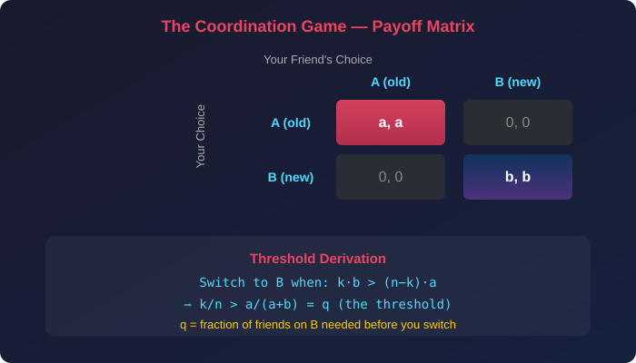
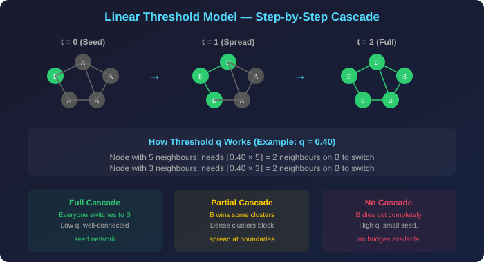
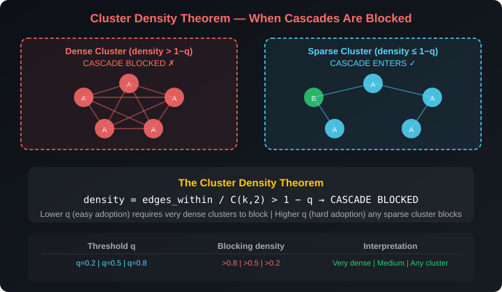
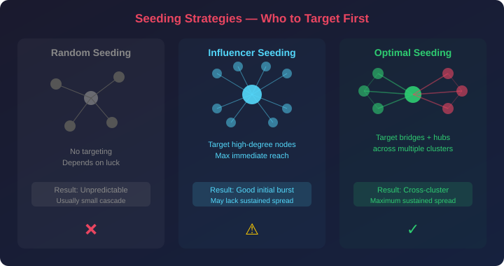
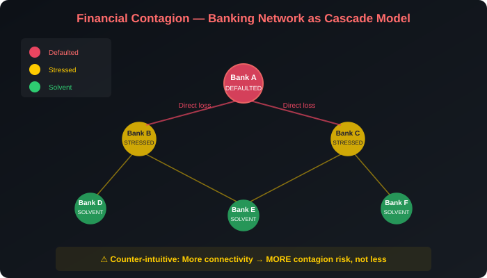

# Diffusion, Cascades & Collective Action in Networks — Plain Language Notes

> **What this covers:** Why do humans copy each other's behaviour? How does a new product, idea, or trend spread through a social network? What determines whether adoption goes viral or dies out? How does the coordination game create a mathematical threshold for switching? Why do dense communities block cascades at their borders? What is the Cluster Density Theorem and how do you apply it? How do you choose the optimal nodes to seed a campaign? What causes collective action to fail even when everyone wants change? How does financial contagion cascade through banking networks? This file covers informational/coordination/network-effect reasons for following others, the coordination game and its payoff algebra, the linear threshold model, social reinforcement, cascade dynamics within and across communities, the Cluster Density Theorem, seeding strategies, collective action problems, financial contagion, and all three assignment case studies fully solved.

---

## Part 1 — Why Do Humans Follow Each Other?

### The Core Observation

> **The puzzle:** Humans regularly copy others' behaviour — even when they don't know whether the other person is correct. Is this irrational?

**No.** It's a calculated response to uncertainty. If **many** people do X, there is likely a good reason, even if you can't personally verify it. Copying others is an efficient shortcut when gathering your own information is costly or impossible.

Think about it this way: you arrive at a new city and see two restaurants. One is packed, the other is empty. You don't know anything about either restaurant's food quality. But you can observe that many independent people chose Restaurant A. Those people presumably had some information or experience that led them there. By choosing Restaurant A yourself, you're using **the wisdom of the crowd** as a proxy for information you don't have.

This is rational. But it has a dark side: **information cascades**, where everyone copies a bad choice because the first few people happened to get it right by luck. We'll explore this later.

---

### Three Fundamental Reasons for Following Others

| Reason | Mechanism | Example | Key Property |
|---|---|---|---|
| **Informational** | Others have knowledge you lack; their action is evidence of quality | Everyone leaves a restaurant → probably bad food | Based on **inference** — you deduce information from others' actions |
| **Coordination** | Value comes from matching what others do, regardless of intrinsic quality | Everyone speaks English → you should speak English too | Based on **compatibility** — the thing itself doesn't matter, matching does |
| **Network Effects** | More adopters = better product for everyone | More WhatsApp users → more valuable it is for you | Based on **externalities** — each new user benefits ALL existing users |

**Why these distinctions matter for assignments:**

- **Informational following** is about learning: "I don't know whether this restaurant is good, but 50 people chose it, so it's probably fine."
- **Coordination following** is about matching: "I don't care whether we drive on the left or right — I just need to do the same as everyone else to avoid crashes."
- **Network effects following** is about increasing returns: "The more people use this messaging app, the more useful it becomes for me specifically."

> **Should you always follow others?** Not always. In informational cascades, early luck can lock everyone into a suboptimal choice. In coordination games, society can get stuck on an inferior standard (e.g., the QWERTY keyboard layout was designed to slow typing, but everyone uses it because everyone else uses it). In network effects, a worse product can dominate simply because it reached critical mass first (e.g., VHS vs Betamax).

---

### The Information Cascade — When Following Goes Wrong

Here's how a cascade forms and how it can lead to a bad outcome:

```
Person 1: Gets private signal "A is good" → chooses A
Person 2: Gets private signal "A is good" → chooses A  
Person 3: Gets private signal "B is good" → BUT sees two people chose A
          → Thinks: "My signal says B, but two signals say A. 
             2 > 1, so A is probably better" → chooses A
Person 4: Gets private signal "B is good" → sees THREE chose A
          → Thinks: "Overwhelming evidence for A" → chooses A
...
Everyone: Chooses A, even though B was actually better
```

**The cascade is fragile:** It was built on Person 1 and Person 2 happening to get the same signal. If Person 1 had gotten "B is good," the entire cascade would have gone the other way. The outcome is determined by **initial randomness**, not by truth.

> **Key insight for assignments:** Information cascades are **easily started** (just 2-3 people can trigger one) but **easily broken** (by someone who publicly reveals their private information instead of following the crowd).

---

## Part 2 — Diffusion in Networks

### What Is Diffusion?

**Scenario:** You buy a new pair of trendy shoes. Your friends notice. Some buy them too. Their friends see them wearing those shoes. More people buy. This chain of adoption spreading through a network is called **diffusion.**

Diffusion is the process by which a new behaviour, product, technology, or idea **propagates through a population** via the connections between individuals. It's not random — it follows the architecture of the social network.

**How to visualize it:**

```
Time 0:   [YOU buy shoes]
                │
Time 1:   [3 of your 10 friends buy them]
                │
Time 2:   [7 of THEIR friends buy them]
                │
Time 3:   [Some of those friends' friends buy them]
                │
          ...cascade continues until it stops...
```

### What Happens Eventually?

The spread follows one of exactly three possible outcomes:

1. **Full adoption (complete cascade)** — everyone in the network eventually buys the shoes. The cascade reaches every reachable node.
2. **Partial adoption (partial cascade)** — the spread stops at community boundaries. Some clusters adopt, others don't. The cascade is **blocked** by structural features of the network.
3. **No adoption (cascade failure)** — the initial spark dies out before reaching critical mass. The seed group was too small, or surrounding nodes had thresholds too high.

### What Controls the Outcome?

Four factors determine which of the three outcomes occurs:

| Factor | Role | Effect |
|---|---|---|
| **Individual thresholds** | How many friends must adopt before *you* adopt | Higher thresholds → harder to start and sustain a cascade |
| **Network structure** | How communities connect (or don't) | Dense clusters can block cascades; weak ties enable crossing |
| **Payoff advantage** | How much better is the new product vs. the old? | Higher advantage → lower effective threshold → easier spread |
| **Seeding strategy** | Who is the first adopter? | Hubs and bridge users launch more effective cascades |

> **The fundamental challenge:** You can control the seeding strategy and sometimes the payoff advantage (via subsidies, marketing), but you CAN'T control network structure or individual thresholds. The art of viral marketing is optimizing the factors you can control to overcome the constraints you can't.


---

## Part 3 — Modeling Diffusion: The Coordination Game

### The Setup

This is the mathematical engine behind the threshold model. Pay close attention — this is the foundation of everything that follows.

Two options exist — call them **A** (old behaviour, the status quo) and **B** (new behaviour, the innovation).

Each option gives a **payoff per matching friend:**
- Option A gives payoff **a** per friend who also chooses A
- Option B gives payoff **b** per friend who also chooses B
- If you and a friend choose **different** options, **neither of you gets any payoff** from that interaction

> **Coordination matters:** You only receive the payoff when you choose the *same* thing as your friend. If you go to the library but your friend goes out, neither of you benefits from the interaction. The payoff comes from **matching**.

### The Payoff Matrix (Per Friend Interaction)

|  | Friend chooses A | Friend chooses B |
|---|---|---|
| **You choose A** | You get **a**, Friend gets **a** | You get **0**, Friend gets **0** |
| **You choose B** | You get **0**, Friend gets **0** | You get **b**, Friend gets **b** |



### Computing Your Best Choice — The Full Derivation

Suppose you have **n** friends total, and **k** of them have already switched to B. The remaining **(n − k)** friends are still on A.

**Your payoff if you stay on A:**

You match with the $(n-k)$ friends who are also on A. Each matching interaction gives you payoff $a$.

$$
\text{Payoff}_A = (n - k) \times a
$$

**Your payoff if you switch to B:**

You match with the $k$ friends who are on B. Each matching interaction gives you payoff $b$.

$$
\text{Payoff}_B = k \times b
$$

**You switch to B when Payoff_B > Payoff_A:**

$$
k \times b > (n - k) \times a
$$

Now let's solve for the **fraction** of friends that must be on B:

$$
kb > na - ka
$$

$$
kb + ka > na
$$

$$
k(a + b) > na
$$

$$
\frac{k}{n} > \frac{a}{a + b}
$$

**Define the threshold:**

$$
\boxed{q = \frac{a}{a + b}}
$$

### Interpreting the Threshold

- $q$ is the **fraction of your friends** that must choose B before you switch
- If the fraction of your neighbours on B **exceeds** $q$ → you switch to B
- If it's **below** $q$ → you stay on A
- $q$ depends ONLY on the payoff values $a$ and $b$ — not on the network structure

**Properties of the threshold:**

| Condition | Threshold $q$ | Interpretation |
|---|---|---|
| $b \gg a$ (new is much better) | $q \to 0$ | Almost no friends needed on B — you switch eagerly |
| $b = a$ (equal payoffs) | $q = 0.5$ | Need half your friends on B to switch — symmetric |
| $b \ll a$ (old is much better) | $q \to 1$ | Nearly all friends must be on B before you switch |

> **Why this matters:** The threshold $q$ captures the "stubbornness" of the population. A low $q$ means people switch easily (the innovation is compelling). A high $q$ means people resist change (the status quo is comfortable).

---

### Worked Example 1 (Lecture Example)

- Library (A): payoff $a = 2$ per friend also studying
- Fun (B): payoff $b = 3$ per friend also having fun
- Threshold: $q = \frac{2}{2 + 3} = \frac{2}{5} = 0.40$

You need **at least 40% of friends** on "fun" before you switch.

**Specific case:** You have 20 friends — 15 choose library, 5 choose fun.

$$
\text{Fraction on B} = \frac{5}{20} = 0.25 < 0.40 \; (= q)
$$

$$
\text{Payoff}_A = 15 \times 2 = 30 \qquad \text{Payoff}_B = 5 \times 3 = 15
$$

→ **You stay with Library**, even though fun has higher individual payoff ($b > a$).

**When would you switch?** You need at least $\lceil 0.40 \times 20 \rceil = 8$ friends on fun. Right now only 5 are — you need 3 more before it's worth switching.

### Worked Example 2

- Old app (A): payoff $a = 5$ per friend
- New app (B): payoff $b = 5$ per friend
- Threshold: $q = \frac{5}{5 + 5} = 0.50$

Equal payoffs mean you need *exactly half* your friends to switch before you do. This is the **hardest case for the innovation** — when the old and new are equally good, there's no inherent incentive to switch. The cascade succeeds only if a large enough seed group can push local fractions above 0.5.

### Worked Example 3

- Old browser (A): payoff $a = 1$ per friend
- New browser (B): payoff $b = 9$ per friend
- Threshold: $q = \frac{1}{1 + 9} = 0.10$

The new browser is **nine times better**. You need only $10\%$ of friends to switch before you do. This cascade will spread rapidly and easily — even a small seed group can trigger full adoption because the threshold is so low.

> **Key insight from these examples:** Social context (how many friends choose what) can **override your personal preference**. Even if $b > a$ (the new thing is better), you might not switch because too few friends are using it yet. This is the mathematical basis for why good products sometimes fail and bad products sometimes succeed.

---

## Part 4 — The Linear Threshold Model — General Form

### The Algorithm

The coordination game generalises to the standard **Linear Threshold Model**, which is the primary model used in this course for behavioral cascades:

```
ALGORITHM: Linear Threshold Model
═══════════════════════════════════

INITIALIZATION:
  • Every node starts on behaviour A (the status quo)
  • A seed set S of nodes switches to B (these are the "early adopters")
  • Set time t = 0

EACH TIME STEP (t → t+1):
  For each node v still on A:
    Count the fraction of v's neighbours currently on B:
    
    fraction_B(v) = |{u ∈ neighbours(v) : u is on B}| / degree(v)
    
    If fraction_B(v) ≥ q:
      Node v switches to B (irreversible!)
  
  If NO nodes switched this round → STOP (convergence reached)

REPEAT until convergence
```

**Key properties of this model:**

1. **Deterministic** — given the same network and seed set, the outcome is always the same (unlike SIR which is probabilistic)
2. **Irreversible** — once a node switches to B, it NEVER switches back to A
3. **Monotonic** — the number of B-nodes can only increase or stay the same over time
4. **Convergent** — the process always terminates in finite steps (because the network is finite and switches are irreversible)



### Threshold Calculation for Assignments

The number of neighbours that must already be on B before node $v$ switches:

$$
\text{Number of neighbours needed} = \lceil q \times \text{degree}(v) \rceil
$$

The ceiling function $\lceil \cdot \rceil$ rounds up because you can't have a fractional person.

**Assignment Case Study 1:** 20 connections, threshold $q = 0.25$

$$
0.25 \times 20 = \mathbf{5} \text{ friends must share first}
$$

**Assignment Case Study 2:** 14 contacts, threshold $q = 0.5$

$$
0.5 \times 14 = \mathbf{7} \text{ contacts must adopt first}
$$

**Assignment Case Study 3 (Banks):** 12 counterparties, threshold $q = 0.25$

$$
0.25 \times 12 = \mathbf{3} \text{ counterparty defaults trigger failure}
$$

> [!TIP]
> **Mental shortcut:** When $q = 0.25$, you need $1/4$ of your friends. When $q = 0.50$, you need $1/2$. Always compute the exact number = $q \times \text{degree}$ and round up if needed. For assignments, the numbers are usually designed to come out clean.

---

## Part 5 — Social Reinforcement and Cascade Mechanics

### What Is Social Reinforcement?

**Social reinforcement** is the self-amplifying mechanism at the heart of diffusion. It's a **positive feedback loop**:

```
More people adopt B
    ↓
Each remaining A-node sees a higher fraction of B-neighbours
    ↓
More nodes cross their threshold
    ↓
More people adopt B
    ↓
... and so on
```

This creates a **cascade** — a chain reaction of adoptions spreading through the network. Once enough nodes switch in a local area, the cascade becomes self-sustaining: each new adoption makes the next one easier.

**The tipping point:** There exists a critical mass of initial B-adopters above which the cascade becomes self-sustaining and below which it fizzles out. This is analogous to $R_0 = 1$ in epidemics (from Topic 11), but here it depends on the network structure rather than a simple multiplication $p \times k$.

### Why Social Reinforcement Is Different from Biological Contagion

This is a crucial distinction (also covered in Topic 13):

| Property | Social Reinforcement (Cascades) | Biological Contagion (Epidemics) |
|---|---|---|
| **Decision** | You **choose** to adopt after evaluating | No choice — virus enters involuntarily |
| **Need for multiple signals** | Usually need **multiple** friends adopting (threshold) | Usually a **single** contact suffices |
| **Reversibility** | In general models, can reverse (but not in our model) | Recovery happens regardless of choice |
| **Model type** | Deterministic threshold-based | Stochastic probability-based |
| **Key parameter** | Threshold $q$ (fraction of friends needed) | Probability $p$ (per-contact transmission) |

> **Assignment trap avoidance:** Don't confuse cascade models (threshold-based, deterministic, choice-based) with epidemic models (probability-based, stochastic, involuntary). They look similar but have fundamentally different mechanics.

---

### The Three Cascade Outcomes in Detail

| Scenario | Conditions | Outcome | Visual Pattern |
|---|---|---|---|
| **Full cascade** | Seed group large enough + low thresholds + no blocking clusters | Everyone eventually switches to B | Wave sweeps across entire network |
| **Partial cascade** | Intermediate conditions; some dense clusters block the spread | B wins some clusters, stops at others | Patchy adoption — islands of B in a sea of A |
| **No cascade** | Seed group too small OR high thresholds OR all neighbouring clusters too dense | B dies out completely, everyone stays A | Brief flicker, then back to all-A |

**What determines which outcome you get?** It's the interaction between:
1. The threshold $q$ (how easy it is to switch)
2. The seed set size (how many start on B)
3. The network topology (whether clusters can block or bridges can transmit)

---

## Part 6 — Network Structure and Cascades

### Within-Community Spread

Inside a **tightly connected cluster** (where most people know most other people), diffusion is **fast and efficient**:

- When one person in the cluster adopts B, many of their neighbours are **also** neighbours of each other
- This means a single adoption immediately raises the fraction-on-B for **many** nodes simultaneously
- Those nodes are more likely to cross their threshold, leading to a rapid chain reaction
- The cascade sweeps through the cluster in very few time steps

**Worked Example:**
Consider a tight group of 6 friends where everyone knows everyone (complete graph, degree = 5 for each node). Threshold $q = 0.4$.

- Each node needs $\lceil 0.4 \times 5 \rceil = 2$ friends on B to switch
- If 2 are seeded on B: each remaining A-node sees 2 out of 5 friends on B → fraction = 0.4 ≥ q → ALL switch immediately
- Full cascade in **one step**!

Now compare this to a **chain** (path graph) of 6 nodes: each node has degree 2 (or 1 if at an end).

- Seed the leftmost node
- Its only neighbour sees 1/2 = 0.5 ≥ 0.4 → switches
- The NEXT neighbour now sees 1/2 = 0.5 ≥ 0.4 → switches
- But the cascade takes **5 steps** instead of 1 to traverse the chain
- And at each step, only ONE new node switches

> **This is why** in Case Study 1, some communities had long chains of reshares while others stopped after 1–2 steps. Dense clusters allow parallel adoption; sparse chains force sequential adoption.

---

### Across-Community Spread

Between communities connected by **weak ties** (a few friendship links between otherwise separate groups):

- A node at the boundary has **few** neighbours in the other community (by definition — they're mostly connected within their own group)
- Even if the **entire** source community adopted B, the fraction-on-B seen by boundary nodes in the target community might be low
- Example: A boundary node has 8 friends in their own cluster (all on A) and 2 friends in the source cluster (both on B). Fraction on B = 2/10 = 0.2. If $q > 0.2$, the node stays on A.
- The threshold $q$ may **never be reached** at the boundary → cascade stops dead

This is the fundamental reason why cascades often die at community boundaries. The **weak tie paradox** of diffusion: weak ties are essential for information to *reach* other communities (as Granovetter showed), but they're often insufficient for the cascade to actually *convert* those communities.

---

### The Role of Bridges (Multi-Community Members)

Users who belong to **multiple communities** serve as the only pathway for crossing cluster boundaries:

- A **bridge user** has significant numbers of friends in multiple groups
- When they adopt B, they simultaneously raise the fraction-on-B for boundary nodes in **multiple** communities
- Without bridge users, the cascade stays **permanently confined** to its starting cluster

**Why TrendHub / Case Study 1 failed to go platform-wide:**
1. Influencers gave initial **visibility** within their local cluster
2. But without sufficient **bridge users** connecting to other clusters, the cascade couldn't jump community boundaries
3. Even with high payoff advantage, the structural barrier of weak inter-cluster links prevented platform-wide adoption

> [!IMPORTANT]
> **Optimal strategy:** Seed bridging users + high-degree nodes **within multiple communities simultaneously**. This attacks the cascade frontier from multiple directions, increasing the chances that boundary nodes see enough B-neighbours to switch.


---

## Part 7 — The Cluster Density Theorem — Key Exam Result

### The Theorem

This is the most important theoretical result for assignments:

> **Theorem:** A cascade **CANNOT** enter a cluster if that cluster has **internal edge density > (1 − q)**.

Where:
- $q$ = adoption threshold (the fraction of friends needed to switch)
- **Internal edge density** = fraction of all possible edges within the cluster that actually exist

### Why This Works — The Full Intuition

Imagine a cluster of $k$ nodes that is very dense internally. Each node in the cluster has most of its connections **within** the cluster (to other A-nodes) and only a few connections **outside** the cluster (to B-nodes).

For a boundary node in this cluster:
- **Internal connections:** Many friends within the cluster, currently on A
- **External connections:** Few friends outside the cluster, possibly on B
- Even if ALL external friends adopt B, the **fraction** of B-neighbours seen by the boundary node is limited by the ratio of external to total friends
- If the cluster is dense enough, this ratio stays permanently below $q$
- Therefore, no node in the cluster **ever** crosses its threshold
- The cascade is **permanently blocked**

### The Formula

A cluster of $k$ nodes blocks a cascade if:

$$
\text{density} = \frac{\text{edges within cluster}}{\binom{k}{2}} > 1 - q
$$

Where $\binom{k}{2} = \frac{k(k-1)}{2}$ is the maximum possible edges between $k$ nodes.

### Worked Example: Does This Cluster Block a Cascade?

**Setup:** A cluster of 5 nodes with 8 internal edges. Threshold $q = 0.3$.

$$
\text{Maximum possible edges} = \binom{5}{2} = \frac{5 \times 4}{2} = 10
$$

$$
\text{Density} = \frac{8}{10} = 0.80
$$

$$
\text{Blocking condition:} \quad 0.80 > 1 - 0.3 = 0.70 \quad ✓ \text{ (YES, blocked!)}
$$

The cluster density (0.80) exceeds the blocking threshold (0.70), so the cascade **cannot** enter this cluster.

**What if $q = 0.15$?**

$$
\text{Blocking condition:} \quad 0.80 > 1 - 0.15 = 0.85 \quad ✗ \text{ (NO, not blocked!)}
$$

Now the cascade CAN enter because the threshold is too low — people switch too easily for even a dense cluster to resist.

### Interpretation Table

| Threshold $q$ | Blocking density must exceed | What this means |
|---|---|---|
| $q = 0.2$ (easy to adopt) | $1 - 0.2 = 0.8$ | Only **near-complete clusters** block the cascade |
| $q = 0.5$ (moderate) | $1 - 0.5 = 0.5$ | Moderately dense clusters suffice to block |
| $q = 0.8$ (hard to adopt) | $1 - 0.8 = 0.2$ | **Any mildly connected group** blocks the cascade |

> **High threshold (q near 1):** Hard to adopt → even weakly dense clusters block the cascade. The innovation faces enormous resistance.
> 
> **Low threshold (q near 0):** Easy to adopt → only extremely dense clusters (near-complete graphs) block the cascade. The innovation spreads almost everywhere.



> [!WARNING]
> **Common mistake:** Students often get the direction of the inequality confused. The **blocking condition** is density > (1 − q), NOT density > q. If the threshold is low (q = 0.1), you need very high density (> 0.9) to block — which is correct because low thresholds mean easy adoption, so only very cohesive groups can resist.

---

## Part 8 — Increasing Payoff and Adoption Rate

### How Payoff Changes Affect the Threshold

If the **payoff advantage of the new behaviour increases** ($b$ ↑ while $a$ stays fixed):

$$
q = \frac{a}{a + b} \downarrow
$$

A lower threshold means:
1. **Fewer** neighbours need to adopt before you do → lower individual resistance
2. The cascade spreads **faster** and **farther** → each adoption triggers more adoptions
3. **Weaker** connections between clusters can now be bridged → the blocking density requirement increases toward 1.0
4. Eventually, **no cluster** can block the cascade (when $q \to 0$, blocking requires density > 1.0 which is impossible)

### The Marketing Implication

| Strategy | Effect on $b$ | Effect on $q$ | Effect on cascade |
|---|---|---|---|
| **Free trial** | $b$ ↑ (reduces risk) | $q$ ↓ | Easier to start and sustain |
| **Subsidy / discount** | $b$ ↑ (reduces cost) | $q$ ↓ | Lowers barrier to entry |
| **Referral bonus** | $b$ ↑ (adds reward) | $q$ ↓ | Creates incentive to match |
| **Making old product worse** | $a$ ↓ (reduces status quo value) | $q$ ↓ | Pushes people away from A |

> **The dual approach:** You can lower $q$ by either increasing $b$ (make the new thing better) OR decreasing $a$ (make the old thing worse). Both have the same mathematical effect on the threshold.

### Worked Example: Payoff Sensitivity

| | $a$ | $b$ | $q = a/(a+b)$ | Needed fraction |
|---|---|---|---|---|
| Scenario 1 | 3 | 3 | 0.50 | Half your friends |
| Scenario 2 | 3 | 7 | 0.30 | Less than a third |
| Scenario 3 | 3 | 12 | 0.20 | One in five |
| Scenario 4 | 3 | 47 | 0.06 | Just one in seventeen |

As $b$ increases while $a$ stays at 3, the threshold drops rapidly. With $b = 47$, the innovation is so compelling that only 6% of your friends need to adopt before you switch.

---

## Part 9 — Seeding Strategy — Who to Target First

### Why Seeding Matters

The cascade outcome depends critically on WHERE in the network you plant the first adopters. The same network with the same threshold can produce a full cascade or no cascade at all, depending on the seed set.

---

### Strategy 1: Random Seeding

Start the cascade from randomly chosen nodes. No targeting, no strategy — just pick nodes at random.

**Advantages:**
- Cheapest (no analysis needed)
- Easiest to implement

**Disadvantages:**
- Results depend entirely on luck
- Random nodes are likely **peripheral** (most nodes in most networks are peripheral)
- Peripheral seeds have few connections → cascade starts from a tiny footprint → usually dies quickly

**When it works:** Only when the threshold is very low ($q$ near 0) AND the network is well-connected. In this case, almost any starting point triggers a cascade.

---

### Strategy 2: High-Degree Seeding (Influencer Strategy)

Start from nodes with the most connections (hubs/influencers).

**Why this often works:**
1. Influencer adopts B → they have many neighbours
2. Many nodes immediately see a B-neighbour → higher fraction-on-B
3. More nodes cross their threshold in the first round
4. Cascade starts from a much larger effective footprint

**When this fails:**
- The influencer's connections might be **within a single dense community** that can resist the cascade through the density theorem
- The influencer might be in a **star topology** (many connections, but none of those connections connect to each other) → the cascade reaches many nodes but then immediately dies because no secondary spreading occurs
- Without **bridges** to other communities, even a massive initial burst stays contained

> **TrendHub / Case Study 1 insight:** Influencers gave initial visibility, but *within-community* threshold conditions still needed to be met for the cascade to continue beyond the influencer's direct audience. The cascade died at community boundaries because bridge users were insufficient.

---

### Strategy 3: Optimal Seeding (Bridges + Hubs)

> **Optimal strategy:** Seed **bridging users** (who connect multiple communities) **AND** high-degree nodes **within multiple communities** simultaneously.

This strategy works because:
1. Bridge users ensure the cascade can **cross** community boundaries
2. High-degree nodes within each community ensure **rapid local saturation**
3. Attacking from multiple directions means boundary nodes see B-neighbours from **multiple** sides, increasing their fraction-on-B faster

**The compound effect:**
- Node X is at the boundary of Community A and Community B
- If only Community A's side propagates → X sees 2/10 friends on B = 0.20
- If BOTH sides propagate → X sees 4/10 friends on B = 0.40
- The threshold might be $q = 0.30$ → with one-side seeding (fail), with two-side seeding (success)



---

## Part 10 — Collective Action Problems

### The Setup

Everyone **disagrees** with the current situation (e.g., unfair company policy, unjust law, exploitative platform). Yet nothing changes. Why?

This is the **collective action problem**: each individual would act *if enough others acted too*, but no one acts first because they don't know if others will follow. It's a coordination game where the "new behaviour" is rebellion/protest/action.

Think of it in terms of our threshold model:
- **Behaviour A** = staying passive (the safe default)
- **Behaviour B** = taking action (protesting, quitting, joining a movement)
- Each person has a personal threshold: "I'll act if at least $t$ others join"

---

### Intrinsic Thresholds

Each person $i$ has a personal threshold $t_i$: the **minimum number of participants** (including themselves) they need before they'll join.

$$
\text{Person } i \text{ joins if } |\text{current participants}| \geq t_i
$$

**Why thresholds differ:**

| Person Type | Threshold | Description |
|---|---|---|
| **Activists** | $t_i = 1$ | Will act alone. Don't need anyone else. |
| **Early joiners** | $t_i = 2\text{–}5$ | Will join if they see a small core of committed people |
| **Mainstream** | $t_i = 10\text{–}50$ | Need substantial visible participation before joining |
| **Reluctant** | $t_i = 100+$ | Will only join when it's "safe" — when everyone else already is |
| **Never-joiners** | $t_i = \infty$ | Will never act regardless (too scared, too comfortable, etc.) |

---

### The Information Problem

In real networks, you only know the thresholds of your **local neighbours** — not the entire network. This limited information creates a fundamental coordination failure:

- There might be 1,000 people willing to act if they knew 999 others would join
- But each of those 1,000 people only knows their immediate friends
- None of them can see the full picture
- So each waits for enough visible participants... which never materializes because everyone is waiting

This is the **paradox of collective action**: the coalition that would be stable if it formed can never form because the information needed to form it is distributed across the network.

---

### Three Outcomes in Detail


**Case 1 — No Action (Threshold too high):**

Some individuals have thresholds so high relative to their connections that they will never join. Their absence causes others below them in the cascade chain to drop out. The "cascade of refusal" propagates backward: if you won't join, then I won't join (because I needed you), then another person won't join (because they needed me), etc.

**Example:** 
- Alice will act if 5 others do. But only 3 people in her network have lower thresholds.
- Those 3 will act if 2 others do. But among them, only 1 is an activist.
- The activist acts alone (threshold = 1). The 2 early joiners see 1 participant < their threshold of 2. Nothing happens.

**Case 2 — No Action (Information failure):**

A feasible coalition exists — enough people have low enough thresholds that a self-sustaining cascade COULD form. But they don't *know* each other's thresholds. Each waits for others to confirm they'll join first. Nobody goes first because nobody knows if anyone else will follow. Pure coordination failure.

**Example:**
- 50 people each have threshold = 20. If they all knew each other's thresholds, they'd all join (50 ≥ 20 for each).
- But each person only knows their 5 closest friends' thresholds.
- Each sees only 5 potential participants — not enough to meet their threshold of 20.
- Everyone stays passive. The coalition that *should* have formed never does.

**Case 3 — Action Succeeds:**

Enough people have mutual awareness of each other's thresholds (e.g., through a public meeting, social media announcement, or common knowledge event). The coalition forms because everyone can see that enough others are committed.

**Example:**
- Same 50 people with threshold = 20.
- A public rally is announced. 30 people show up.
- Each attendee sees 30 committed people ≥ 20 → they all confirm participation.
- News spreads: "30+ are committed." The remaining 20 people hear this and join (30 ≥ 20).
- Full collective action achieved.

---

### The "Divide and Conquer" Effect

Dense clusters with weak inter-cluster links mean each small group knows only its local information. Even if globally enough people are willing to act, **local uncertainty** prevents any group from committing.

This is why **autocratic regimes fear social media**: platforms that make thresholds **publicly visible** (through likes, retweets, petition signatures) convert private willingness into public common knowledge, enabling collective action that would have been impossible under information isolation.

> **Broadcasting information publicly** (making thresholds common knowledge) can trigger collective action that was impossible when each group only knew its own local information. The information, not just the willingness, is what was missing.

---

## Part 11 — Financial Contagion — The Banking Application

### How the Threshold Model Applies to Banking

The same threshold/cascade model applies perfectly to banking networks. This is not just an analogy — it's the **same mathematical framework** with different labels:

| Concept | Social Networks | Banking Networks |
|---|---|---|
| Node | Person | Bank |
| Edge | Social connection | Lending relationship (directed: lender → borrower) |
| Behaviour A | Status quo (not adopting) | Remaining solvent |
| Behaviour B | Adopting new behaviour | Defaulting |
| Threshold $q$ | Fraction of friends needed to switch | Fraction of counterparty defaults that triggers own default |
| Cascade | Behaviour spread | Default contagion chain |
| Dense cluster | Resistant community | Insulated regional banking cluster |
| Seed set | Early adopters | Banks that fail first (due to external shock) |



---

### Two Channels of Financial Contagion

**Channel 1 — Direct Losses (Lending Defaults):**
- Bank A lent money to Bank B
- Bank B defaults on its obligations
- Bank A loses the money it lent → Bank A's balance sheet weakens
- If enough of Bank A's counterparties default (exceeding its threshold $q$) → Bank A defaults too
- This is the **direct cascade** channel — identical to the threshold model

**Channel 2 — Indirect Losses (Fire Sales and Asset Prices):**
- When banks are under stress, they sell assets quickly ("fire sales")
- These rushed sales depress market prices
- **All** banks holding similar assets see their portfolios lose value — even banks with NO direct lending connection to the failing bank
- This creates contagion **without direct links** — through shared exposure to asset markets

> **The fire sale channel is uniquely dangerous** because it bypasses the network structure entirely. In the social cascade model, spread requires network edges. In financial contagion, the fire sale channel means that stress can spread even between banks that have zero direct relationships.

---

### The Counter-Intuitive Result: Connectivity ≠ Stability

In social networks, more connections generally help (more friends = more information, more support). But in banking:

**More connections → MORE contagion risk, not less:**

1. More connections = each bank is exposed to more counterparties
2. More counterparties = more channels through which a shock can arrive
3. A shock that enters through any one channel can propagate to all connected banks
4. In a highly connected banking network, a single bank failure can trigger a system-wide cascade

**Moderate or low connectivity limits contagion:**
- Fewer connections = fewer channels for shocks to travel
- A failing bank affects only a small number of direct counterparties
- The cascade is **contained** — it can't propagate network-wide

**Financial network structural features:**
- **Core-periphery structure:** Large central banks are critical cascade hubs — their failure has system-wide consequences
- **Too-big-to-fail:** Core banks have so many connections that their default triggers cascading failures throughout the network
- **Systemic risk:** The risk that the failure of one institution triggers failures in many others, potentially collapsing the entire financial system

> [!CAUTION]
> **This is opposite to social networks!** In social diffusion, high connectivity HELPS cascades spread (which is usually the goal — you WANT the product to spread). In financial networks, high connectivity AMPLIFIES destructive cascades (which you want to PREVENT). The same mathematical model, but the **desirability** of the cascade is reversed.

---

## Part 12 — Summary: Factors Controlling Cascade Outcome

| Factor | Effect on cascade spread | Mathematical connection |
|---|---|---|
| **Lower threshold $q$** | Spreads faster and farther | $q = a/(a+b)$; lower $q$ = easier adoption |
| **Higher payoff $b$ (new behavior)** | Lowers $q$ → spreads more | Direct: $b \uparrow$ → $q \downarrow$ |
| **High-degree seed nodes** | Faster initial spread | More immediate neighbours see B |
| **Bridge users across clusters** | Enable cross-cluster spread | Break the density barrier from multiple sides |
| **Dense clusters (density > 1−q)** | **Block** the cascade | Cluster Density Theorem |
| **Weak inter-cluster ties** | Slow or stop cross-cluster spread | Boundary nodes can't reach threshold |
| **Shared information about thresholds** | Enables collective action | Solves the coordination/information problem |
| **High network connectivity (banking)** | **Amplifies** contagion risk | More channels for shock propagation |

---

## Part 13 — Assignment Answer Reference Sheet

| Question | Answer | Formula/Reason |
|---|---|---|
| Chain of reshares in marketing | **Diffusion** | Behaviour spreading through social network via threshold dynamics |
| Why campaign didn't go platform-wide | **High thresholds + weak bridging users + inter-cluster weak ties** | All three together blocked spread at community boundaries |
| Why spread faster within communities | **Members observed more neighbours sharing** | Higher fraction of local neighbours → threshold met faster |
| CS1: 20 connections, threshold 0.25 | **5 must share** | $0.25 \times 20 = 5$ |
| Bridging users valuable because | **Enable cross-community diffusion** | Only path across cluster boundaries |
| Best network model for EV adoption | **Social network** | Adoption via social influence, not physical routes |
| Early adopters' role | **Reduce uncertainty through visible adoption** | Others can observe and verify before adopting |
| EV cascade conditions | **Giant connected component + many low-threshold individuals** | Both structure and threshold distribution needed |
| CS2: 14 contacts, threshold 0.5 | **7 contacts must adopt** | $0.5 \times 14 = 7$ |
| Why EV adoption varied by community | **Network structure and thresholds varied** | Core thesis of threshold cascade model |
| Directed edge A→B in banking | **A lending to B** | Direction indicates credit flow |
| Mechanisms for banking cascade | **Direct losses (lending) + indirect (asset price)** | Both channels present |
| High connectivity in banking → | **Amplifies shock propagation** | More channels = more contagion paths |
| CS3: 12 counterparties, threshold 0.25 | **3 defaults trigger failure** | $0.25 \times 12 = 3$ |
| Network property for banking resilience | **Low connectivity** | Limits channels for contagion propagation |

---

## Part 14 — Common Traps and Misconceptions

> [!WARNING]
> **Misconception 1: "Having high-payoff new behaviour always causes a cascade"**
>
> **Reality:** Payoff advantage lowers the threshold, but if the network has dense clusters (density > 1−q) or no bridging users, the cascade **still stops** at community boundaries. Payoff advantage is necessary but NOT sufficient.

> [!WARNING]
> **Misconception 2: "High connectivity always makes networks more stable/resilient"**
>
> **Reality:** In banking/contagion contexts, HIGH connectivity **AMPLIFIES** shocks — low connectivity reduces cascade channels and increases resilience. This is the opposite of social networks where connectivity helps.

> [!WARNING]
> **Misconception 3: "Everyone must adopt for a cascade to be called successful"**
>
> **Reality:** Cascades can partially spread — reaching only certain clusters. A "successful cascade" just means a self-sustaining chain reaction. The outcome depends on whether cascade front nodes can cross the $(1−q)$ density barrier at cluster boundaries.

> [!WARNING]
> **Misconception 4: "The threshold q depends on the network structure"**
>
> **Reality:** The threshold $q = a/(a+b)$ depends ONLY on the payoff values $a$ and $b$. It's a property of the **individuals**, not the network. The network structure determines whether a given threshold allows or blocks cascades.

> [!WARNING]
> **Misconception 5: "If the new product is better (b > a), everyone will eventually switch"**
>
> **Reality:** Even when $b > a$, the threshold $q < 0.5$ but is NOT zero. You still need a meaningful fraction of friends to adopt first. And the Cluster Density Theorem means dense communities can resist this fraction indefinitely.

> [!WARNING]
> **Misconception 6: "Diffusion and epidemic models are the same"**
>
> **Reality:** Diffusion (threshold model) is **deterministic** and **choice-based** — a node switches when enough neighbours have switched. Epidemics (SIR/SIS) are **probabilistic** and **involuntary** — each contact independently transmits with probability $p$. They're different mathematical frameworks.

| ❌ Wrong Statement | ✅ Correct Understanding |
|---|---|
| "Dense clusters help cascades spread faster" | Dense clusters with density > (1−q) **BLOCK** cascades |
| "Random seeding is just as good as targeted" | Targeted seeding (bridges + hubs) dramatically outperforms random |
| "Collective action fails because people don't care" | It fails because people **do** care but lack **information** about others' willingness |
| "Financial networks benefit from more connections" | More connections create more contagion channels — they AMPLIFY systemic risk |
| "Information cascades require threshold models" | Information cascades are about Bayesian updating of beliefs; threshold models are about coordination games |

> [!NOTE]
> **For financial contagion (CS3):**
> The threshold model applies to bank defaults without needing to think about social payoffs. The threshold $q$ = fraction of counterparties that must default to trigger your own default. Low $q$ = fragile bank (vulnerable to cascading failure). High $q$ = resilient bank (can absorb multiple counterparty defaults).

---

## Part 15 — Formulas and Equations Cheat Sheet

### The Threshold Formula

$$
\boxed{q = \frac{a}{a + b}}
$$

Where $a$ = payoff per friend on A, $b$ = payoff per friend on B.

### Switching Condition

$$
\text{Switch to B if:} \quad \frac{k}{n} \geq q
$$

Where $k$ = friends on B, $n$ = total friends.

### Number of Friends Needed

$$
\text{Friends needed on B} = \lceil q \times \text{degree} \rceil
$$

### Cluster Density Theorem

$$
\text{Cascade blocked if:} \quad \frac{\text{internal edges}}{\binom{k}{2}} > 1 - q
$$

### Cascade Enters If

$$
\text{Cascade enters if:} \quad \text{density} \leq 1 - q
$$

---

## Part 16 — Connections to Other Topics in This Course

| This topic | Connection to Diffusion & Cascades |
|---|---|
| **Strength of Weak Ties (Granovetter)** | Weak ties are the bridges that carry innovations between communities. Without weak ties, cascades stay trapped in their origin cluster. But weak ties alone may not provide enough "signal" to trigger adoption (the threshold might not be met). |
| **Community Detection** | Community structure determines WHERE cascades stop. Girvan-Newman identifies the boundaries that cascades struggle to cross. Edge betweenness identifies the bridges that enable crossing. |
| **Homophily & Social Influence** | Homophily creates dense communities (high internal density → high blocking potential). Social influence is the mechanism BY WHICH cascades spread. Cascade success requires the influence signal to overcome homophily-driven cohesion. |
| **PageRank & Web Graph** | High-PageRank nodes are structurally important — they receive many "influence flows." Seeding high-PageRank nodes for a cascade is analogous to seeding high-degree nodes, but with global importance weighting. |
| **Epidemics (SIR/SIS)** | Both are spreading models, but with different mechanics: deterministic thresholds vs. stochastic probability. The "tipping point" in cascades is the analogue of $R_0 = 1$ in epidemics. |
| **Power Law & Preferential Attachment** | Hub nodes (high degree, power-law tail) are often the most effective cascade seeds. But coreness (from Topic 13) can be a better predictor than raw degree. |
| **Small World Effect** | The small-world property (short paths + clustering) creates the environment where cascades CAN spread globally through short chains, but may be BLOCKED by the clustering that coexists with those short paths. |
| **Viral Diffusion & Influence Maximization** | Direct extension: Topic 13 asks "which nodes should we seed?" using centrality measures and K-core decomposition, building directly on the cascade mechanics established here. |

---

## Part 17 — Practice Questions (Self-Test)

1. **What is the threshold $q$ if $a = 4$ and $b = 6$?**
   - Answer: $q = \frac{4}{4+6} = \frac{4}{10} = 0.40$. You need 40% of your friends on B before you switch.

2. **A node has 15 friends and threshold $q = 0.4$. How many friends must be on B before it switches?**
   - Answer: $\lceil 0.4 \times 15 \rceil = \lceil 6.0 \rceil = 6$ friends.

3. **A cluster of 6 nodes has 12 internal edges. Threshold $q = 0.3$. Does the cluster block the cascade?**
   - Answer: Max edges = $\binom{6}{2} = 15$. Density = $12/15 = 0.80$. Blocking condition: $0.80 > 1 - 0.3 = 0.70$ → **YES, the cluster blocks the cascade.**

4. **What happens if $b$ increases while $a$ stays fixed?**
   - Answer: $q = a/(a+b)$ decreases, making adoption easier, cascades faster, and harder for clusters to block (because $1-q$ increases, requiring even denser clusters).

5. **Why does collective action fail even when everyone wants change?**
   - Answer: Because each person only knows their local neighbours' thresholds — not the full network. Even if a sufficient coalition exists globally, local information is insufficient to coordinate. This is an information failure, not a motivation failure.

6. **Why is high connectivity BAD in banking networks but GOOD in social networks?**
   - Answer: In social networks, you WANT cascades (product adoption, information spread). More connections → faster cascade → good. In banking, cascades are DESTRUCTIVE (bank failures). More connections → faster contagion → bad. Same math, opposite desirability.

7. **In Case Study 1, name three factors that prevented platform-wide spread.**
   - Answer: (1) High thresholds required many friends to adopt first, (2) Insufficient bridge users to carry the cascade across community boundaries, (3) Weak inter-cluster ties meaning boundary nodes saw too few B-neighbours to switch.

8. **A bank has 8 counterparties and threshold $q = 0.375$. How many defaults trigger its failure?**
   - Answer: $0.375 \times 8 = 3$ counterparty defaults. If 3 or more counterparties default, the bank fails.

> The full Python implementation is in `code/08_diffusion_cascades.py`.
