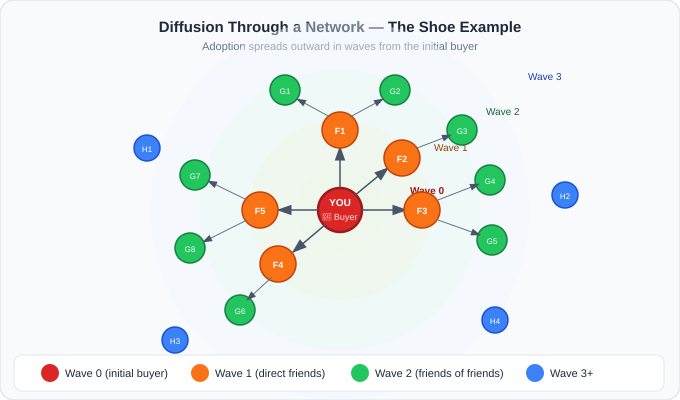
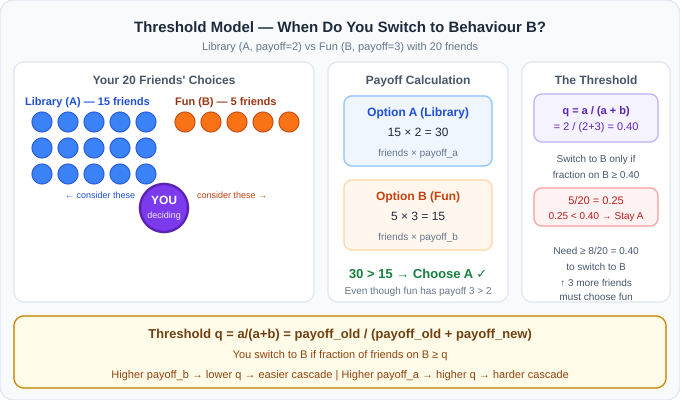
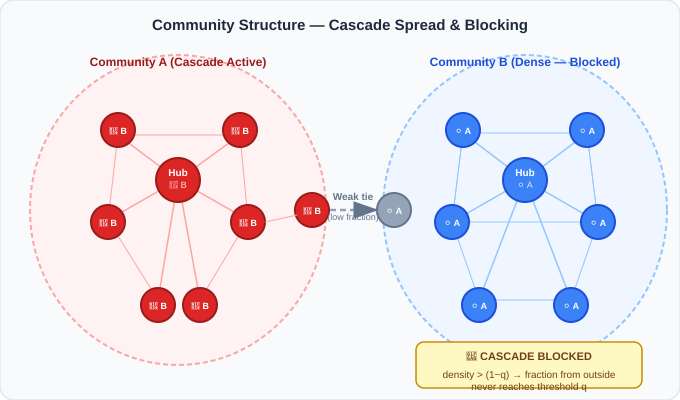
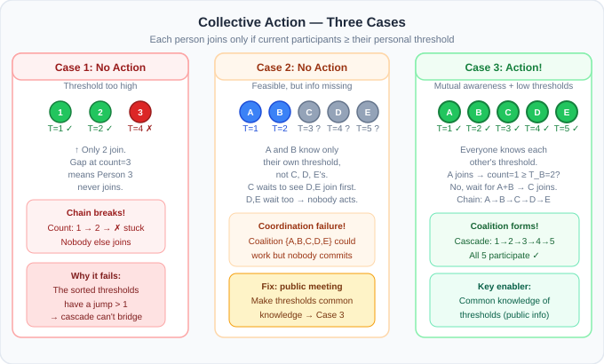

# Diffusion, Cascades & Collective Action in Networks

## 1. Why Do Humans Follow Each Other?

> **The Core Observation:** Humans regularly copy others' behaviour — even when they don't know whether the other person is correct. Why?

This isn't irrational. It's a calculated response to uncertainty. If **many** people do X, there is likely a good reason, even if you can't personally verify it.

### Three Fundamental Reasons for Following Others

| Reason | Mechanism | Example |
|---|---|---|
| **Informational** | Others have knowledge you lack; their action is evidence | Everyone leaves a restaurant → probably bad food |
| **Coordination** | Value comes from matching what others do | Everyone speaks English → you should too |
| **Network Effects** | More adopters = better product for everyone | More WhatsApp users → more valuable it is for you |

> **Should you follow others?** Not always — sometimes it leads to *information cascades* where everyone copies a bad choice because the first few people happened to get it right by luck. But in most practical coordination problems, following is rational.

---

## 2. Diffusion in Networks — The Shoe Example

**Scenario:** You buy a new pair of trendy shoes. Your friends notice. Some buy them too. Their friends see them. More people buy. This chain of adoption spreading through a network is called **diffusion**.

### What Happens Eventually?

The spread follows one of three outcomes:
1. **Full adoption** — everyone in the network eventually buys the shoes.
2. **Partial adoption** — the spread stops at community boundaries.
3. **No adoption** — the initial spark dies out before reaching critical mass.

### What Controls the Outcome?

- **Individual thresholds**: how many friends must adopt before *you* adopt
- **Network structure**: how communities connect (or don't)
- **Payoff advantage**: how much better is the new product vs. the old?
- **Seeding strategy**: who is the first adopter?

---

## 3. Modeling Diffusion: The Coordination Game

### Setup

Two options exist — call them **A** (old behaviour, e.g. studying in the library) and **B** (new behaviour, e.g. going out for fun).

Each option gives a **payoff per matching friend**:
- Option A gives payoff **a** per friend who also chooses A
- Option B gives payoff **b** per friend who also chooses B

> **Coordination matters:** You only receive the payoff when you choose the *same* thing as your friend. If you go to the library but your friend goes out, neither of you benefits from the interaction.

### Computing Your Best Choice

Suppose you have **n** friends total, and **k** of them have already switched to B.

$$\text{Payoff}_A = (n - k) \times a \qquad \text{Payoff}_B = k \times b$$

**You switch to B when:** $\text{Payoff}_B > \text{Payoff}_A$

$$k \times b > (n - k) \times a$$

$$k \times b > n \cdot a - k \cdot a$$

$$k(a + b) > n \cdot a$$

$$\frac{k}{n} > \frac{a}{a + b} \equiv q \quad \leftarrow \textbf{The Threshold}$$

### The Threshold Formula

$$\boxed{q = \frac{a}{a + b}}$$

- $q$ is the **fraction of your friends** that must choose B before you switch
- If the fraction of your neighbours on B exceeds $q$ → you switch to B
- If it's below $q$ → you stay on A

### Worked Example (from lecture)

- Library (A): payoff $a = 2$ per friend
- Fun (B): payoff $b = 3$ per friend
- Threshold: $q = \frac{2}{2 + 3} = 0.40$

You need **at least 40% of friends** on "fun" before you switch.

**Specific case:** You have 20 friends — 15 choose library, 5 choose fun.

$$\text{Fraction on B} = \frac{5}{20} = 0.25 < 0.40 \; (= q)$$

$$\text{Payoff}_A = 15 \times 2 = 30 \qquad \text{Payoff}_B = 5 \times 3 = 15$$

→ **You stay with Library**, even though fun has higher individual payoff ($b > a$).

**Key insight:** Social context (how many friends choose what) can override your personal preference.

---

## 4. The Threshold Model — General Form

The coordination game generalises to the standard **Linear Threshold Model**:

- Every node starts on behaviour A.
- A seed set of nodes switches to B.
- At each step: a node switches to B if the **fraction of its neighbours** already on B is $\geq q$.
- Repeat until no more nodes switch (convergence).

### Threshold Calculation for Assignments

$$\text{Number of neighbours that must adopt} = \lceil q \times \text{degree} \rceil$$

**Assignment Case Study 1:** 20 connections, threshold $q = 0.25$
$$0.25 \times 20 = \mathbf{5} \text{ friends must share first}$$

**Assignment Case Study 2:** 14 contacts, threshold $q = 0.5$
$$0.5 \times 14 = \mathbf{7} \text{ contacts must adopt first}$$

**Assignment Case Study 3 (Banks):** 12 counterparties, threshold $q = 0.25$
$$0.25 \times 12 = \mathbf{3} \text{ counterparty defaults trigger failure}$$

---

## 5. Social Reinforcement and Cascade Effects

**Social reinforcement** is the self-amplifying mechanism in diffusion:

> The more people adopt B → the higher the fraction of B-neighbours each remaining A-node sees → the more likely they cross their threshold → the more adopt B → repeat.

This creates a **cascade** — a chain reaction of adoptions spreading through the network.

### Cascade Outcomes

| Scenario | Outcome |
|---|---|
| Seed group large enough, low thresholds | **Full cascade** — everyone switches to B |
| Seed group too small, high thresholds | **No cascade** — B dies out, everyone stays A |
| Dense communities block spread | **Partial cascade** — B wins some clusters, not others |

---

## 6. Network Structure and Cascades

### Within-Community Spread

Inside a **tightly connected cluster**, diffusion is fast:
- Many neighbours are close to each other
- One adoption immediately raises the fraction-on-B for many neighbours
- Threshold conditions are met quickly

**This is why:** in Case Study 1, some communities had long chains of reshares while others stopped after 1–2 steps.

### Across-Community Spread

Between communities connected by **weak ties**:
- A node at the boundary has few neighbours in the other community
- Even if the entire source community adopted B, the fraction-on-B seen by boundary nodes in the target community is low
- The threshold $q$ may never be reached → cascade stops

### The Role of Bridges (Multi-Community Members)

Users who belong to **multiple communities** are the only pathway for crossing cluster boundaries. If they don't adopt:
- The campaign stays confined to its starting cluster
- This explains Case Study 1's failure to go platform-wide

---

## 7. The Cluster Density Theorem — Key Exam Result

This is the most important theoretical result for assignments:

> **Theorem:** A cascade CANNOT enter a cluster if that cluster has **internal edge density > (1 − q)**.

where:
- $q$ = adoption threshold
- **Internal density** = fraction of a cluster's possible edges that actually exist within the cluster

### Why This Works

If a cluster is very dense internally, each node in it has many neighbours *within* the cluster and few *outside*. Even if all external nodes adopt B, the fraction of B-neighbours seen by cluster members stays low — below their threshold $q$.

### Formula

A cluster of $k$ nodes blocks a cascade if:
$$\text{density} = \frac{\text{edges within cluster}}{\binom{k}{2}} > 1 - q$$

### Interpretation

| Density | q=0.2 | q=0.5 | q=0.8 |
|---|---|---|---|
| Must exceed for blocking | 0.8 | 0.5 | 0.2 |
| Interpretation | Very dense cluster needed | Moderately dense | Any sparse cluster blocks |

> **High threshold (q near 1):** hard to adopt → even weakly dense clusters block the cascade.
>
> **Low threshold (q near 0):** easy to adopt → only extremely dense clusters (near-complete) block the cascade.

---

## 8. Increasing Payoff and Adoption Rate

If the **payoff advantage of the new behaviour increases** (b ↑ while a stays fixed):

$$q = \frac{a}{a + b} \downarrow$$

A lower threshold means:
- Fewer neighbours need to adopt before you do
- The cascade spreads faster and farther
- Weaker connections between clusters can now be bridged

**Marketing implication:** Increase the incentive (free trial, subsidy, discount) → lower the effective threshold → cascade spreads wider.

---

## 9. Seeding Strategy — Who to Target First

### Random Seeding

Start the cascade from randomly chosen nodes. No targeting. Results depend on luck of the draw.

### High-Degree Seeding (Influencer Strategy)

Start from nodes with the most connections (hubs/influencers). Why this works:
1. Influencer adopts B
2. Influencer has many neighbours → many nodes immediately see a higher fraction-on-B
3. More nodes cross their threshold immediately
4. Cascade starts from a much larger effective footprint

**TrendHub / Case Study 1 insight:** Influencers gave initial visibility, but *within-community* threshold conditions still needed to be met for the cascade to continue beyond the influencer's direct audience.

> **Optimal strategy:** Seed bridging users + high-degree nodes within multiple communities simultaneously.

---

## 10. Collective Action Problems

### The Setup

Everyone **disagrees** with the current situation (e.g., unfair company policy, unjust law). Yet nothing changes. Why?

This is the **collective action problem**: each individual would act *if enough others acted too*, but no one acts first because they don't know if others will follow.

### Intrinsic Thresholds

Each person $i$ has a personal threshold $t_i$: the **minimum number of participants** (including themselves) they need before they'll join.

$$\text{Person } i \text{ joins if } |\text{current participants}| \geq t_i$$

### The Information Problem

In real networks, you only know the thresholds of your **local neighbours** — not the entire network. This limited information can prevent action even when a successful coalition is theoretically possible.

### Three Outcomes (Cases)

**Case 1 — No Action (Threshold too high):**
Some individuals have thresholds so high relative to their connections that they will never join. Their absence causes others below them in the cascade chain to drop out. Nobody acts.

**Case 2 — No Action (Information failure):**
A feasible coalition exists — enough people have low enough thresholds — but they don't *know* each other's thresholds. Each waits for others to confirm they'll join first. Pure coordination failure.

**Case 3 — Action Succeeds:**
Enough people have mutual awareness of each other's thresholds (e.g., through a public meeting or common knowledge event). The coalition forms.

### "Divide and Conquer" Effect

Dense clusters with weak inter-cluster links mean each small group knows only its local information. Even if globally enough people are willing to act, local uncertainty prevents any group from committing. This is why **broadcasting information publicly** (making thresholds common knowledge) can trigger collective action.

---

## 11. Financial Contagion — Case Study 3 Application

The same threshold/cascade model applies perfectly to banking networks:

| Concept | Networks | Banking |
|---|---|---|
| Node | Person | Bank |
| Edge | Social connection | Lending relationship (directed: lender → borrower) |
| Behaviour A | Standing (solvent) | Remaining solvent |
| Behaviour B | Adopting new behaviour | Defaulting |
| Threshold $q$ | Fraction of friends needed | Fraction of counterparty defaults that triggers own default |
| Cascade | Behaviour spread | Contagion chain |
| Dense cluster | Resistant community | Insulated regional cluster |

### Counter-intuitive Result: Connectivity ≠ Stability

More connections → each bank is more exposed to counterparty defaults → a shock propagates to more banks quickly. **Moderate or low connectivity** limits the number of channels a shock can travel through.

- **Core-periphery structure**: large central banks are critical cascade hubs
- **Direct losses**: from lending to defaulted banks
- **Indirect losses**: fire sales depress asset prices → stress spreads even without direct links

---

## 12. Summary: Factors Controlling Cascade Outcome

| Factor | Effect on cascade spread |
|---|---|
| **Lower threshold q** | Spreads faster and farther |
| **Higher payoff b** (new behavior) | Lowers q → spreads more |
| **High-degree seed nodes** | Faster initial spread |
| **Bridge users across clusters** | Enable cross-cluster spread |
| **Dense clusters (density > 1-q)** | Block the cascade |
| **Weak inter-cluster ties** | Slow or stop cross-cluster spread |
| **Shared information about thresholds** | Enables collective action |
| **High network connectivity (banking)** | Amplifies contagion risk |

---

## 13. Assignment Answer Reference Sheet

| Question | Answer | Formula/Reason |
|---|---|---|
| Chain of reshares in marketing | **Diffusion** | Behaviour spreading through social network |
| Why campaign didn't go platform-wide | **High thresholds + weak bridging users + inter-cluster weak ties** | All three together blocked spread |
| Why spread faster within communities | **Members observed more neighbours sharing** | Higher fraction of local neighbours → threshold met faster |
| CS1: 20 connections, threshold 0.25 | **5 must share** | $0.25 \times 20 = 5$ |
| Bridging users valuable because | **Enable cross-community diffusion** | Only path across cluster boundaries |
| Best network model for EV adoption | **Social network** | Adoption via social influence, not physical routes |
| Early adopters' role | **Reduce uncertainty through visible adoption** | Others can observe and verify before adopting |
| EV cascade conditions | **Giant connected component + many low-threshold individuals** | Both structure and threshold distribution needed |
| CS2: 14 contacts, threshold 0.5 | **7 contacts must adopt** | $0.5 \times 14 = 7$ |
| Why EV adoption varied by community | **Network structure and thresholds varied** | Core thesis of threshold cascade model |
| Directed edge A→B in banking | **A lending to B** | Direction indicates credit flow |
| Mechanisms for banking cascade | **Direct losses (lending) + indirect (asset price)** | Both channels present |
| High connectivity in banking → | **Amplifies shock propagation** | More channels = more contagion paths |
| CS3: 12 counterparties, threshold 0.25 | **3 defaults trigger failure** | $0.25 \times 12 = 3$ |
| Network property for banking resilience | **Low connectivity** | Limits channels for contagion propagation |

---

## 14. Common Exam Misconceptions

> [!WARNING]
> **Misconception:** "Having high-payoff new behaviour always causes a cascade"
>
> **Reality:** Payoff advantage lowers the threshold, but if the network has dense clusters or no bridging users, the cascade still stops at community boundaries.

> [!WARNING]
> **Misconception:** "High connectivity always makes networks more stable/resilient"
>
> **Reality:** In banking/contagion contexts, HIGH connectivity AMPLIFIES shocks — low connectivity reduces cascade channels and increases resilience.

> [!WARNING]
> **Misconception:** "Everyone must adopt for a cascade to be called successful"
>
> **Reality:** Cascades can partially spread — reaching only certain clusters. The outcome depends on whether cascade front nodes can cross the (1−q) density barrier.

> [!NOTE]
> **For financial contagion (CS3):**
> The threshold model applies to bank defaults without needing to think about social payoffs. The threshold $q$ = fraction of counterparties that must default to trigger your own default. Low $q$ = fragile bank, High $q$ = resilient bank.

> The full Python implementation is in `code/08_diffusion_cascades.py`.
