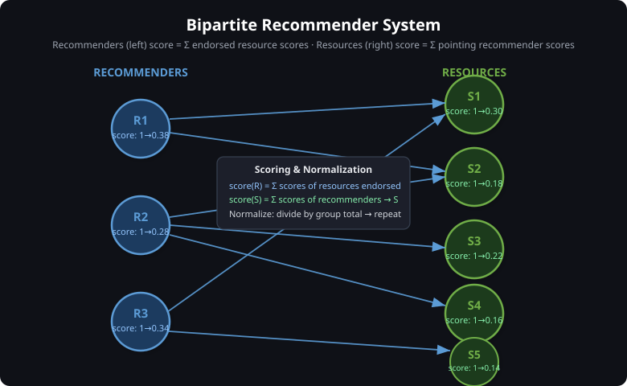
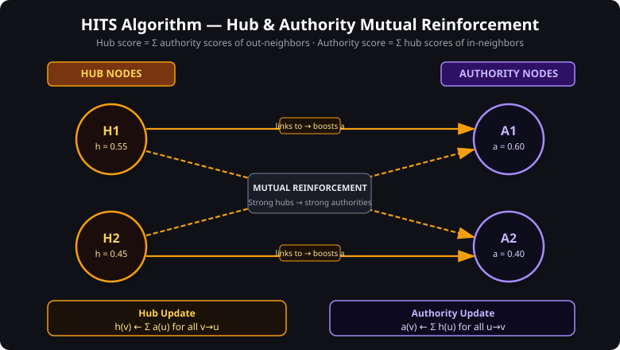
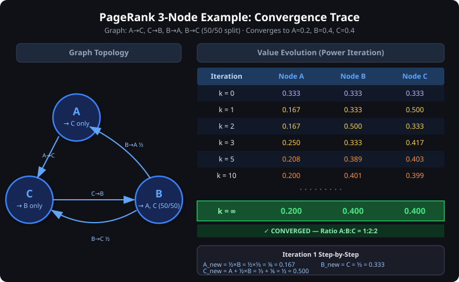
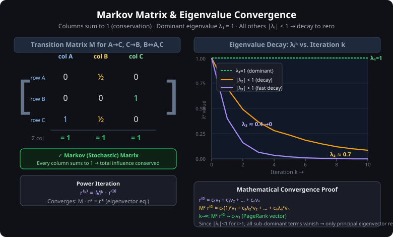

# HITS, Recommender Systems & PageRank Linear Algebra

> **Topic:** Hyperlink-Induced Topic Search (HITS), Bipartite Recommender Scoring, and the Mathematical Foundations of PageRank via Markov Matrices and Eigenvalues.

---

## 1. The Bipartite Recommender System

### 1.1 The Core Idea — Mutual Reinforcement

A **recommender system** identifies high-quality resources based on who endorses them and, conversely, judges the quality of endorsers based on the quality of what they recommend. This creates a **positive feedback loop**:

```
Good Resource → Trusted Recommender → Good Resource → ...
```

> **Analogy:** Sharing joy multiplies it; sharing sorrow lessens it. Similarly, a high-quality
> resource amplifies the credibility of its pointer, and a credible pointer elevates the status
> of what it points to.

This reciprocal credit system forms the foundational framework for measuring **authority**, **trust**, and **influence** within interconnected networks.

---

### 1.2 Structure — Bipartite Graph

The system consists of two disjoint groups of nodes with edges only crossing between them:

```
RECOMMENDERS         RESOURCES
(Left nodes)         (Right nodes)

    R1  ─────────►  ─────  S1
    R1  ─────────►  ─────  S2
    R2  ─────────►  ─────  S3
    R2  ─────────►  ─────  S4
    R3  ─────────►  ─────  S5
    R3  ─────────►  ─────  S1
```

- **Bipartite** means edges only go from recommenders → resources (no recommender points to another recommender, no resource points to another resource).
- In the course example: **3 recommenders** and **5 resources**.



---

### 1.3 Scoring Rules

| Node Type | Score = |
|---|---|
| **Recommender** | Sum of scores of all resources it endorses |
| **Resource** | Sum of scores of all recommenders pointing to it |

**Initialization:** All nodes start with a score of **1**.

**After each round:** Apply **normalization** — divide each node's score by the total sum of scores within its group.

$$
\text{Normalized}(x) = \frac{\text{Score}(x)}{\sum_{\text{all } y \text{ in same group}} \text{Score}(y)}
$$

This prevents unbounded growth and preserves proportional weight.

---

### 1.4 Iterative Process & Convergence

The assign-then-normalize cycle repeats iteratively:

1. **Assign:** Compute new scores for all recommenders and resources simultaneously.
2. **Normalize:** Divide each score by the group total.
3. **Repeat** until convergence (~200 iterations).

**Why does it converge?**
- The normalization bounds all values in (0, 1).
- Each cycle is essentially a matrix multiplication (see Section 5).
- The Perron-Frobenius theorem guarantees convergence to a unique stable distribution.

> **Key Insight:** Scores stop changing when the steady state is reached — the relative ranking of nodes becomes fixed.

---

## 2. The HITS Algorithm (Hyperlink-Induced Topic Search)

### 2.1 Overview

HITS extends the bipartite recommender concept to **general directed graphs** (not just bipartite structures). Every node simultaneously plays two roles:

| Role | Metric | Meaning |
|---|---|---|
| **Hub** | Hub score $h(v)$ | How well does this node point to high-quality destinations? |
| **Authority** | Authority score $a(v)$ | How many high-quality hubs point to this node? |

> **Origin:** HITS was developed by Jon Kleinberg (1999) for ranking early web directories and news aggregators, where trust in a directory depended on the quality of its linked content, and trust in content depended on the credibility of the directories featuring it.

---

### 2.2 The Mutual Reinforcement Equations

The two scores are **co-dependent** — each is defined in terms of the other:

$$
\boxed{h(v) = \sum_{v \to u} a(u)}
$$

> A node's **hub score** = sum of the **authority scores** of the nodes it links to.

$$
\boxed{a(v) = \sum_{u \to v} h(u)}
$$

> A node's **authority score** = sum of the **hub scores** of the nodes that link to it.

> **Intuition:**
> - Strong **hubs** amplify the authority of the nodes they reference.
> - Strong **authorities** validate the hub status of those that link to them.



---

### 2.3 HITS Algorithm Steps

1. **Initialize:** Set $h(v) = 1$ and $a(v) = 1$ for all nodes.
2. **Authority Update:** $a(v) \leftarrow \sum_{u \to v} h(u)$ for all $v$.
3. **Hub Update:** $h(v) \leftarrow \sum_{v \to u} a(u)$ for all $v$.
4. **Normalize:** Divide all hub scores by $\sum_v h(v)^2$, and all authority scores by $\sum_v a(v)^2$ (L2 normalization), OR divide by group sum (L1 normalization).
5. **Repeat** until convergence.

> **Note:** In the course's bipartite version, recommenders = hubs and resources = authorities, and normalization uses L1 (sum = 1 after each round).

---

### 2.4 Worked Example — Calculating Authority Score

**Setup:** A user is followed by two hubs with hub scores **3** and **5**.

$$
a(\text{user}) = 3 + 5 = \mathbf{8} \quad \text{(before normalization)}
$$

**Setup:** A paper is cited by two papers with authority scores **1.5** and **2.5**.

Hub-independent authority contribution before normalization:

$$
a(\text{paper}) = 1.5 + 2.5 = \mathbf{4.0}
$$

---

### 2.5 HITS vs. PageRank: Strengths and Weaknesses

| Property | HITS | PageRank |
|---|---|---|
| **Scores per node** | Two (hub + authority) | One (global rank) |
| **Best suited for** | Topic-specific subgraphs | Global graph ranking |
| **Stability** | Sensitive to graph structure; fluctuates with additions/removals | Robust and stable as graph grows |
| **Scope** | Applied to a focused subgraph per query | Applied to entire graph once |
| **Convergence** | Guaranteed mathematically | Guaranteed mathematically |
| **Weakness** | Sensitive to irrelevant parts of the graph; lacks a global notion of importance | Requires careful handling of dangling/sink nodes |

> **Why HITS fails on large social graphs:** Rankings fluctuate significantly when new users join or leave. HITS works best applied to topic-specific subgraphs (e.g., users in a fitness discussion).

---

## 3. PageRank — The Random Walk Model

### 3.1 Core Principle

> **A node is important if it is pointed to by other important nodes.**

This is a **recursive, self-referential** definition resolved through iterative computation.

**The conservation principle:** Influence is a finite resource. The total "gold coins" in the network is fixed (conserved) throughout every redistribution cycle. This prevents inflation to infinity or depletion to zero.

---

### 3.2 Three-Node Example: A, B, C

**Graph structure:**
- A → C (A sends all its value to C)
- C → B (C sends all its value to B)
- B → A and B → C (B splits its value 50/50)

**Initialization:** Each node holds $\frac{1}{3}$.

| Iteration | Node A | Node B | Node C |
|---|---|---|---|
| 0 | $\frac{1}{3}$ | $\frac{1}{3}$ | $\frac{1}{3}$ |
| 1 | $\frac{1}{6}$ | $\frac{1}{3}$ | $\frac{1}{2}$ |
| ... | ... | ... | ... |
| **Converged** | **0.2** | **0.4** | **0.4** |

**Derivation of Iteration 1:**

$$
A_{new} = \frac{1}{2} \times B_{old} = \frac{1}{2} \times \frac{1}{3} = \frac{1}{6}
$$

$$
B_{new} = C_{old} = \frac{1}{3}
$$

$$
C_{new} = A_{old} + \frac{1}{2} \times B_{old} = \frac{1}{3} + \frac{1}{6} = \frac{1}{2}
$$

**Converged ratio:** A : B : C = **1 : 2 : 2**, confirming:

$$
A = 0.2, \quad B = 0.4, \quad C = 0.4
$$

> **Key insight:** The equilibrium is determined entirely by the network's topology — NOT by the initial values.



---

### 3.3 Five-Node Example: The System of Linear Equations

In a 5-node network (A, B, C, D, E), each node's PageRank is expressed as a **linear equation** in terms of its neighbors' PageRank:

$$
A = \frac{C}{3}
$$

$$
B = A + \frac{E}{2}
$$

$$
E = D + \frac{C}{3}
$$

**Conservation check:** The total of all node values must always equal **1.0** (or the starting total).

This system of equations is solved by iteration (power method), not symbolic algebra, because:
- Values are interdependent (circular dependencies)
- The matrix formulation handles all equations simultaneously

---

## 4. Matrix Formulation of PageRank

### 4.1 State Vector and Transition Matrix

At any iteration, the network state is a **column vector** $\mathbf{r}$ where each entry $r_i$ is the current PageRank of node $i$:

$$
\mathbf{r}^{(0)} = \begin{bmatrix} r_A \\ r_B \\ r_C \end{bmatrix} = \begin{bmatrix} 1/3 \\ 1/3 \\ 1/3 \end{bmatrix}
$$

The network topology is encoded in a **transition matrix** $M$ where:

$$
M_{ij} = \frac{1}{\text{out-degree}(j)} \quad \text{if node } j \text{ links to node } i, \text{ else } 0
$$

> **Column convention:** Column $j$ describes how node $j$ distributes its score to others. If node $j$ has 3 outgoing links, each cell in column $j$ (for the linked nodes) gets $\frac{1}{3}$.

**Matrix update rule:**

$$
\mathbf{r}^{(t+1)} = M \cdot \mathbf{r}^{(t)}
$$

**After $k$ iterations:**

$$
\mathbf{r}^{(k)} = M^k \cdot \mathbf{r}^{(0)}
$$

---

### 4.2 Example — Three-Node Transition Matrix

For the A→C, C→B, B→A, B→C graph:

$$
M = \begin{bmatrix}
0 & \frac{1}{2} & 0 \\
0 & 0 & 1 \\
1 & \frac{1}{2} & 0
\end{bmatrix}
$$

Reading the matrix:
- **Column 1 (A):** A sends all its value to C → $M_{31} = 1$, all others = 0
- **Column 2 (B):** B splits between A and C → $M_{12} = M_{32} = \frac{1}{2}$
- **Column 3 (C):** C sends all its value to B → $M_{23} = 1$

**Verification:**

$$
M \cdot \mathbf{r}^{(0)} = \begin{bmatrix} 0 & 1/2 & 0 \\ 0 & 0 & 1 \\ 1 & 1/2 & 0 \end{bmatrix} \begin{bmatrix} 1/3 \\ 1/3 \\ 1/3 \end{bmatrix} = \begin{bmatrix} 1/6 \\ 1/3 \\ 1/2 \end{bmatrix}
$$

This matches Iteration 1 computed manually! ✅

---

## 5. Markov Matrices — The Mathematical Foundation

### 5.1 Definition

A **Markov matrix** (also called a **stochastic matrix**) is a matrix where:

$$
\boxed{\sum_{i} M_{ij} = 1 \quad \text{for every column } j}
$$

Every **column sums to 1**. This is the algebraic formulation of **conservation of total influence** — every unit of rank that flows out of a node is received by exactly one or more other nodes.

### 5.2 Why Column Sum = 1 Matters

If every column sums to 1:

$$
\mathbf{1}^T M = \mathbf{1}^T \quad \Rightarrow \quad \sum_i r_i^{(t+1)} = \sum_i r_i^{(t)}
$$

The total score is **conserved** through every matrix multiplication. This ensures:
- No unbounded growth
- No collapse to zero
- A stable equilibrium must exist

---

### 5.3 Eigenvalues and Convergence — Mathematical Proof

**The key theorem:** For any Markov matrix, the **largest eigenvalue is always exactly $\lambda_1 = 1$**.

The **power iteration method** exploits this property:

Any initial state vector $\mathbf{r}^{(0)}$ can be written as a **linear combination of eigenvectors**:

$$
\mathbf{r}^{(0)} = c_1 \mathbf{v}_1 + c_2 \mathbf{v}_2 + \cdots + c_n \mathbf{v}_n
$$

After $k$ applications of $M$:

$$
\mathbf{r}^{(k)} = M^k \mathbf{r}^{(0)} = c_1 \lambda_1^k \mathbf{v}_1 + c_2 \lambda_2^k \mathbf{v}_2 + \cdots + c_n \lambda_n^k \mathbf{v}_n
$$

Now apply the key facts:
- $\lambda_1 = 1$ → $\lambda_1^k = 1^k = 1$ (remains constant forever)
- All other eigenvalues $|\lambda_i| < 1$ → $\lambda_i^k \to 0$ as $k \to \infty$

Therefore, as $k \to \infty$:

$$
\boxed{\mathbf{r}^{(k)} \xrightarrow{k \to \infty} c_1 \mathbf{v}_1}
$$

**The "noise" from all sub-dominant eigenvectors vanishes**, leaving only the **principal eigenvector** $\mathbf{v}_1$ associated with $\lambda = 1$.



### 5.4 What This Means

| Mathematical fact | Network interpretation |
|---|---|
| $\lambda_1 = 1$ | Dominant eigenvector is the stable PageRank distribution |
| $|\lambda_i| < 1$ for $i > 1$ | All transient fluctuations die out |
| Convergence is guaranteed | Any starting vector leads to the same final ranking |
| The limit is $c_1 \mathbf{v}_1$ | PageRank is the dominant eigenvector of $M$ |

> **Fundamental result:** PageRank of a node is NOT a product of computation alone — it is an **intrinsic property of the graph's topology**, revealed by the principal eigenvector of the transition matrix.

---

### 5.5 Eigenvector Equation at Steady State

At convergence, the PageRank vector $\mathbf{r}^*$ satisfies:

$$
M \mathbf{r}^* = \mathbf{r}^*
$$

This means $\mathbf{r}^*$ is an **eigenvector of $M$ with eigenvalue 1**. Expanding:

$$
M \mathbf{r}^* = 1 \cdot \mathbf{r}^* \implies (M - I)\mathbf{r}^* = \mathbf{0}
$$

This is the definition of an **eigenvector**: multiplication by $M$ does not change the direction of $\mathbf{r}^*$, only (trivially) its scale by $\lambda = 1$.

---

## 6. Dangling Nodes and the Damping Factor

### 6.1 The Dangling Node Problem

A **dangling node** (sink) has no outgoing edges. In matrix terms, its column in $M$ is all zeros — it **absorbs** probability without redistributing it.

This breaks the column-sum-to-1 property, meaning $M$ is no longer a valid Markov matrix, and convergence is no longer guaranteed.

### 6.2 The Damping Factor Fix

**Teleportation:** With probability $(1-d)$, the surfer jumps to a completely random node instead of following a link.

The modified PageRank formula:

$$
\boxed{PR(v) = \frac{1-d}{n} + d \sum_{u \to v} \frac{PR(u)}{|N^+(u)|}}
$$

Where $d \approx 0.85$ is the **damping factor**.

In matrix form, the modified transition matrix becomes:

$$
\hat{M} = d \cdot M + \frac{(1-d)}{n} \cdot \mathbf{1}\mathbf{1}^T
$$

This matrix $\hat{M}$ is:
- A valid Markov matrix (every column sums to 1)
- **Irreducible:** every node can reach every other node (via teleportation)
- **Aperiodic:** no periodic cycles that prevent convergence

These properties guarantee **unique convergence** for any network topology.

---

## 7. Assignment — Case Study Reference

### Case Study 1: Social Media Platform (HITS vs. PageRank)

| Question | Answer | Key Reasoning |
|---|---|---|
| Strong hub definition | **Follow many authoritative users** | Hub score = sum of authority scores of pointed-to nodes |
| Why HITS fails on full social graph | **Sensitive to irrelevant parts; lacks global importance** | HITS is query-dependent and topology-sensitive |
| Authority score from hubs 3 and 5 | **8** | $a = 3 + 5 = 8$ (sum of hub scores) |
| Why PageRank preferred globally | **Uses the entire link structure** | Single global ranking; no subgraph needed |
| PageRank convergence mechanisms | **Damping factor < 1 + handling dangling nodes** | These restore the Markov property |

### Case Study 2: Web Search (PageRank Mechanics)

| Question | Answer | Key Reasoning |
|---|---|---|
| HITS better suited for | **Topic-specific searches** | Requires building a focused subgraph per query |
| PageRank anti-stuck mechanisms | **Random jumps + redistributing dangling node rank + following links** | All three restore valid probability flow |
| Total incoming contribution (0.2+0.1+0.3) | **0.6** | $0.2 + 0.1 + 0.3 = 0.6$ (simple sum before damping) |
| Why dangling nodes are problematic | **They absorb probability mass** | Without redistribution, total probability < 1 |
| Why transition probabilities sum to 1 | **To represent a valid random walk (Markov property)** | Non-stochastic matrix has no convergence guarantee |

### Case Study 3: Academic Citation Network

| Question | Answer | Key Reasoning |
|---|---|---|
| Authority paper definition | **Cited by many influential papers** | Authority score = sum of hub scores of citing papers |
| HITS manipulation methods | **Creating hub papers + excessive self-citations** | HITS is locally computed; easy to exploit |
| Authority from scores 1.5 and 2.5 | **4.0** | $a = 1.5 + 2.5 = 4.0$ |
| PageRank's manipulation resistance | **Global normalization and damping** | Local exploits don't significantly shift global distribution |
| Properties improving PageRank stability | **High connectivity + presence of hubs** | Denser networks propagate rank faster; hubs accelerate convergence |

---

## 8. Mathematical Concept Quick Reference

### 8.1 HITS Update Equations

$$
h(v) \leftarrow \sum_{v \to u} a(u) \qquad \text{(Hub update)}
$$

$$
a(v) \leftarrow \sum_{u \to v} h(u) \qquad \text{(Authority update)}
$$

### 8.2 PageRank Recursive Formula

$$
PR(v) = \sum_{u \to v} \frac{PR(u)}{|N^+(u)|}
$$

### 8.3 PageRank with Damping

$$
PR(v) = \frac{1-d}{n} + d \sum_{u \to v} \frac{PR(u)}{|N^+(u)|}
$$

### 8.4 Normalization (Bipartite Recommender)

$$
\text{Normalized Score}(x) = \frac{\text{Score}(x)}{\sum_{y \in \text{group}} \text{Score}(y)}
$$

### 8.5 Markov Matrix Property

$$
\sum_{i} M_{ij} = 1 \quad \forall j \qquad \Leftrightarrow \qquad \text{Total influence is conserved}
$$

### 8.6 Eigenvalue Convergence

$$
M^k \mathbf{r}^{(0)} \xrightarrow{k \to \infty} c_1 \mathbf{v}_1 \quad \text{where } M\mathbf{v}_1 = \mathbf{v}_1
$$

### 8.7 Steady State Condition

$$
M \mathbf{r}^* = \mathbf{r}^* \quad \Leftrightarrow \quad \mathbf{r}^* \text{ is the eigenvector of } M \text{ with } \lambda = 1
$$

---

## 9. Common Exam Traps & Misconceptions

> [!WARNING]
> **Trap 1: Confusing hub and authority updates**
> Hub update uses authority scores of OUT-neighbors. Authority update uses hub scores of IN-neighbors. Getting this backwards gives completely wrong answers.

> [!WARNING]
> **Trap 2: Forgetting both accepted answers for "why HITS fails on full graph"**
> Both *"sensitive to irrelevant parts"* AND *"lacks global notion of importance"* are correct. Answering only one gives partial credit (0.5/1).

> [!WARNING]
> **Trap 3: Dangling nodes "reduce authority scores" or "break hub calculations"**
> Wrong. Dangling nodes **absorb probability mass** — this is the precise problem. They drain the total probability sum below 1.

> [!NOTE]
> **Convergence guarantee:** Both HITS and PageRank are **mathematically guaranteed to converge** for any network topology (given proper handling of sinks and damping for PageRank). The question "does HITS converge?" — YES, it always does.

> [!NOTE]
> **HITS convergence stability vs. PageRank:** HITS *does converge*, but its *results are unstable* — small changes in the input graph (new user joins) produce large changes in the ranking. PageRank is far more stable to such structural changes.

> [!CAUTION]
> **PageRank convergence mechanisms (Case Study 2, partial answer trap):** Three mechanisms help: (1) random jumps, (2) redistributing dangling node rank, (3) following links most of the time. Missing the third gives 0.66/1 instead of 1/1.

> [!CAUTION]
> **PageRank stability (Case Study 3):** Both *"high connectivity"* AND *"presence of hubs"* improve stability. *Uniform degree distribution* and *strong community isolation* do NOT help — isolation impedes rank propagation.

---

## 10. Conceptual Summary

```
BIPARTITE RECOMMENDER SYSTEM
  ├─ Nodes: Recommenders (hubs) + Resources (authorities)
  ├─ Scoring: score(recommender) = Σ score(resources it points to)
  │           score(resource) = Σ score(recommenders pointing to it)
  └─ Normalize after each round → iterate to convergence

HITS (General Directed Graphs)
  ├─ Every node has BOTH hub score AND authority score
  ├─ Hub score = Σ authority scores of out-neighbors
  ├─ Authority score = Σ hub scores of in-neighbors
  ├─ Normalize → repeat
  └─ Best for: topic-specific, query-dependent ranking

PAGE RANK (Global Directed Graphs)
  ├─ Every node has ONE score
  ├─ PR(v) = Σ PR(u)/out-degree(u) over all u→v
  ├─ Damping factor handles sinks, ensures Markov property
  ├─ Matrix form: r = M·r at steady state (eigenvector equation)
  └─ Best for: global, stable, scalable ranking

MATHEMATICAL GUARANTEE
  ├─ Transition matrix M is a Markov matrix (columns sum to 1)
  ├─ Largest eigenvalue λ₁ = 1
  ├─ All other |λᵢ| < 1 → their contribution → 0 over iterations
  └─ Convergence to principal eigenvector v₁ is guaranteed
```

---

> The full Python implementation for PageRank is in [`code/07_pagerank.py`](code/07_pagerank.py).
> See also: [`07_PageRank_and_Web_Graph.md`](07_PageRank_and_Web_Graph.md) for damping factor worked examples and the random walk model.
