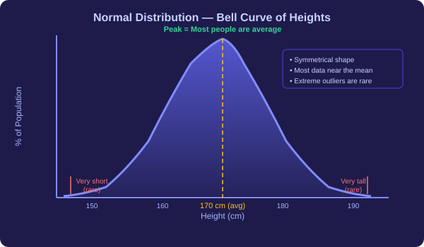
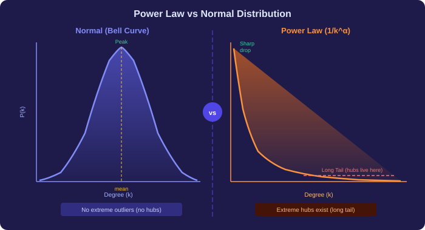
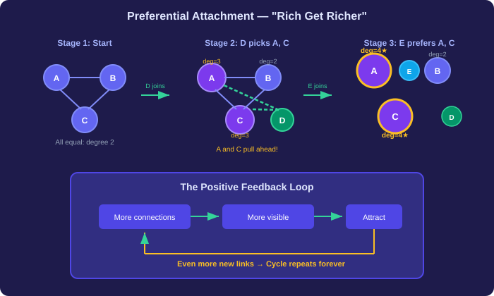
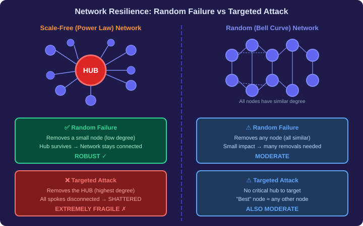

# Power Law, Preferential Attachment & Network Resilience — Plain Language Notes

> **What this covers:** Why do real-world networks look nothing like random networks? This file explains the dramatic gap between the "bell curve" world of random models and the "power law" world of the real internet, social media, and airline routes. We build from the normal distribution through the Central Limit Theorem, into power laws, the Barabási–Albert preferential attachment model, and finally network resilience under random failures vs. targeted attacks. All three assignment case studies are fully solved at the end.

---

## Part 1 — The Normal Distribution: Nature's Default

### What Is a Normal Distribution?

When you measure a biological or cognitive trait across a large population — height, weight, IQ — and plot the results, you nearly always see the same shape: a **bell curve**.

```
     Percentage
     of People
        ▲
        │         ┌───┐
        │       ┌─┘   └─┐
        │     ┌─┘         └─┐
        │   ┌─┘             └─┐
        │ ┌─┘                 └─┐
        │─┘                     └──
        └──────────────────────────► Measurement
               (e.g., height)
```

**What the bell curve tells us:**

| Feature | What it means |
|---|---|
| **Central peak** | Most people cluster around the average |
| **Symmetrical taper** | Equal chance of being above or below average |
| **Thin tails** | Extreme outliers are exceedingly rare |

**Example — Human Height:**
- Average adult height ≈ 5'7" (170 cm)
- Vast majority fall between 5'0" and 6'2"
- Finding someone 7'0" tall is extremely rare
- Finding someone 8'0" tall is essentially impossible

> **Key idea:** In a normal distribution, there *is* a "typical" value. Most individuals are close to it, and extreme deviations are vanishingly unlikely. Nature seems to favor an average state.



---

### Why Does Nature Produce Bell Curves? — The Central Limit Theorem

The reason the bell curve appears everywhere in nature has a deep mathematical explanation called the **Central Limit Theorem (CLT)**.

**The intuition — a number-picking experiment:**

Imagine 10 people each independently pick a random integer between 1 and 100. Now add up their picks.

- **Minimum possible sum:** 10 (everyone picks 1)
- **Maximum possible sum:** 1,000 (everyone picks 100)
- **Most likely sum:** around **550** (the middle)

Why is the middle overwhelmingly likely?

| Outcome | How many ways to get there? | Probability |
|---|---|---|
| Sum = 10 | Exactly **1 way** — all pick 1 | Astronomically tiny |
| Sum = 1000 | Exactly **1 way** — all pick 100 | Astronomically tiny |
| Sum ≈ 550 | **Billions of combinations** — high picks from some cancel low picks from others | Very high |

The extreme outcomes require *perfect alignment* — every single person must independently choose the same extreme value. The middle outcomes have a *vast combinatorial advantage* — there are simply far more ways to get a moderate result.

$$
\text{Sum around the middle} \longleftrightarrow \text{Many, many combinations} \longleftrightarrow \text{High probability}
$$

$$
\text{Sum at the extremes} \longleftrightarrow \text{Only 1 combination} \longleftrightarrow \text{Near-zero probability}
$$

---

### The Formal Statement of the CLT

> **Central Limit Theorem:** Whenever a measured quantity is the **sum of many independent random variables**, its distribution converges to a **normal (bell-shaped) distribution**, regardless of the shape of the individual variables' distributions.

**Why does human height follow a bell curve?**

Your height is determined by the *sum* of many small, independent factors:
- Hundreds of genes, each contributing a tiny amount
- Nutrition during childhood
- Environmental stresses
- Sleep patterns

Because the final height = sum of all these independent pieces → CLT kicks in → bell curve.

$$
\text{Height} = \underbrace{g_1 + g_2 + \cdots + g_n}_{\text{many independent genetic factors}} + \underbrace{e_1 + e_2 + \cdots + e_m}_{\text{environmental factors}} \xrightarrow{\text{CLT}} \text{Normal Distribution}
$$

> **The critical requirement:** The CLT applies when the result is an **additive sum** of **independent** variables. If the variables are *not* independent — if the outcome of one depends on another — the CLT breaks down, and you can get very different distributions. This is exactly what happens in real-world networks.

---

## Part 2 — Random Networks and the Bell Curve of Degrees

### The G(n, p) Random Graph Model (Erdős–Rényi)

The simplest model for building a network is the **Erdős–Rényi random graph**, denoted $G(n, p)$:

**Recipe:**
1. Start with $n$ nodes (no edges yet).
2. For *every possible pair* of nodes, flip a biased coin with probability $p$.
3. If heads → add an edge. If tails → no edge.

Every pair's coin flip is **independent** of every other pair's.

**Example: $G(1000, 0.1)$ — 1000 nodes, $p = 0.1$**

Each node can potentially connect to 999 others. Each potential edge has a 10% chance of existing.

**Expected degree of any node:**

$$
\text{Expected degree} = (n - 1) \times p = 999 \times 0.1 \approx 100
$$

Because each edge is decided by an independent coin flip, the degree of any single node is the *sum* of 999 independent Bernoulli random variables. By the CLT:

$$
\text{Degree of a node} = \underbrace{X_1 + X_2 + \cdots + X_{999}}_{\text{each } X_i \in \{0,1\} \text{ with prob } p} \xrightarrow{\text{CLT}} \text{Normal Distribution}
$$

**Result:** The degree distribution of a $G(n, p)$ graph follows a **bell curve** centered at $np$.

```
  Number of
    Nodes
      ▲
      │           ┌─────┐
      │         ┌─┘     └─┐
      │       ┌─┘         └─┐
      │     ┌─┘             └─┐
      │   ┌─┘                 └─┐
      │───┘                     └───
      └──────────────────────────────► Degree
           50    80  100  120   150
                     ↑
               Average = 100
```

- Most nodes have degree ≈ 100
- Very few nodes have degree < 50 or > 150
- A node with degree 500 is **statistically impossible**

> **Key insight for assignments:** In a $G(n, p)$ model, the peak of the degree distribution occurs at $n \times p$. For $G(1000, 0.1)$, the peak is at $1000 \times 0.1 = 100$.

---

### Properties of Random Networks

| Property | Value / Behavior |
|---|---|
| **Average degree** | $(n-1) \times p \approx n \times p$ |
| **Degree distribution** | Bell curve (normal / Poisson for small $p$) |
| **Hub nodes** | Do NOT exist — no node is dramatically more connected |
| **"Typical" node** | Yes — most nodes look alike |
| **Formation process** | Independent coin flips (additive, independent → CLT applies) |

---

## Part 3 — The Power Law: What Real Networks Actually Look Like

### The Shocking Discovery

In the late 1990s, when scientists finally had the data and computing power to map real networks like the **World Wide Web**, they expected to see a bell curve of degrees. Instead, they found something radically different.

**What they saw:**

Instead of a symmetrical peak in the middle, the data showed:
- A **massive spike at low degrees** — most nodes have very few connections
- A **long, gradually declining tail** extending to extremely high degrees
- **No central peak** — there is no "typical" node

This is the **power law distribution**.

### The Power Law Formula

$$
P(k) \approx \frac{1}{k^\alpha}
$$

Where:
- $P(k)$ = the fraction of nodes with degree $k$
- $k$ = degree (number of connections)
- $\alpha$ = the **power law exponent** (typically between 2 and 3 for real networks)

For the World Wide Web's incoming links, $\alpha \approx 2$:

$$
P(k) \approx \frac{1}{k^2}
$$

**What this means in practice:**

| Degree $k$ | $P(k) = 1/k^2$ | Interpretation |
|---|---|---|
| 1 | 1.00 | Maximum — most pages have ~1 link |
| 2 | 0.25 | 4× fewer pages have 2 links |
| 10 | 0.01 | 100× fewer pages have 10 links |
| 100 | 0.0001 | 10,000× fewer, but they **still exist** |
| 10,000 | 0.00000001 | Incredibly rare, but **not zero** |

> **The critical difference:** In a normal distribution, the probability of extreme values drops off *exponentially* (faster than any power). In a power law, it drops off only *polynomially* (much more slowly). This means extreme outliers — massive hubs — are rare but **always present**.



---

### The Long Tail

The most important structural feature of the power law is the **long tail** — the curve extends far along the x-axis, never quite reaching zero.

| Feature | Normal Distribution | Power Law Distribution |
|---|---|---|
| **Visual Shape** | Symmetrical Bell Curve | Sharp drop with long right tail |
| **Average Node** | Most nodes are near the mean | No single "typical" node exists |
| **High-Degree Nodes** | Non-existent or extremely rare | Present as significant **hubs** |
| **Tail Behavior** | Quick exponential drop-off to zero | "Long Tail" — extends to very high values |
| **Describes** | Random networks, biological traits | WWW, social media, airline networks |

> **Hub example:** Google's homepage has billions of incoming links. In a random network of the same size, the maximum degree would be maybe 2× or 3× the average. In a power law network, the maximum degree can be **millions of times** the average.

---

### Detecting a Power Law: The Log-Log Test

How do you confirm that data follows a power law? Take the **logarithm** of both sides:

$$
P(k) = \frac{1}{k^\alpha} \implies \log P(k) = -\alpha \cdot \log k
$$

This is the equation of a **straight line** with slope $-\alpha$ on a log-log plot!

| What you plot | x-axis | y-axis | If power law → you see |
|---|---|---|---|
| **Raw data** | $k$ | $P(k)$ | Sharp drop curve |
| **Log-log plot** | $\log k$ | $\log P(k)$ | **Straight line** with slope $-\alpha$ |

**The mathematical property being used:**

$$
\log\left(\frac{1}{k^\alpha}\right) = \log(1) - \log(k^\alpha) = 0 - \alpha \cdot \log(k) = -\alpha \cdot \log(k)
$$

This uses two log rules:
1. $\log(1) = 0$
2. $\log(a^b) = b \cdot \log(a)$

> **Assignment tip:** If you are told that a log-log plot gives a straight line with slope $-2.3$, then the power law exponent is $\alpha = 2.3$ and the distribution is $f(k) = 1/k^{2.3}$.

---

### Where Power Laws Appear (Beyond the Web)

The power law is not just a quirk of hyperlinks. It appears across many domains:

| Domain | Nodes | Edges | What happens |
|---|---|---|---|
| **World Wide Web** | Web pages | Hyperlinks | Few pages have millions of links; most have nearly zero |
| **Phone calls** | People | Calls | Most calls are short; a few last hours |
| **Music downloads** | Songs | Downloads | A few hits get millions; most get almost none |
| **Social networks** | Users | Friendships | A few "super-connectors" have thousands of friends |
| **Airline networks** | Airports | Flight routes | A few hubs (Mumbai, Delhi) connect to nearly everything |
| **Citation networks** | Papers | Citations | A few landmark papers get cited thousands of times |

> **The common thread:** In all these systems, extreme inequality is not an anomaly — it's the *structural norm*. This cannot be explained by the Central Limit Theorem.

---

## Part 4 — Why Power Laws Emerge: Preferential Attachment

### The Core Question

If the Central Limit Theorem (sum of independent random variables → bell curve) explains random networks, what mechanism produces the power law?

**Answer:** The **Barabási–Albert (BA) model** of **Preferential Attachment** — often called the **"Rich Get Richer"** phenomenon.

The fundamental difference:

| | Random Network (Erdős–Rényi) | Real Network (Barabási–Albert) |
|---|---|---|
| **How edges form** | Every pair has *equal, independent* probability | New nodes *prefer* connecting to popular nodes |
| **Growth** | All nodes exist from the start | Nodes are added *one at a time* |
| **History matters?** | No — every edge is a fresh coin flip | Yes — early advantage compounds over time |
| **CLT applies?** | Yes → bell curve | No (not independent) → power law |

---

### The Classroom Analogy: Step by Step

**Starting state:** 3 people — A, B, C — all mutually friends (a triangle). Everyone has degree 2.

```
    A ——— B
     \   /
      \ /
       C

Degrees: A=2, B=2, C=2 (total = 6)
```

**Person D arrives and must make 2 friends.**

D doesn't pick randomly. D is *attracted* to people based on how many friends they already have. Suppose D picks A and C.

```
    A ——— B       D
     \   /       / \
      \ /       /   \
       C ——————     A

Degrees: A=3, B=2, C=3, D=2 (total = 10)
```

Now A and C are slightly ahead. **This tiny advantage matters.**

**Person E arrives and must make 2 friends.**

E's probability of connecting to each existing node:

$$
P(\text{connect to } A) = \frac{k_A}{\sum k_j} = \frac{3}{10} = 0.30
$$

$$
P(\text{connect to } B) = \frac{k_B}{\sum k_j} = \frac{2}{10} = 0.20
$$

$$
P(\text{connect to } C) = \frac{k_C}{\sum k_j} = \frac{3}{10} = 0.30
$$

$$
P(\text{connect to } D) = \frac{k_D}{\sum k_j} = \frac{2}{10} = 0.20
$$

A and C, who already have more connections, are **50% more likely** to attract E than B and D. If E connects to A and C, they pull even further ahead → the gap widens → future newcomers are even more likely to connect to them.

**This is the feedback loop:**

```
More connections → More visible → Attract more new links → Even more connections → ...
```



---

### The Preferential Attachment Formula

When a new node joins and must connect to an existing node $i$:

$$
\boxed{P(\text{attaching to node } i) = \frac{k_i}{\sum_{j} k_j}}
$$

Where:
- $k_i$ = current degree of node $i$ (how many connections it already has)
- $\sum_j k_j$ = **total degree sum** across all nodes in the network

**Important properties of this formula:**

1. **All probabilities sum to 1:**

$$
\sum_i P(\text{attaching to } i) = \sum_i \frac{k_i}{\sum_j k_j} = \frac{\sum_i k_i}{\sum_j k_j} = 1 \quad \checkmark
$$

2. **Proportional to degree:** If node A has degree 100 and node B has degree 50, then A is **exactly twice as likely** to get the new connection.

3. **No node is excluded:** Even a node with degree 1 has a non-zero probability — it's just very small compared to the hubs.

> **Assignment calculation example:** If the network has 8 users with degrees A=4, B=3, C=5, D=3, E=3, F=4, G=3, H=3:
>
> Total degree sum = $4 + 3 + 5 + 3 + 3 + 4 + 3 + 3 = 28$
>
> $P(\text{new node connects to C}) = \frac{5}{28} \approx 0.1786$

---

### The Barabási–Albert (BA) Model — Full Algorithm

**Parameters:**
- $m_0$ = number of initial nodes (fully connected to each other)
- $m$ = number of edges each new node adds when it joins ($m \leq m_0$)

**Algorithm:**

```
Step 1: Start with m₀ fully connected nodes
        (initial edges = m₀ × (m₀ - 1) / 2)

Step 2: For each new node added to the network:
        a) Select m existing nodes to connect to
        b) Selection probability for node i = k_i / Σk_j
        c) Add m edges from the new node to the selected nodes

Step 3: Repeat Step 2 until the desired network size is reached
```

**Counting edges in a BA model:**

$$
\boxed{\text{Total edges} = \underbrace{\frac{m_0(m_0 - 1)}{2}}_{\text{initial complete graph}} + \underbrace{(\text{number of new nodes}) \times m}_{\text{edges from new nodes}}}
$$

> **Worked example:** $m_0 = 5$, $m = 3$, adding 15 new nodes:
> - Initial edges = $\frac{5 \times 4}{2} = 10$
> - New edges = $15 \times 3 = 45$
> - **Total edges = $10 + 45 = 55$**

> **Another worked example (linear start):** Start with 4 airports in a line (A-B-C-D), so initial edges = 3. Add 8 new airports, each connecting to 3 existing airports:
> - Initial edges = 3
> - New edges = $8 \times 3 = 24$
> - **Total edges = $3 + 24 = 27$**

---

### Why Preferential Attachment Produces a Power Law

**The mathematical result (proven by Barabási and Albert, 1999):**

When a network grows according to the preferential attachment rule, the degree distribution converges to:

$$
P(k) \sim k^{-3}
$$

That is, a power law with exponent $\alpha = 3$ (or close to it, depending on model parameters).

**Why?**

- Early nodes get a "head start" — they've been accumulating links since the beginning.
- Highly connected nodes grow their degree *faster* because new nodes preferentially attach to them.
- But growth is *sub-linear* relative to time (new nodes keep splitting attention), so the advantage compounds but doesn't become a monopoly.
- The interplay between "early advantage" and "dilution by growth" produces exactly the power law exponent.

**The contrast with random networks:**

| Process | Independence? | CLT? | Result |
|---|---|---|---|
| $G(n,p)$: Each edge decided by independent coin flip | ✅ Yes | ✅ Applies | Bell curve |
| BA model: Each new edge depends on *current* degrees | ❌ No | ❌ Fails | Power law |

> **The fundamental insight:** The CLT requires independence. Preferential attachment violates independence — each new edge depends on the entire history of the network. This is why the distribution escapes the bell curve and produces extreme inequality.

---

## Part 5 — Network Resilience: Random Failures vs. Targeted Attacks

### The Big Question

Networks with hubs (power law) vs. networks without hubs (bell curve) — which is more robust? The answer depends on *what kind of failure* you're asking about.

### Two Types of Failure

| Type | What happens | Real-world analogy |
|---|---|---|
| **Random failure** | Nodes are removed **at random** | Weather delays at random airports; server crashes |
| **Targeted attack** | The **highest-degree nodes** are removed first | Terrorists targeting the busiest airports; DDoS on major servers |

---

### Power Law Networks (Scale-Free): The Achilles' Heel

**Under random failures — remarkably robust:**
- Most nodes in a power law network have very low degree.
- If you remove a random node, you're almost certainly removing a low-degree node.
- The hubs remain intact → the network stays connected.
- You can remove a large fraction of random nodes before the network fragments.

**Under targeted attacks — catastrophically fragile:**
- The entire network depends on a handful of hubs.
- Removing just the top few hubs disconnects most of the network.
- The "long tail" of low-degree nodes becomes isolated instantly.

**Real-world example — Indian Aviation Network ($\sim$140 airports):**
- Removing **5 random small airports** → barely any impact (passengers reroute)
- Removing **top 5 hub airports** (Mumbai, Delhi, Bangalore, Hyderabad, Chennai) → **67% of the network disconnected**, stranding thousands

---

### Random Networks (Bell Curve): Uniformly Mediocre

**Under random failures — moderate impact:**
- All nodes have similar degree → every removal has roughly the same effect.
- Need to remove many nodes before significant fragmentation.

**Under targeted attacks — same moderate impact:**
- No node is dramatically more important than any other.
- Targeting "the best connected" node doesn't remove many more edges than targeting a random one.
- Need to remove ~85% of nodes (118–122 out of 140) before significant fragmentation.

---

### Resilience Comparison Summary

| | Power Law (Scale-Free) | Random (Bell Curve) |
|---|---|---|
| **Random failure** | ✅ **Highly robust** — hubs survive | ⚠️ Moderately robust |
| **Targeted attack** | ❌ **Extremely fragile** — hubs are single points of failure | ⚠️ Moderately robust (same as random) |
| **Critical vulnerability** | The top few hubs | No single critical node |
| **Real-world analogy** | Internet backbone, airline hubs | Mesh networks, road grids |

```
Power Law Network:          Random Network:
    ★ = Hub                  All nodes similar

      ★                       o—o—o
     /|\                      |×| |
    / | \                     o—o—o
   o  o  o                    | |×|
  /|     |\                   o—o—o
 o o     o o

Remove ★ → network shatters   Remove any node → barely matters
Remove random o → barely       Remove any node → barely matters
matters!
```



> **The paradox of scale-free networks:** The same structural feature (hubs) that makes them *incredibly efficient* for routing and communication also makes them *incredibly vulnerable* to targeted disruption. Hubs are both the network's greatest strength and its Achilles' heel.

---

## Part 6 — The Web as a Directed Graph

### Web Graph Structure

The World Wide Web is naturally modeled as a **directed graph**:

| Element | Graph equivalent |
|---|---|
| Web page | **Node** |
| Hyperlink from page A to page B | **Directed edge** A → B |
| Number of pages linking TO a page | **In-degree** |
| Number of pages a page links TO | **Out-degree** |

When we measure the distribution of **in-degrees** (how many pages link to each page), we find the power law with $\alpha \approx 2$:

$$
P(\text{in-degree} = k) \approx \frac{1}{k^2}
$$

This means:
- Most web pages are obscure (very few incoming links)
- A tiny elite (Google, Wikipedia, Amazon) have millions of incoming links
- The gap is not gradual — it's *extreme*

> **Why preferential attachment applies to the web:** When someone creates a new webpage and adds links, they're far more likely to link to well-known sites (Google, Wikipedia) than obscure ones. Popular pages have more "visibility" → they attract more links → they become even more popular. This is the rich-get-richer loop in action.

---

## Part 7 — Assignment Case Study Answers

### Case Study 1: Power Law Distribution in Networks (Dr. Kumar)

Dr. Kumar first tested a $G(1000, 0.1)$ random network (bell curve as expected), then analyzed real-world networks like the WWW (found power law instead).

| Question | ✅ Correct Answer | Explanation |
|---|---|---|
| Which function describes the power law distribution on the WWW? | $f(k) = 1/k^\alpha$ for constant $\alpha$ | Power law = inverse power of degree. NOT exponential, NOT Gaussian. |
| Which phenomena exhibit power law distributions? | **Incoming hyperlinks in web graphs** AND **Duration of telephone conversations** AND **Number of downloads for songs** | All three show the long-tail/hub pattern. Heights of adults follow a *normal* distribution (CLT applies). |
| Key structural difference between random and real-world networks? | **Real-world networks often contain a few highly connected hub nodes** | Random networks are egalitarian (no hubs). Real networks have extreme inequality. |
| Difference between normal and power law in terms of extreme values? | **Power law extends to higher values** | Normal's tails decay exponentially (extremely fast). Power law tails decay polynomially (slowly) — allowing massive hubs. |
| Which mechanisms explain power law emergence? | **Nodes that already have many connections attract new links more easily** AND **Networks grow over time by continuously adding new nodes** | Preferential attachment requires BOTH: (1) growth (new nodes join) and (2) preferential linking (rich-get-richer). Both are needed. |

> [!WARNING]
> **Partial credit traps:**
> - "Which phenomena exhibit power law?" has **3 correct answers** (hyperlinks, phone calls, song downloads). "Heights of adults" is WRONG — heights follow a normal distribution. Missing one costs you ⅓ of the mark.
> - "Mechanisms for power law emergence" has **2 correct answers** (growth + preferential attachment). Writing only one gives you 0.5/1.

---

### Case Study 2: Social Network Growth Analysis (TechConnect)

TechConnect launched with 100 users, grew to 50,000, and observed power law behavior with $\alpha = 2.3$.

| Question | ✅ Correct Answer | Explanation |
|---|---|---|
| Log-log plot shows straight line with slope $-2.3$. What does this tell us? | **The degree distribution is $f(K) = 1/K^{2.3}$** | A straight line on a log-log plot = power law. The slope = $-\alpha$. |
| 8 users with degrees A=4, B=3, C=5, D=3, E=3, F=4, G=3, H=3. User I joins. $P(I \to C)$? | **$5/28 \approx 0.1786$** (answer range: 0.17–0.18) | Total degree = $4+3+5+3+3+4+3+3=28$. $P = 5/28 = 0.1786$. |
| Which statements describe "rich get richer"? | **Nodes with higher degrees attract new edges proportionally** AND **The sum of probabilities for all nodes equals one** | First is the definition of preferential attachment. Second is a mathematical necessity: $\sum \frac{k_i}{\sum k_j} = 1$. "All new users connect randomly" is WRONG (that's Erdős–Rényi). "Low-degree nodes never receive connections" is WRONG (they can, just with low probability). |
| Verifying power law via $\log(f(K)) = -\alpha \cdot \log(K)$. Which property is used? | **$\log(1) = 0$ and $\log(a^b) = b \cdot \log(a)$** | $\log(1/k^\alpha) = \log(1) - \log(k^\alpha) = 0 - \alpha\log(k)$. Uses both properties. |
| BA model with $m_0 = 5$, $m = 3$, after adding 15 new nodes. Total edges? | **55** | Initial: $\frac{5 \times 4}{2} = 10$. New: $15 \times 3 = 45$. Total = $10 + 45 = 55$. |

> [!WARNING]
> **Calculation trap — Preferential attachment probability:**
> Don't forget to compute the **total degree sum** across ALL nodes (not just the target). This is the denominator. A common mistake is dividing by the number of nodes instead of the sum of degrees.

---

### Case Study 3: Mumbai Airport Flight Network Crisis

The Indian aviation network (~140 airports) follows a power law. Mumbai (95 connections) is a major hub; small airports like Nashik have 3–4 connections.

| Question | ✅ Correct Answer | Explanation |
|---|---|---|
| Why do new airlines prefer routes to Mumbai over Diu? | **Preferential attachment favors high-degree hub airports** | Mumbai has high degree → high "visibility" → new connections are attracted to it. NOT because of costs or regulations. |
| Why does disrupting 5 small airports have minimal impact vs. Mumbai? | **Real networks have centralized critical hubs** | Power law networks depend on hubs. Removing small nodes barely affects the connected structure. Removing a hub cascades. |
| Which statements describe random network $G(140, 0.08)$? | **Each possible route has 8% probability of existing** AND **If $p=1$, every airport connects to all others** AND **Most airports would have similar connection counts** | All three are correct properties of $G(n,p)$. "Power-law distribution" is WRONG — $G(n,p)$ gives bell curve. |
| Which observations are correct about network resilience? | **Hub airports are critical single points of failure** AND **Removing top 5 hubs disconnects majority of network** | Both are hallmarks of scale-free vulnerability. Random closures do NOT show similar impact. Weather doesn't always fragment. |
| 4 airports (linear A-B-C-D), add 8 new airports each connecting to 3 existing. Total routes? | **27** | Initial edges (linear) = 3. New edges = $8 \times 3 = 24$. Total = $3 + 24 = 27$. |

> [!IMPORTANT]
> **The resilience paradox in assignments:** Scale-free (power law) networks are BOTH highly robust (to random failure) AND highly fragile (to targeted attack). Questions often test whether you understand this *dual nature*. Don't simply say "power law networks are fragile" — they're fragile only to targeted attacks.

---

## Part 8 — Formula Cheat Sheet

### Power Law Distribution

$$
P(k) = \frac{1}{k^\alpha} \quad \text{or equivalently} \quad P(k) \propto k^{-\alpha}
$$

### Log-Log Transformation (Detecting Power Law)

$$
\log P(k) = -\alpha \cdot \log k \quad \Longrightarrow \quad \text{Straight line on log-log plot with slope } -\alpha
$$

### Preferential Attachment Probability

$$
P(\text{new node attaches to node } i) = \frac{k_i}{\sum_j k_j}
$$

### BA Model — Total Edge Count

$$
\text{Total edges} = \frac{m_0(m_0 - 1)}{2} + (\text{new nodes}) \times m
$$

### Expected Degree in $G(n, p)$

$$
\text{Expected degree} = (n-1) \times p \approx n \times p
$$

### Central Limit Theorem

$$
\text{Sum of independent random variables} \xrightarrow{n \to \infty} \text{Normal Distribution}
$$

### Network Resilience Rules

$$
\text{Scale-free + random failure} \longrightarrow \text{Robust}
$$

$$
\text{Scale-free + targeted attack} \longrightarrow \text{Fragile}
$$

$$
\text{Random network + any failure type} \longrightarrow \text{Moderate impact}
$$

---

## Part 9 — Exam Traps to Watch Out For

> [!WARNING]
> **Trap 1: "Heights of adults" follow a power law**
>
> WRONG. Heights follow a **normal distribution** (CLT applies — height = sum of many independent genetic/environmental factors). This is a common wrong answer in the "which phenomena show power law" questions.

> [!WARNING]
> **Trap 2: Only ONE mechanism explains power law emergence**
>
> There are **TWO** required mechanisms: (1) **preferential attachment** (rich get richer) AND (2) **network growth** (new nodes continuously join). Both must be present. Writing only one gives 0.5/1.

> [!WARNING]
> **Trap 3: "Sum of probabilities = 1" is NOT "rich get richer"**
>
> The sum-to-one property is a *mathematical fact* about probabilities, not a description of the rich-get-richer phenomenon. However, it IS a correct *statement about preferential attachment* — it's just describing a different (valid) property. Read the question carefully.

> [!CAUTION]
> **Trap 4: Confusing preferential attachment probability denominator**
>
> The denominator is the **total sum of all degrees** $\sum k_j$, NOT the number of nodes. If 8 users have degrees summing to 28, and node C has degree 5, then $P = 5/28$, NOT $5/8$.

> [!CAUTION]
> **Trap 5: Edge count in BA model — don't forget the initial graph**
>
> Total edges = initial edges + new edges. If the initial graph is fully connected with $m_0$ nodes, the initial edges = $m_0(m_0-1)/2$. If it's a linear chain of $m_0$ nodes, the initial edges = $m_0 - 1$. Read the problem carefully for the initial graph structure.

> [!CAUTION]
> **Trap 6: "Low-degree nodes can NEVER receive new connections"**
>
> WRONG. In preferential attachment, low-degree nodes have a *low probability* of receiving new connections, but that probability is never zero. They CAN still receive links — it's just unlikely compared to the hubs.

> [!NOTE]
> **Scale-free resilience is a two-sided coin:** The same hubs that make power law networks efficient also make them vulnerable. Under *random* failure, hubs protect the network. Under *targeted* attack, hubs ARE the vulnerability. Many assignment questions test whether you understand both sides.

---

## Part 10 — Big Picture Summary

Here's the entire topic in a single flow:

```
Question: "Why do real networks have hubs, while random networks don't?"
   ↓
Random Networks (Erdős–Rényi G(n,p)):
   - Edges formed by independent coin flips
   - CLT applies → degrees follow bell curve
   - No hubs, all nodes roughly equal
   ↓
Real Networks (WWW, social media, airlines):
   - Degrees follow power law: P(k) ∝ 1/k^α
   - Massive hubs exist (Google, Mumbai airport)
   - No "typical" node
   ↓
Why? Preferential Attachment (Barabási–Albert):
   - Network GROWS over time (new nodes join)
   - New nodes prefer connecting to popular nodes
   - P(connect to i) = k_i / Σk_j
   - "Rich Get Richer" → early advantage compounds
   - Edges are NOT independent → CLT fails → power law emerges
   ↓
Consequences for Resilience:
   - Random failure → hubs survive → network stays connected ✓
   - Targeted attack on hubs → network shatters instantly ✗
   - This is the Achilles' heel of scale-free networks
```

> See [`code/10_power_law_ba_model.py`](code/10_power_law_ba_model.py) for Python implementations of the BA model, Erdős–Rényi model, and network resilience simulations.
