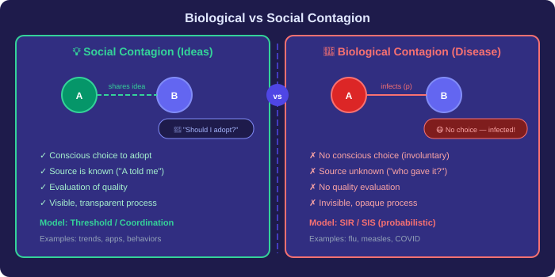
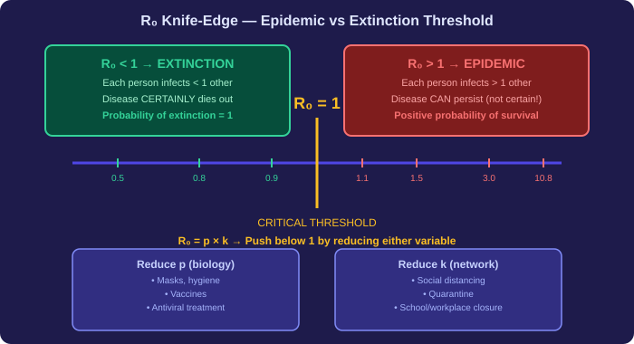
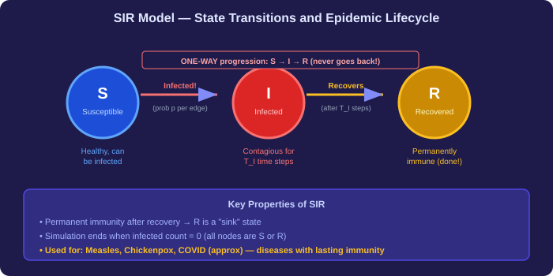

# Epidemics, Rich Get Richer & The Long Tail — Plain Language Notes

> **What this covers:** How do diseases spread through networks? How does early luck create permanent inequality? Why is the "niche" collectively more valuable than the "hits"? This file covers the Rich Get Richer phenomenon, the Long Tail, biological vs social contagion, the SIR/SIS epidemic models, the Basic Reproductive Number $R_0$, the branching process, the knife-edge property, and the recursive mechanics of epidemic persistence — with all three assignment case studies fully solved.

---

## Part 1 — The "Rich Get Richer" Phenomenon

### The Core Idea

We already know that preferential attachment causes power law distributions in networks. But "Rich Get Richer" goes deeper — it explains **why early luck, not quality, often determines who ends up on top.**

The feedback loop:

```
Early slight advantage → More visibility → More new connections
→ Even more visibility → Even more connections → ...
```

Once this loop starts, it becomes **self-reinforcing**. The initial advantage doesn't need to be earned — it can be pure luck, timing, or random chance.

> **Key insight:** If we could "reset" history to zero and replay it, the winners would likely be completely different people, books, songs, or websites. The current leaders aren't necessarily the "best" — they're the ones who got lucky early and then had that luck amplified by the feedback loop.

---

### The Music Experiment: Proof That Popularity Is Self-Fulfilling

Researchers designed a brilliant experiment to test this:

**Setup:**
- **48 identical songs** were placed on multiple separate "portals" (websites)
- Different groups of users were assigned to different portals
- Users could listen to and download songs

**Two conditions:**
1. **Control group:** Users could NOT see download counts — they judged songs purely on quality
2. **Social influence groups:** Users COULD see how many times each song had been downloaded

**Results:**

| Condition | What happened |
|---|---|
| **No download counts visible** | Songs ranked roughly by actual quality. Results were consistent across groups. |
| **Download counts visible** | Rankings varied **wildly** between portals. Different songs became "hits" in different worlds. |

**Why?** When download counts were visible:
1. A song gets a few early downloads (possibly by random chance)
2. New users see it's "popular" and are more likely to download it
3. More downloads → appears even more popular → even more downloads
4. The early random lead becomes **insurmountable**

> **The profound conclusion:** In systems with visible popularity metrics, what becomes popular is largely determined by **initial random variance**, not by intrinsic quality. The "best" song doesn't always win — the "luckiest" one does.

---

### Social Q&A Platforms: The Same Problem in Action

This phenomenon is visible on platforms like Stack Overflow, Quora, or Reddit:

```
Timeline of a Question Thread:
┌──────────────────────────────────────────────────┐
│  t=0: Question posted                           │
│  t=1 min: Answer A posted (mediocre quality)     │
│  t=2 min: Answer A gets 3 upvotes (early bird)   │
│  t=5 min: Answer A is now at TOP of thread        │
│  ─────── visibility barrier ───────              │
│  t=30 min: Answer B posted (brilliant quality)   │
│  t=60 min: Answer B is buried, gets 0 upvotes    │
│  t=∞: Answer A has 200 upvotes, B has 5          │
└──────────────────────────────────────────────────┘
```

**Why?**
- Answer A was posted first → got early upvotes → pushed to the top
- Being at the top → maximum visibility → captures most future engagement
- Answer B, despite being objectively better, can't overcome A's structural advantage

> **The critical challenge:** How do you separate **genuine quality** from **structural advantage**? In any popularity-based system, the signal (true quality) is drowned out by noise (the rich-get-richer effect). Figuring out how to "subtract" this noise to reveal true value is an open research problem.

---

### Rich Get Richer and Power Laws

The Rich Get Richer mechanism is the **generative process** behind power law distributions:

| What we see | Why it happens |
|---|---|
| A few songs with millions of downloads | Early downloads attracted more downloads (feedback loop) |
| A few websites with billions of links | Early web pages attracted more links (preferential attachment) |
| A few people with millions of followers | Early followers attracted more followers (visibility) |
| 20% of infected → 80% of transmissions | Super-spreaders have more contacts → more exposure → more infections |

The mathematical signature of this inequality is always the same: **power law distribution** — a sharp drop with a long tail.


---

## Part 2 — The Long Tail

### Beyond Bestsellers: The Hidden Value of the Niche

A common misconception: "All the money is in the top 10% of bestsellers."

**Reality:** When you plot **popularity rank** (x-axis) vs. **sales volume** (y-axis), you see:

```
  Sales
  Volume
    ▲
    │ █
    │ █
    │ █ █
    │ █ █                    ← "Head" (top 10% — bestsellers)
    │ █ █ █
    │ █ █ █ █ ░░░░░░░░░░░░░░░░░░░░░░░░░░░░░░░░░░░░░░░░
    │ █ █ █ █ ░░░░ ← "Long Tail" (bottom 90% — niche products)
    └──────────────────────────────────────────────────► Rank
         1  2  3  4  5                        10,000
```

**The key insight:**
- The **head** (top 10%) has high individual sales but covers a small area
- The **long tail** (bottom 90%) has low individual sales but covers a **massive** area
- In many businesses, the tail accounts for **80% of total transactions**

| Segment | % of Products | Individual Sales | Total Revenue Share |
|---|---|---|---|
| **Head** (bestsellers) | ~10% | Very high per item | ~20% |
| **Long Tail** (niche) | ~90% | Low per item | ~80% |

> **Why digital platforms thrive on the long tail:** YouTube doesn't make its money just from viral videos. It makes money from the **billions** of niche videos that each get a few hundred views. Amazon doesn't survive on bestsellers alone — it thrives because it can stock millions of niche products that physical stores can't carry.

---

### Product Lifecycle and the Tail

Products don't stay in the "head" forever. Every bestseller eventually migrates down:

```
Today's Hit → Tomorrow's Classic → Next Year's Niche Item
   (Head)        (Mid-range)           (Long Tail)
```

- A blockbuster movie is a "hit" for a few weeks → becomes a catalog title
- A chart-topping song → becomes an old favorite → joins the massive tail of music history
- **The shape of the distribution stays constant** even as individual items shift positions

> **Business implication:** A successful enterprise must manage BOTH the head (current hits) AND the tail (past hits + niche items). Ignoring the tail means ignoring where most of the aggregate value lives.

---

### Zipf's Law: The Long Tail in Language

The long tail isn't just an economic phenomenon — it's a **universal pattern** found in human language itself.

**Zipf's Law:** The frequency of any word is inversely proportional to its rank in the frequency table:

$$
\text{Frequency of word with rank } k \propto \frac{1}{k}
$$

| Rank ($k$) | Word | Approximate Frequency |
|---|---|---|
| 1 | "the" | ~7% of all words |
| 2 | "of" | ~3.5% |
| 3 | "and" | ~2.3% |
| 10 | "in" | ~0.7% |
| 100 | "between" | ~0.07% |
| 1,000 | "climate" | ~0.007% |

A few common words ("the", "of", "and") appear with extreme frequency. But the **thousands of uncommon words** collectively make up the majority of all text ever written.

> **The parallel:** Just like a few bestsellers dominate individual sales but the niche dominates total volume, a few common words dominate individual frequency but thousands of rare words dominate total usage.

---

### Why the Long Tail Matters for Assignments

The long tail is a **manifestation of the power law**. Both describe the same mathematical reality: extreme inequality at the individual level, but massive collective value in the "tail."

**Key relationships:**

| Concept | Mathematical Form | Example |
|---|---|---|
| Power Law | $P(k) = 1/k^\alpha$ | Degree distribution of networks |
| Zipf's Law | $\text{freq}(k) = 1/k$ | Word frequencies in English |
| Long Tail | Sharp drop + extended tail | Sales distributions, download patterns |
| 80/20 Rule | Top 20% → 80% of visible impact | But bottom 80% → 80% of aggregate value |

> [!IMPORTANT]
> **Assignment trap:** A question about "20% of infected causing 80% of transmissions" might seem like it's about epidemics, but the correct answer relates to **Zipf's Law / Long Tail / Power Law** patterns — not to random network distributions or uniform probability.

---

## Part 3 — Biological vs. Social Contagion

### Two Types of "Spreading"

Both diseases and ideas spread through networks, but their mechanics are **fundamentally different:**

| Feature | Social Contagion (Ideas/Behaviors) | Biological Contagion (Diseases) |
|---|---|---|
| **Choice** | Individual **chooses** to adopt or reject | **No choice** — virus enters involuntarily |
| **Evaluation** | Person evaluates the idea consciously | No "vetting process" — infection is automatic |
| **Source identification** | Usually know WHO introduced the idea | Usually **cannot** identify the specific source |
| **Transparency** | Visible process — you know where trends come from | **Invisible** process — opaque transmission |
| **Model type** | Decision-based (threshold models, coordination games) | Probability-based (SIR/SIS models) |

### Why These Differences Matter

**Social contagion (idea spreading):**
- You see your friend using a new app → you evaluate it → you choose to adopt it
- You know exactly who introduced you to the idea
- The process is conscious and visible

**Biological contagion (disease spreading):**
- A flu virus enters your body through a handshake → you have no say in the matter
- You were surrounded by 5 sick people — you can't tell which one infected you
- The process is involuntary and invisible

> **The key distinction for assignments:**
> - "Disease spread involves **no conscious choice**" → ✅ CORRECT
> - "Disease transmission is **stochastic (random)**" → ✅ CORRECT
> - "Identifying the source is easier in disease spread" → ❌ WRONG (it's harder!)
> - "Disease and idea spread follow identical dynamics" → ❌ WRONG (fundamentally different)



---

### Social Contagion Reaches Beyond Direct Contact

Research has found that social influence extends surprisingly far through networks:

| Separation from obese friend | Increased likelihood of becoming obese |
|---|---|
| 1 degree (direct friend) | **+45%** |
| 2 degrees (friend of friend) | **+25%** |
| 3 degrees (friend of friend of friend) | **+12%** |

This shows that behaviors like obesity, smoking, and even happiness are **not purely individual** — they cascade through networks, with influence diminishing but persisting across multiple degrees of separation.

---

## Part 4 — The Two Pillars of Epidemic Modeling

### Pillar 1: The Pathogen (Biological Properties)

Different diseases have vastly different levels of contagiousness:

| Pathogen | Contagiousness | How it spreads |
|---|---|---|
| **Measles** | Extremely high ($p \approx 0.90$) | Airborne — casual proximity |
| **Influenza** | High | Respiratory droplets, surfaces |
| **Common cold** | Moderate | Contact with contaminated surfaces |
| **COVID-19** | High ($p \approx 0.25$ per contact) | Respiratory droplets, aerosols |
| **HIV** | Low per contact | Specific intimate/fluid contact |
| **Ebola** | Low per casual contact | Direct contact with bodily fluids |

### Pillar 2: The Network (Contact Structure)

The **same group of people** can form different networks depending on the disease:

| Disease | What counts as a "contact"? | Network density |
|---|---|---|
| **Common cold** | Anyone in same room, shared surfaces | **Very dense** (many contacts) |
| **Flu** | Close proximity, shared objects | **Dense** |
| **HIV** | Intimate partners only | **Very sparse** (few contacts) |

> **Key insight:** $k$ (number of contacts) is NOT a fixed property of a person — it depends on the specific disease being modeled. The same individual might have $k = 50$ for flu (everyone in their office) but $k = 2$ for HIV.

**The interplay:**

$$
\text{Epidemic outcome} = f(\underbrace{p}_{\text{pathogen property}}, \underbrace{k}_{\text{network property}})
$$

Both matter. A highly contagious pathogen ($p$ close to 1) can still be contained if the network is sparse ($k$ is small). A weakly contagious pathogen ($p$ close to 0) can still cause an epidemic if the network is extremely dense ($k$ is huge).

---

## Part 5 — The Branching Model

### The Tree Architecture

The simplest model for disease spread treats the population as a **hierarchical tree**:

```
Level 0 (root):        [Patient Zero]
                       /      |      \
Level 1:            [A]      [B]      [C]         ← k = 3 contacts
                   / | \    / | \    / | \
Level 2:         [.][.][.][.][.][.][.][.][.]       ← k² = 9 people
                 /|\ ...                            
Level 3:        [27 people]                         ← k³ = 27 people
```

**At level $i$:** There are $k^i$ total people in the contact network.

**But not everyone gets infected.** Each edge transmits with probability $p$:

| Level | People in contact network | Expected infections |
|---|---|---|
| 0 | 1 | 1 (patient zero) |
| 1 | $k$ | $pk$ |
| 2 | $k^2$ | $(pk)^2$ |
| 3 | $k^3$ | $(pk)^3$ |
| $i$ | $k^i$ | $(pk)^i$ |

$$
\boxed{\text{Expected infections at level } i = (pk)^i = R_0^i}
$$

---

## Part 6 — The Basic Reproductive Number $R_0$

### Definition

$$
\boxed{R_0 = p \times k}
$$

Where:
- $p$ = probability of infection across a single contact edge
- $k$ = number of contacts per infected individual

$R_0$ = **expected number of secondary infections** produced by a single infected individual.

### The Knife-Edge Property

The value $R_0 = 1$ is a **sharp dividing line** that determines the fate of the entire outbreak:

| Condition | What happens | Probability of extinction |
|---|---|---|
| $R_0 < 1$ | Each infected person infects **< 1** others on average | Disease **certainly dies out** (probability = 1) |
| $R_0 = 1$ | Each infected person infects **exactly 1** other on average | Critical threshold (knife-edge) |
| $R_0 > 1$ | Each infected person infects **> 1** others on average | Disease **can become epidemic** (positive probability) |

> [!IMPORTANT]
> **Subtlety:** $R_0 > 1$ does NOT guarantee an epidemic with certainty. It means there is a **positive probability** of an epidemic. The disease could still die out by random chance (all initial transmissions fail). But $R_0 < 1$ DOES guarantee extinction with **probability = 1**.

```
                    KNIFE-EDGE at R₀ = 1
                           │
       ◄── EXTINCTION ─────┼───── EPIDEMIC ──►
                           │
    Certain death           │   Positive probability
    (prob = 1)              │   of persistence
                           │
    R₀ = 0.5  0.8  0.9    1.0    1.1  1.5  3.0
```

### Calculating $R_0$ — Worked Examples

**Example 1: Campus A** — $p = 0.25$, $k = 12$

$$
R_0 = 0.25 \times 12 = 3.0
$$

Expected secondary infections from one person = **3.0** → Epidemic likely.

**Example 2: Campus B** — $p = 0.25$, $k = 8$

$$
R_0 = 0.25 \times 8 = 2.0
$$

**Example 3: Campus C** — $p = 0.25$, $k = 4$

$$
R_0 = 0.25 \times 4 = 1.0
$$

Right at the knife-edge — barely self-sustaining.

**Example 4: After intervention** — reduce $k$ from 12 to 6 AND improve hygiene $p$ from 0.25 to 0.20:

$$
R_0 = 0.20 \times 6 = 1.2
$$

> **Assignment tip:** $R_0$ calculations are straightforward multiplication. Always identify which values correspond to $p$ (probability per contact) and $k$ (number of contacts).

---

### How Public Health Reduces $R_0$

Since $R_0 = p \times k$, you can push it below 1 by reducing **either** variable:

| Strategy | Which variable? | How? |
|---|---|---|
| Masks, hand washing, hygiene | Reduce $p$ | Lower probability of transmission per contact |
| Vaccines | Reduce $p$ | Make transmission biologically impossible |
| Social distancing | Reduce $k$ | Fewer contacts per person |
| Quarantine | Reduce $k$ | Isolate infected individuals (effectively $k \to 0$) |
| School closure | Reduce $k$ | Remove a dense contact environment |
| Lockdown | Reduce $k$ | Minimize all social interactions |

> **The knife-edge power:** Because $R_0 = 1$ is such a sharp threshold, even a **small** reduction can flip the system from epidemic to extinction. Pushing $R_0$ from 1.2 to 0.9 — a change of only 25% — transforms a self-sustaining epidemic into a self-extinguishing outbreak.



---

### Expected Infections at Multiple Levels

Using the branching model, the expected infections at each level $i$ = $R_0^i$:

**Example: Measles outbreak — $p = 0.90$, $k = 12$**

$$
R_0 = 0.90 \times 12 = 10.8
$$

| Level | Expected infections = $R_0^i$ |
|---|---|
| 0 (patient zero) | 1 |
| 1 | $10.8^1 = 10.8$ |
| 2 | $10.8^2 = 116.64$ |
| 3 | $10.8^3 \approx 1{,}259.7 \approx 1{,}260$ |

> **Assignment tip:** "Expected number at the third transmission generation" means level 3 = $R_0^3$. Level 1 = $R_0^1$, Level 2 = $R_0^2$, etc.

**But be careful about "exposed" vs "expected infections":**

| | "Exposed" (people in contact network) | "Expected infections" |
|---|---|---|
| Level $i$ | $k^i$ | $(pk)^i = R_0^i$ |
| Formula uses | Only $k$ | Both $p$ and $k$ |

**Example: $k = 6$, $p = 0.50$, Level 2:**
- People **exposed** at level 2 = $k^2 = 36$
- **Expected infections** at level 2 = $(pk)^2 = (0.50 \times 6)^2 = 3^2 = 9$

> [!WARNING]
> **Assignment trap:** "$R_0 = 3.0$ indicates disease persists **indefinitely**" is **WRONG**. $R_0 > 1$ means the disease persists with **positive probability**, NOT with certainty. The correct phrasing is "persists with positive probability, not certainty."

---

## Part 7 — The SIR Model

### Three States of Every Individual

The **SIR model** categorizes every person in the network into exactly one of three states:

| State | Symbol | Meaning | Can infect? | Can be infected? |
|---|---|---|---|---|
| **Susceptible** | S | Healthy, never been infected | No | Yes |
| **Infected** | I | Currently sick, actively contagious | Yes | No (already sick) |
| **Recovered** | R | Was sick, now immune forever | No | No (immune) |

**The key property of SIR:** The progression is **one-way and permanent**:

$$
S \xrightarrow{\text{gets infected}} I \xrightarrow{\text{recovers}} R \quad \text{(NEVER goes back)}
$$

Once recovered, a person is **permanently immune** — they can NEVER be reinfected. This is why SIR applies to diseases like **measles** (lifelong immunity after recovery).

### The Infectious Period $T_I$

During the infected state, a person remains contagious for $T_I$ time steps:

- Each time step, for every edge connecting the infected person to a susceptible neighbor, a "coin flip" with probability $p$ determines transmission
- After $T_I$ time steps, the person moves to Recovered regardless

**If $T_I = 1$:** One chance to infect neighbors, then immediately recovered.
**If $T_I = 2$:** Two chances to infect neighbors (over 2 time steps), then recovered.
**If $T_I = 8$:** Eight chances (e.g., measles — contagious for 8 days).

### When Does an SIR Simulation End?

The simulation stops when **no infected nodes remain** — all nodes are either Susceptible or Recovered.

This happens because:
1. Susceptible nodes are depleted (everyone got infected and recovered)
2. OR remaining susceptible nodes are "shielded" by a wall of recovered nodes — no path exists from any infected node to any susceptible node

```
Before:    S ← I → S → S       I can still spread
After:     R ← R → R → S       All infected have recovered
                         ↑      This S is safe — no I neighbors
```



---

## Part 8 — The SIS Model

### No Permanent Immunity

The **SIS model** applies to diseases where recovery does NOT grant immunity — you can be reinfected. Examples: common cold, some STIs.

$$
S \xrightarrow{\text{gets infected}} I \xrightarrow{\text{recovers}} S \xrightarrow{\text{reinfected}} I \xrightarrow{\text{recovers again}} S \cdots
$$

**The key difference from SIR:**

| Property | SIR | SIS |
|---|---|---|
| After recovery | **Permanently immune** (R state) | **Susceptible again** (back to S) |
| Can be reinfected? | **Never** | **Yes, multiple times** |
| Disease can persist? | Only until hosts are depleted | **Indefinitely** (cycles through population) |
| "Sink" state? | Yes — R is a terminal state | No — nodes cycle between S and I |
| Used for | Measles, chickenpox, COVID (approx.) | Common cold, some bacterial infections |
| Termination | When no I nodes remain | When no I nodes remain (may never happen) |

### Why SIS Can Persist Forever

In SIR, recovered nodes act as "firebreaks" — they can't be reinfected, so they block the disease. Eventually the disease runs out of susceptible hosts.

In SIS, recovered nodes go **back to susceptible** — so the disease can circle back and reinfect them. This creates potential **oscillating patterns:**

```
Time 1: [S] [I] [S] [S] [S]   → A infects B
Time 2: [S] [S] [I] [S] [S]   → B recovers (back to S), C infected
Time 3: [S] [I] [S] [I] [S]   → B reinfected by C, D infected
...                              Disease keeps cycling!
```

> **Why SIR is correct for measles:** The case study states "measles follows an SIR model" because infection **confers lifelong immunity**. After recovery, you can never get measles again. This is the defining characteristic of SIR. It's NOT because of $T_I = 8$, NOT because $p$ is high, and NOT because of the network structure.

---

## Part 9 — The Simulation Algorithm

### SIR Simulation — Step by Step

```
INITIALIZATION:
  - Set all nodes to Susceptible (S)
  - Pick one seed node → set to Infected (I)
  - Set clock t = 0

EACH TIME STEP (t → t+1):
  For each Infected node:
    For each Susceptible neighbor:
      Flip a coin with probability p
      If heads → neighbor becomes Infected
    
    Increment this node's infection timer
    If timer ≥ T_I → node becomes Recovered (R)

  If no Infected nodes remain → STOP (simulation complete)

REPEAT until termination
```

**Key properties:**
- **Stochastic:** Different runs with same parameters give different results (due to random coin flips)
- **Terminates** when infected count = 0
- Multiple simulations needed for statistical reliability

### SIS Simulation — Key Difference

Same as SIR, but when a node's infection timer reaches $T_I$:
- Instead of moving to Recovered, it moves back to **Susceptible**
- It can be reinfected in subsequent time steps

---

## Part 10 — The Paradox of Supercritical Extinction

### When $R_0 > 1$ Doesn't Guarantee an Epidemic

In simple branching models, $R_0 > 1$ means the disease *can* become an epidemic. But in complex network structures, even $R_0 > 1$ can lead to **certain extinction**.

**Example:** $p = 2/3$, $k = 2$ → $R_0 = 4/3 > 1$

Under simple branching logic, this should produce an epidemic. But in a specific infinite network where connections double at each level (4 independent links between levels):

- Probability of a single link failing: $1 - p = 1/3$
- Probability of ALL 4 links failing (total failure at one level): $(1/3)^4 = 1/81$
- Over infinite levels, even a $1/81$ chance per level **accumulates to certainty**

$$
P(\text{extinction}) = 1 - \left(1 - \frac{1}{81}\right)^\infty = 1
$$

**Why?** The branching model assumes a tree structure (no cycles, no redundancy). Real networks have complex topology that can trap or eliminate the disease.

> **Key takeaway:** $R_0$ is a useful rule of thumb, but it's not the whole story. The network's specific geometry matters.

---

## Part 11 — The Recursive Mechanics: $q_n$ and $q^*$

### What Is $q_n$?

$q_n$ = the probability that the infection reaches **at least one person** at depth $n$ in the branching tree.

### Deriving the Recurrence Relation

For the infection to reach level $n$, **at least one** of the $k$ branches must succeed.

A single branch succeeds if:
1. The pathogen crosses the first edge (probability $p$) **AND**
2. The infection then reaches level $n-1$ from the child node (probability $q_{n-1}$)

$$
P(\text{one branch succeeds}) = p \times q_{n-1}
$$

$$
P(\text{one branch fails}) = 1 - p \cdot q_{n-1}
$$

All $k$ branches fail simultaneously:

$$
P(\text{total failure}) = (1 - p \cdot q_{n-1})^k
$$

Therefore:

$$
\boxed{q_n = 1 - (1 - p \cdot q_{n-1})^k}
$$

### The Fixed-Point Equation for $q^*$

At infinite depth, the system reaches equilibrium where $q_n = q_{n-1} = q^*$:

$$
\boxed{q^* = 1 - (1 - p \cdot q^*)^k}
$$

**What $q^*$ tells us:**
- If $q^* = 0$ → disease dies out with certainty
- If $q^* > 0$ → disease persists with positive probability (epidemic)

$q^*$ is the **fixed point** of the function $f(x) = 1 - (1 - px)^k$.

---

### The Characteristic Function and Its Derivative

$$
f(x) = 1 - (1 - px)^k
$$

The derivative at the origin tells us whether the disease can survive:

$$
f'(x) = pk(1 - px)^{k-1}
$$

$$
\boxed{f'(0) = pk = R_0}
$$

**This is critical:** The derivative of $f$ at $x = 0$ is exactly $R_0$!

| Condition | $f'(0)$ vs. slope of $y = x$ | What happens |
|---|---|---|
| $R_0 < 1$ | $f'(0) < 1$ → curve stays below $y = x$ | $q^* = 0$ → extinction |
| $R_0 > 1$ | $f'(0) > 1$ → curve rises above $y = x$ | $q^* > 0$ → epidemic |

---

### Geometric Analysis: Cobwebbing

To find $q^*$, start at $x = 1$ and iteratively apply $f$:

$$
x_0 = 1 \to x_1 = f(1) \to x_2 = f(f(1)) \to x_3 = f(f(f(1))) \to \cdots \to q^*
$$

**Supercritical ($R_0 > 1$):**
- $f(x)$ rises above $y = x$ near the origin
- There's a non-zero intersection point
- Cobwebbing from $x = 1$ converges to this positive $q^*$
- **Disease persists**

**Subcritical ($R_0 < 1$):**
- $f(x)$ stays below $y = x$ everywhere
- Only intersection is at the origin
- Cobwebbing from $x = 1$ drives toward $q^* = 0$
- **Disease dies out**

```
Supercritical (R₀ > 1):     Subcritical (R₀ < 1):

  y │    y=x  / f(x)          y │    y=x  /
    │      / ╱                   │      / /
    │     /╱                     │     / /  f(x)
    │    ╱/                      │    / /
    │   ╱ ── q* ≠ 0             │   / /
    │  ╱/                        │  //
    │ ╱/                         │ //
    │╱/                          │//
    └──────── x                  └──────── x
    0    q*                      0 = q*

  Converges to                 Converges to
  positive q*                  q* = 0
```

### The Percolation Model

An alternative way to think about epidemic spread is the **percolation model**:

- Instead of simulating day-by-day transmission, **pre-determine** which edges are "open" (transmit) and which are "closed" (don't transmit)
- Each edge is independently "open" with probability $p$
- The disease reaches a node if and only if there exists a **path of open edges** from the seed to that node

This is equivalent to the temporal simulation but converts **temporal dynamics into spatial analysis** — like water flowing through a network of pipes where some are open and some are blocked.

**Properties of the percolation model:**
1. Each connection's receptiveness is predetermined once (single probabilistic event per edge)
2. Temporal dynamics are converted into spatial analysis
3. The model produces the same statistical outcomes as the temporal simulation

> [!IMPORTANT]
> **"Receptive channels guarantee information transmission"** is WRONG. A receptive channel means the edge can transmit, but the disease only reaches a node if there's a **complete path** of receptive channels from the seed. Individual receptive channels don't guarantee anything on their own.

---

## Part 12 — Assignment Case Study Answers

### Case Study 1: Network Dynamics and Disease Propagation (Dr. Sarah Chen)

COVID-19 spread across six university campuses with different social distancing levels.

| Question | ✅ Correct Answer | Explanation |
|---|---|---|
| Which campus has highest secondary infections? | **Campus A: E[X] = 3.00** | $R_0 = p \times k = 0.25 \times 12 = 3.0$. Campus B: $0.25 \times 8 = 2.0$. Campus C: $0.25 \times 4 = 1.0$. |
| "20% of infected → 80% of transmissions" is an example of? | **Zipf's Law (word frequency pattern)** | This pattern (extreme concentration at the top, long tail at the bottom) is the signature of Zipf's Law / power law / long tail. NOT random distribution, NOT uniform probability. |
| Differences between disease and idea spreading? | **Disease involves no conscious choice** AND **Disease transmission is stochastic (random)** | Disease is involuntary + random. Identifying the source is NOT easier in disease spread (it's harder — the process is invisible). They do NOT follow identical dynamics. |
| Campus A reduces $k: 12 \to 6$ and $p: 0.25 \to 0.20$. New expected secondary infections? | **1.2** | $R_0 = 0.20 \times 6 = 1.2$ |
| Mask-wearing study: different adoption rates despite identical conditions. Why? | **Rich-get-richer amplification** AND **Initial random variation** AND **Visibility of adoption counts** | All three are correct. This is the music experiment replicated for masks: visibility of counts + random initial variation + feedback loop = divergent outcomes. NOT "predetermined preferences." |

> [!WARNING]
> **Trap — "20% → 80% of transmissions":**
> The correct answer is **Zipf's Law**, NOT "bookstore sales and long-tail theory." While the long tail IS related, the specific pattern of a small percentage causing most of the effect is most precisely described by Zipf's Law. This is counterintuitive — read carefully.

> [!CAUTION]
> **Trap — "Identifying the source is easier in disease spread":**
> This is **WRONG**. The source is much HARDER to identify in disease spread (invisible, involuntary process) compared to idea spread (you usually know who told you).

---

### Case Study 2: Measles Outbreak at Riverside Elementary

A measles outbreak starting from Student X. $p = 0.90$, initial $k = 12$, $T_I = 8$ days.

| Question | ✅ Correct Answer | Explanation |
|---|---|---|
| Initial $R_0$ and expected infections at third generation? | **$R_0 = 10.8$; third generation expects 1,260** | $R_0 = 0.90 \times 12 = 10.8$. Third generation = $R_0^3 = 10.8^3 = 1{,}259.7 \approx 1{,}260$ |
| After exclusion policy ($k: 12 \to 2$, $p$ stays 0.90). New $R_0$? | **1.8** | $R_0 = 0.90 \times 2 = 1.8$ |
| Post-intervention $R_0 = 1.8$. Which statements are correct? | **Intervention reduced $R_0$ but NOT below critical threshold** AND **Outbreak can still persist with positive probability** | $R_0 = 1.8 > 1$, so still above threshold. "Disease will die out with probability = 1" is WRONG (that only happens when $R_0 < 1$). "Exponential decrease" is WRONG. |
| Why does measles follow SIR, not SIS? | **Infection confers lifelong immunity after recovery** | SIR = permanent immunity (recovered → done forever). NOT because $T_I = 8$, NOT because $p$ is high, NOT because of hierarchical networks. |
| $k = 6$, $p = 0.50$. Which statements are correct? | **Expected infections at level 2 = 9** AND **Disease persists with positive probability, not certainty** | $R_0 = 3.0$. Level 2 expected = $R_0^2 = 9$. "$R_0 = 3.0$ indicates persistence indefinitely" is WRONG (positive probability, not certainty). "36 exposed at level 2" confuses the contact network size ($k^2 = 36$) with expected infections ($(pk)^2 = 9$). |

> [!WARNING]
> **Trap — "R₀ = 3.0 indicates disease persists indefinitely":**
> This is **WRONG**. $R_0 > 1$ means the disease can persist with **positive probability**, but NOT with certainty. There's always a chance (however small) that all initial transmissions fail by random chance. Only $R_0 < 1$ gives certainty (certainty of extinction).

> [!WARNING]
> **Trap — "At level 2, 36 individuals are exposed":**
> This confuses **contact network size** ($k^2 = 6^2 = 36$ people exist at level 2) with **expected infections** ($(pk)^2 = (0.5 \times 6)^2 = 9$). The question asks about one or the other — read carefully which is requested.

---

### Case Study 3: Viral Marketing Campaign (TechFlow Inc.)

Viral marketing modeled as a branching process. $p = 0.28$, $k = 5$.

| Question | ✅ Correct Answer | Explanation |
|---|---|---|
| Virality coefficient $V_0$ and what it indicates? | **$V_0 = 1.40$; campaign will likely go viral** | $V_0 = pk = 0.28 \times 5 = 1.40 > 1$ → supercritical → can spread. |
| Which statements about the percolation model are correct? | **Each connection's receptiveness is predetermined once** AND **Temporal dynamics are converted into spatial analysis** | These are the two key properties of percolation. "Receptive channels guarantee transmission" is WRONG (need a complete path). "Identical outcomes as temporal model" is WRONG (statistically equivalent, not identical individual runs). |
| If $p$ increases to 0.32, $k = 5$. New $V_0$? | **1.60** | $V_0 = 0.32 \times 5 = 1.60$ |
| Value of $f'(0)$ and its relationship to $V_0$? | **$f'(0) = 1.40$, equals the virality coefficient** | $f'(0) = pk = 0.28 \times 5 = 1.40 = V_0$. The derivative at the origin IS the reproductive number. |
| Which statements about $q^*$ are correct? | **$q^* > 0$ since $V_0 > 1$** AND **$q^*$ is the solution where $f(x) = x$** AND **$q^*$ represents the limit as $n \to \infty$** | All three are correct. $q^* = 0$ would only apply if $V_0 < 1$, which it isn't. |

> [!WARNING]
> **Trap — "Receptive channels guarantee information transmission":**
> WRONG. A receptive channel (open edge) means that specific connection CAN transmit. But the information only reaches a user if there's a **complete chain** of receptive channels from the influencer to that user. A single open edge somewhere doesn't guarantee anything.

> [!WARNING]
> **Trap — "The model predicts identical outcomes as the temporal model":**
> WRONG. Individual runs will differ (different random edge openings). The models are **statistically equivalent** (same probability distributions), not **identical** (same individual outcomes every time).

---

## Part 13 — Formula Cheat Sheet

### Basic Reproductive Number

$$
R_0 = p \times k
$$

### Expected Infections at Level $i$

$$
E[\text{infections at level } i] = R_0^i = (pk)^i
$$

### Contact Network Size at Level $i$

$$
\text{Nodes at level } i = k^i
$$

### Recurrence Relation for Persistence

$$
q_n = 1 - (1 - p \cdot q_{n-1})^k
$$

### Fixed-Point Equation

$$
q^* = 1 - (1 - p \cdot q^*)^k
$$

### Characteristic Function

$$
f(x) = 1 - (1 - px)^k \qquad f'(0) = pk = R_0
$$

### Knife-Edge Threshold

$$
R_0 < 1 \implies q^* = 0 \quad \text{(certain extinction)}
$$

$$
R_0 > 1 \implies q^* > 0 \quad \text{(positive probability of epidemic)}
$$

### Zipf's Law

$$
\text{frequency}(k) \propto \frac{1}{k}
$$

---

## Part 14 — Exam Traps to Watch Out For

> [!WARNING]
> **Trap 1: "$R_0 > 1$ means disease persists indefinitely / with certainty"**
>
> WRONG. $R_0 > 1$ means **positive probability** of persistence, NOT certainty. Only $R_0 < 1$ gives certainty (of extinction). This is a critical distinction tested in multiple questions.

> [!WARNING]
> **Trap 2: "Identifying the source is easier in disease spread"**
>
> WRONG. Source identification is much HARDER in disease spread (invisible, involuntary). In idea spread, you usually know exactly who told you.

> [!WARNING]
> **Trap 3: Confusing "exposed" with "expected infections"**
>
> - People **exposed** (in contact network) at level $i$ = $k^i$
> - **Expected infections** at level $i$ = $(pk)^i = R_0^i$
> - These are different! $k^i$ vs $(pk)^i$

> [!CAUTION]
> **Trap 4: Why SIR for measles?**
>
> Because infection confers **lifelong immunity** (the defining property of SIR). NOT because of high $p$, NOT because of $T_I = 8$, NOT because of hierarchical networks. The ONLY reason is permanent immunity after recovery.

> [!CAUTION]
> **Trap 5: "20% of infected → 80% of transmissions" = Zipf's Law**
>
> This concentration pattern is an example of Zipf's Law / power law distribution. NOT "bookstore sales" (that's the long tail application), NOT random network degree distribution, NOT uniform probability.

> [!CAUTION]
> **Trap 6: Percolation model — "receptive channels guarantee transmission"**
>
> WRONG. Receptive = the edge CAN transmit. But you need a **complete path** of receptive edges from source to target. One open edge doesn't guarantee the message reaches every node.

> [!CAUTION]
> **Trap 7: "Disease and idea spread follow identical dynamics"**
>
> WRONG. They are fundamentally different: disease = involuntary + stochastic + invisible source. Ideas = voluntary + conscious evaluation + known source.

> [!NOTE]
> **Useful shortcuts:**
> - $R_0 = p \times k$ (just multiply)
> - Expected infections at level $i$ = $R_0^i$ (just raise to power)
> - $f'(0) = pk = R_0$ (derivative at origin = reproductive number)
> - SIR = permanent immunity. SIS = reinfection possible.

---

## Part 15 — Big Picture Summary

```
TOPIC MAP:

RICH GET RICHER
├── Early luck → amplified by visibility → permanent advantage
├── Music experiment: different portals → different winners
├── Q&A platforms: first answer monopolizes attention
└── Produces: Power Law distributions
         └── Long Tail
              ├── Head (top 10%): individually large, collectively ~20%
              ├── Tail (bottom 90%): individually small, collectively ~80%
              └── Zipf's Law: word frequency ∝ 1/rank

EPIDEMIC MODELING
├── Two pillars: PATHOGEN (p) × NETWORK (k)
├── R₀ = p × k
│   ├── R₀ < 1 → extinction (certain)
│   └── R₀ > 1 → epidemic (positive probability)
├── Models:
│   ├── SIR: S → I → R (permanent immunity — measles)
│   └── SIS: S → I → S → I → ... (reinfection — common cold)
├── Branching process:
│   ├── Expected infections at level i = R₀ⁱ
│   └── Contact network size at level i = kⁱ
├── Recursive mechanics:
│   ├── qₙ = 1 - (1 - p·qₙ₋₁)ᵏ
│   ├── q* = fixed point of f(x) = 1 - (1-px)ᵏ
│   └── f'(0) = pk = R₀
└── Key difference: Bio contagion (involuntary) vs Social contagion (voluntary)
```

> See [`code/11_epidemic_models.py`](code/11_epidemic_models.py) for Python implementations of SIR/SIS simulations, $R_0$ calculations, and the $q^*$ fixed-point solver.
