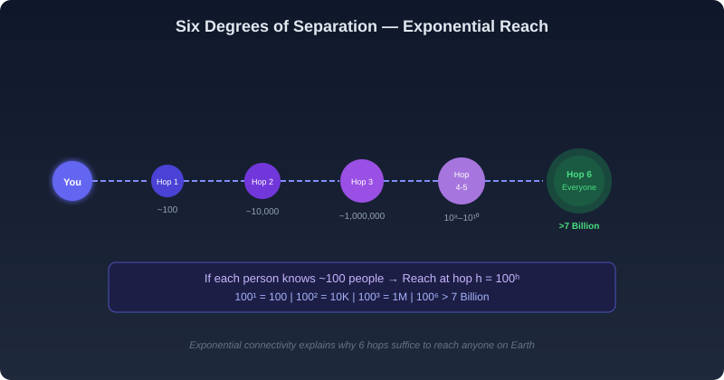
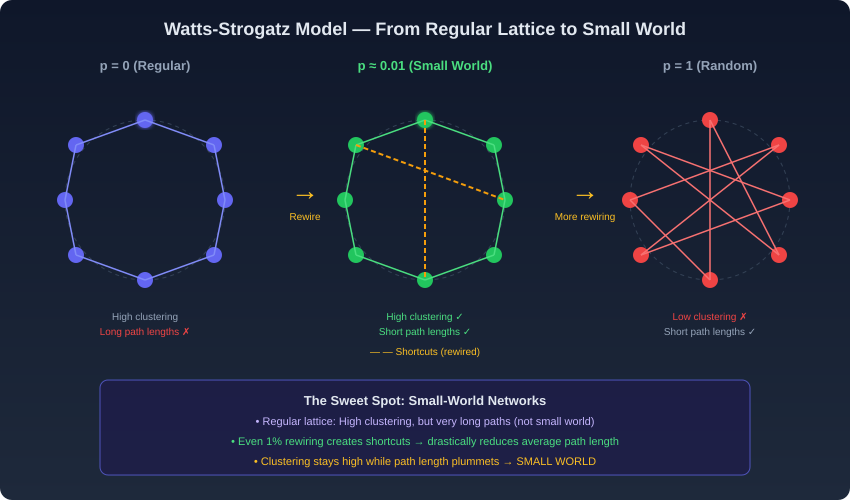
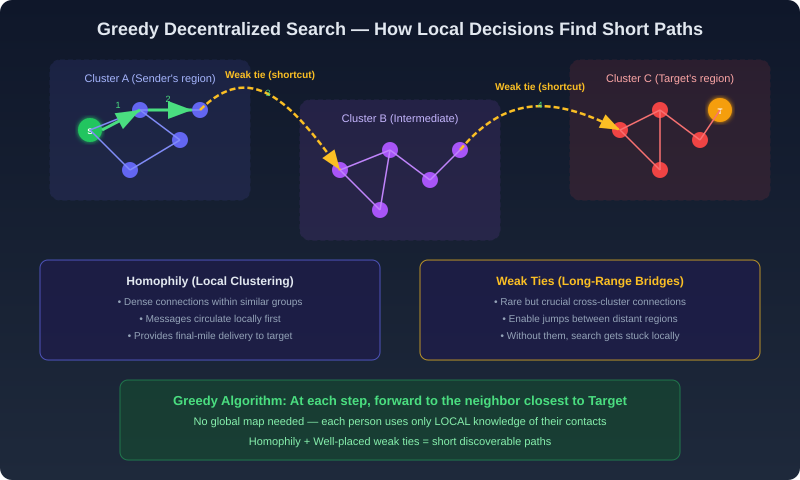
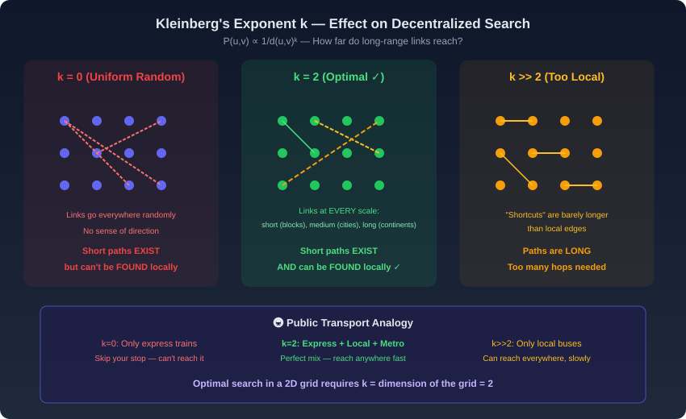
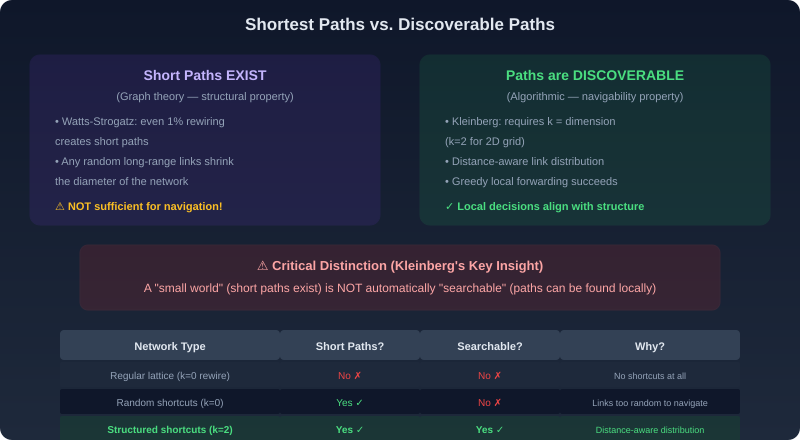

# The Small World Effect — Plain Language Notes

> **What this covers:** How can any two people on Earth be connected by only six intermediaries? How do dense local clusters and rare long-range bridges combine to make enormous networks "small"? Why do some networks allow greedy local search to find short paths, while others don't? This file covers the Small World phenomenon, Milgram's experiment, exponential connectivity, the Watts-Strogatz model, homophily and weak ties, decentralized search, Kleinberg's exponent $k$, the critical difference between *existence* of short paths and *discoverability* of short paths, and all three assignment case studies fully solved.

---

## Part 1 — The Small World Phenomenon

### What Is the "Small World Effect"?

Imagine you're sitting in a small village in rural India and you want to reach a total stranger in a city in Brazil. You don't have their phone number. You don't have the internet. All you can do is pass a letter to someone you personally know, and ask them to forward it to someone *they* personally know, and so on — until the letter reaches the stranger.

**The astonishing finding:** This chain is shockingly short — approximately **six people** on average. This is the "Small World Effect."

**How to think about it:**

- The **friendship graph of the world** is a single giant connected network
- Each person is a **node**
- Each personal relationship is an **edge** (link)
- Despite billions of nodes, the **average shortest path** between any two random people is only about **6 hops**

This idea is popularly called **"Six Degrees of Separation"** — and it means social networks possess an extraordinarily high degree of connectivity.

> **Why this is surprising:** The world has 7+ billion people spread across continents with different cultures, languages, and backgrounds. Intuitively, you'd expect chains of hundreds or thousands. But the architecture of social networks compresses this to about six. Understanding *why* is the central question of this topic.

---

### Stanley Milgram's 1967 Experiment

Stanley Milgram didn't just theorize about six degrees — he **tested it experimentally**. Here's exactly what he did:

**Setup:**
- Selected **random starting participants** in cities like Omaha, Nebraska
- Gave each participant a letter with a **target person's name and location** (a stranger in Boston, Massachusetts)
- **Rules:** You may NOT mail the letter directly. You must send it to someone you know **on a first-name basis** who you think is "closer" to the target
- That person follows the same rule, and so on

**Results:**
- Successfully completed chains reached the target in an average of **~6 intermediary steps**
- This held true even though participants were geographically and socially distant from the target

**What Milgram proved:**
1. The global friendship network IS a single connected entity — you really can reach anyone
2. The chains are remarkably SHORT — not hundreds of steps, but about six
3. Ordinary people can **navigate** this network using only their personal knowledge of their own contacts

> **Key insight for assignments:** Milgram's experiment demonstrates TWO things simultaneously — (1) short paths *exist* in the social network, and (2) people can *find* those paths using only local decisions. Both of these are significant and separate findings.

---

### Why Six Hops Is Enough: Exponential Connectivity

The math behind six degrees is actually quite simple once you see it:

**Assumption:** Each person maintains a circle of roughly **100 friends** (acquaintances they know by name).

| Hop Number | People Reachable | Calculation |
|---|---|---|
| 0 | 1 (you) | $100^0 = 1$ |
| 1 | 100 | $100^1 = 100$ |
| 2 | 10,000 | $100^2 = 10{,}000$ |
| 3 | 1,000,000 | $100^3 = 1{,}000{,}000$ |
| 4 | 100,000,000 | $100^4 = 10^8$ |
| 5 | 10,000,000,000 | $100^5 = 10^{10}$ |
| 6 | 1,000,000,000,000 | $100^6 = 10^{12} \gg 7 \text{ billion}$ |

By hop 5 or 6, the theoretical reach exceeds the entire world population. Even accounting for the fact that many of your friends' friends overlap with each other (the "overlap problem"), the exponential growth is so powerful that six hops still suffice.

> **The overlap problem:** In reality, your friends' friends are not all unique — many of them are the same people (your friends tend to know each other). This is called **clustering**. Despite this overlap, exponential expansion is powerful enough that the reach still explodes to cover billions.



---

## Part 2 — The Social Architecture: Homophily and Weak Ties

### Homophily: Birds of a Feather Flock Together

People tend to form connections with others who are **similar** to them. This is called **homophily**. Similar in what ways?

- **Geographic proximity** — neighbors, coworkers, classmates
- **Professional domain** — same industry, same department
- **Cultural background** — same language, religion, ethnicity
- **Shared interests** — hobbies, sports, political views
- **Educational background** — same university, same graduation cohort

**What homophily creates in the network:**

```
Dense local clusters of tightly interconnected people
who all know each other

    [A]──[B]
     │╲  ╱│
     │ [C] │        ← Everyone knows everyone
     │╱  ╲│           within this cluster
    [D]──[E]
```

These clusters form the **primary sphere of human interaction**. Most of your communication, trust, and daily relationships happen within these localized "shells" of activity.

---

### Weak Ties: The Bridges Between Worlds

While homophily keeps clusters dense and locally connected, **weak ties** are the crucial ingredient that makes the world "small."

**What are weak ties?**
- Connections to people who are **outside** your primary cluster
- A former classmate who moved to another country
- A colleague from an old job in a different industry
- Someone you met at a conference who works in a completely different field

**Why weak ties matter:**

| Property | Strong ties (within cluster) | Weak ties (between clusters) |
|---|---|---|
| **Frequency** | Many — most of your connections | Few — rare connections |
| **Similarity** | High — similar backgrounds | Low — different contexts |
| **Redundancy** | High — they know the same people | Low — they connect you to NEW people |
| **Information** | Same information circulates | **New information** flows in |
| **Role in search** | Help with "last mile" delivery | **Bridge** gaps between distant regions |

> **The fundamental duality:** Every individual maintains a **majority of local connections** (strong ties driven by homophily) while possessing a **small number of distant links** (weak ties). This duality is what enables rapid, short-path connectivity across the entire global population.

---

### How Navigation Actually Works: The Two-Phase Process

When someone in Milgram's experiment is trying to forward a letter to a distant target, the process works in two phases:

```
Phase 1: LONG-RANGE JUMP (Weak Tie)
┌────────────────────────────────────────────────┐
│ Message circulates within local cluster...     │
│ until it reaches someone with a WEAK TIE to    │
│ a person closer to the target's region         │
│                                                │
│ [Your cluster] ───weak tie──→ [Distant region] │
└────────────────────────────────────────────────┘

Phase 2: LOCAL DELIVERY (Homophily)
┌────────────────────────────────────────────────┐
│ Once in the target's region, homophily         │
│ facilitates local navigation:                  │
│ same department → same team → target person    │
│                                                │
│ [Distant region] ──local──→ [TARGET]           │
└────────────────────────────────────────────────┘
```

**The key pattern:**
1. **Homophily** circulates the message locally within the first cluster
2. A **weak tie** bridges the gap to a distant cluster closer to the target
3. **Homophily** again handles the local navigation within the target's region
4. The message reaches the target

This alternation between local navigation (homophily) and long-range jumps (weak ties) is what makes short chains possible.

---

## Part 3 — The Watts-Strogatz Model (1998)

### What Problem Does It Solve?

Real social networks have TWO seemingly contradictory properties simultaneously:

1. **High clustering** — if A knows B and A knows C, then B and C are likely to know each other (your friends tend to be friends with each other)
2. **Short average path lengths** — any two people can be connected in very few steps

A purely regular lattice (grid) has high clustering but very long paths. A purely random network has short paths but no clustering. **How do you get BOTH?**

The Watts-Strogatz model answers this by showing that a tiny amount of randomness injected into a regular structure produces both properties simultaneously.

---

### The Construction Algorithm (Step by Step)

**Step 1 — Start with a regular ring lattice:**
- Arrange $n$ nodes in a circle
- Connect each node to its $K$ nearest neighbors (e.g., $K = 4$ means each node connects to its 2 neighbors on each side)
- This creates a highly ordered, clustered network

**Step 2 — Rewire edges with probability $p$:**
- For each edge in the network:
  - With probability $p$: disconnect one end and reattach it to a **random** node elsewhere in the network
  - With probability $1 - p$: leave the edge unchanged

**Step 3 — The result depends on $p$:**

| Rewiring probability $p$ | Result | Clustering | Path Length |
|---|---|---|---|
| $p = 0$ | Regular lattice (no change) | **High** ✓ | **Long** ✗ |
| $p \approx 0.01$ | **Small-world network** | **High** ✓ | **Short** ✓ |
| $p = 1$ | Random network | **Low** ✗ | **Short** ✓ |

> [!IMPORTANT]
> **The critical insight:** Even a **tiny** rewiring probability — as low as 1% — is sufficient to dramatically reduce the average path length. Those few rewired edges act as **long-range shortcuts** that bridge otherwise distant parts of the network.

**Why does this work?**
- The 99% of edges that remain local preserve the high clustering (your friends still know each other)
- The 1% of edges that are randomly rewired create "wormholes" that connect distant clusters
- A message can travel mostly along local edges but occasionally "jump" through a shortcut
- This combination keeps clustering high while making path lengths short



---

### The Key Takeaway of Watts-Strogatz

> **What the model proves:** A vast population maintains intimate connectivity because of the combination of **local density** (most connections are to nearby nodes) with **occasional far-reaching connections** (a few random shortcuts). Even a billion-node network can have an average path length of ~6 if just a small fraction of edges are random long-range bridges.

**The transition from rigid grid to small world:**
- In a rigid grid: path length scales linearly with network size (slow)
- After minimal rewiring: path length scales **logarithmically** with network size (fast)
- This is why even networks of billions can have short average distances

---

## Part 4 — Decentralized Search: The Real Marvel

### Beyond Existence: Navigability

The Watts-Strogatz model proves that short paths **exist** in social networks. But Milgram's experiment shows something even more remarkable: ordinary people can **find** those short paths without knowing the full structure of the network.

This is the concept of **decentralized search** — navigating a network of billions using only local information.

---

### How Decentralized Search Works

**What each person knows:**
- Their own friends (immediate neighbors in the network)
- Some attributes of the target (e.g., location, profession, name)
- Some sense of "distance" — which of their friends seems "closer" to the target

**What each person does NOT know:**
- The global structure of the network
- The actual shortest path
- How many hops remain
- Who the target's friends are

**The algorithm:** At each step, forward the message to the neighbor who you believe is **geographically or socially closest** to the target.

This is called a **greedy algorithm** — at each step, make the locally optimal choice (reduce the remaining distance as much as possible).

```
Algorithm: GREEDY DECENTRALIZED SEARCH
─────────────────────────────────────────
Input: Current node u, Target node t

1. If u knows t → deliver directly. DONE.

2. Look at all of u's neighbors {v₁, v₂, ..., vₖ}

3. For each neighbor vᵢ, estimate distance d(vᵢ, t)
   (using geography, profession, social group, etc.)

4. Forward to the neighbor vⱼ that MINIMIZES d(vⱼ, t)

5. Repeat from step 1 with the new current node.
```

> **Why this succeeds:** The network's architecture is not purely random. It has a specific structure (dense local clusters + strategically placed shortcuts) that makes greedy forwarding effective. Each step genuinely reduces the remaining "distance" to the target.



---

### The Three Properties That Make Decentralized Search Work

1. **Distributed Intelligence:** No central authority directs the path. The navigation emerges from individual, intuitive choices by each person in the chain.

2. **Proximity Estimation:** Each person can leverage local logic to estimate which of their contacts is "closer" to the target — using cues like geography, profession, shared social circles, etc.

3. **Network Architecture:** The combination of homophily (dense local connections) and weak ties (sparse long-range connections) ensures that there are always enough local friends to make progress and enough distant connections to make big jumps when needed.

---

## Part 5 — Kleinberg's Model: When Is Greedy Search Efficient?

### The Central Question

Watts-Strogatz showed that random rewiring creates short paths. But **can those short paths always be found by greedy local search?**

**Jon Kleinberg (2000)** answered this question definitively: **No!** Short paths and searchable paths are NOT the same thing. The distribution of long-range links determines whether greedy search succeeds or fails.

---

### The Mathematical Model

Place nodes on a **$d$-dimensional grid** (think of a 2D grid for a geographical map). Each node has:
- **Local connections:** to its immediate grid neighbors
- **One long-range connection:** to a distant node, chosen with probability proportional to:

$$
P(u, v) \propto \frac{1}{d(u, v)^k}
$$

Where:
- $d(u, v)$ = the grid distance between nodes $u$ and $v$
- $k$ = the **distance exponent** — the tuning parameter that controls how "far" long-range links tend to reach

**What does the exponent $k$ do?**

- **Low $k$ (e.g., $k = 0$):** $P(u,v) \propto 1/d^0 = 1$ → all nodes are equally likely targets for long-range links → links are **uniformly random** (completely ignoring distance)
- **High $k$ (e.g., $k = 4$):** $P(u,v) \propto 1/d^4$ → probability drops VERY fast with distance → "long-range" links are barely longer than local connections
- **$k = 2$ (for a 2D grid):** The sweet spot — links follow a power-law distribution over distances, creating a **hierarchy of reach** at every scale

---

### The Three Regimes of $k$

#### Regime 1: $k = 0$ (Uniformly Random Long-Range Links)

**What happens:**
- Long-range links connect to random nodes anywhere in the grid with equal probability
- This creates a "small world" — short paths DO exist

**Why greedy search FAILS:**
- The long-range links are too random. A random shortcut might jump you to the other side of the world, but then you have no way to make further progress toward the target.
- Imagine you're in New York trying to reach Tokyo. Your random shortcut takes you to São Paulo. That's not helpful — you're now further away, and your next shortcut might take you to Lagos.
- There's no consistent "sense of direction" — the links provide no information about what's nearby.

> **Result:** Short paths exist, but greedy search takes $\Omega(n^{2/3})$ steps on an $n$-node grid — much worse than the theoretical minimum.

#### Regime 2: $k \gg 2$ (Excessively Local Long-Range Links)

**What happens:**
- The distance penalty is so severe that "long-range" connections barely extend beyond immediate neighbors
- Almost all links are effectively local

**Why greedy search FAILS:**
- There are essentially NO real shortcuts. Every step is a tiny local move.
- To traverse the grid, you must take a huge number of small steps.
- It's like trying to cross a continent with only local bus routes — each bus takes you one town over, and it takes forever.

> **Result:** The search is forced into an exhaustive local crawl. Path lengths are very long.

#### Regime 3: $k = d$ (The Optimal Exponent — $k = 2$ for 2D grid)

**What happens:**
- Long-range links follow a power-law distribution: $P(u,v) \propto 1/d(u,v)^2$
- This creates a **nested hierarchy of links at every scale:**
  - Many links spanning a few blocks
  - Some links spanning a few cities
  - A few links spanning countries
  - Rare links spanning continents

**Why greedy search SUCCEEDS:**
- At every scale of distance, there are enough links to make meaningful progress
- If you're 1000 km from the target, there exist links of ~500 km, ~200 km, ~50 km, etc.
- Each step can roughly halve the remaining distance
- This produces a path of $O(\log^2 n)$ steps — nearly optimal!

> **The fundamental result:** In a $d$-dimensional grid, greedy decentralized search achieves polylogarithmic path lengths **if and only if** the exponent $k$ equals the dimension $d$. For a 2D grid (like a map of the world), this means $k = 2$.



---

### The Transport Analogy

Think of it like designing a public transport system:

| System design | Analogy for $k$ value | Result |
|---|---|---|
| **Only non-stop express flights** (random destinations) | $k = 0$ | You can get near any city, but can't reliably reach your specific destination |
| **Express + metro + bus + walking** (all scales covered) | $k = 2$ | You can reach ANY destination efficiently — take express to the region, metro to the neighborhood, bus to the street, walk to the door |
| **Only local buses** (no express routes) | $k \gg 2$ | You can eventually reach anywhere, but it takes an exhausting number of transfers |

> [!IMPORTANT]
> **The optimal transport system (and social network) integrates routes at EVERY scale.** This is exactly what $k = 2$ (matching the dimension) achieves — a hierarchy of connections from short to long, with the right number at each level.

---

## Part 6 — The Critical Distinction: Existence vs. Discoverability

This is **Kleinberg's most profound contribution** and the concept most frequently tested in assignments:

| | Short Paths EXIST (structural property) | Short Paths are DISCOVERABLE (algorithmic property) |
|---|---|---|
| **What it means** | The graph has small average diameter — there IS a short path between any two nodes | A greedy algorithm using ONLY local information can FIND a short path |
| **What creates it** | Any random long-range links reduce diameter | Only **distance-aware** long-range links ($k = d$) enable navigation |
| **Watts-Strogatz** | Proves this ✓ | Does NOT address this |
| **Kleinberg** | Takes this as given | Proves exactly when this is true ✓ |
| **Analogy** | "A road exists between your house and the airport" | "You can find the road to the airport using only local street signs" |

> [!CAUTION]
> **The most common assignment mistake:** Assuming that "small world" automatically means "searchable." A network can have short paths that no decentralized algorithm can find! Searchability requires **structured randomness** — long-range links distributed according to $P \propto 1/d^k$ with $k = d$.



---

## Part 7 — Key Concepts Summary Table

| Concept | Definition | Key Property |
|---|---|---|
| **Small World Effect** | Any two people connected by ~6 intermediaries | Global connectivity through short chains |
| **Six Degrees of Separation** | Average distance ≈ 6 hops | Milgram's experimental finding |
| **Exponential Connectivity** | Each hop multiplies reach by ~100x | $100^6 > 7$ billion |
| **Homophily** | People connect with similar others | Creates dense local clusters |
| **Weak Ties** | Rare connections to distant regions | Act as shortcuts/bridges between clusters |
| **Watts-Strogatz Model** | Ring lattice + random rewiring | Even 1% rewiring → short paths + high clustering |
| **Decentralized Search** | Navigation using only local information | Greedy forwarding — no global map needed |
| **Kleinberg's Model** | Grid + distance-dependent long-range links | $P(u,v) \propto 1/d(u,v)^k$ |
| **Exponent $k$** | Controls reach of long-range links | $k = d$ (dimension) gives optimal search |
| **Searchability** | Greedy local search finds short paths | Requires structured randomness, not just short paths |
| **Greedy Algorithm** | Forward to neighbor closest to target | Works efficiently only when $k = d$ |

---

## Part 8 — Formulas and Equations Cheat Sheet

### The Link Probability Function (Kleinberg)

$$
P(u, v) \propto \frac{1}{d(u, v)^k}
$$

- $d(u,v)$: distance between nodes $u$ and $v$ on the grid
- $k$: distance exponent (tuning parameter)

### Optimal Exponent

$$
\boxed{k_{\text{optimal}} = d}
$$

where $d$ = dimension of the underlying grid (usually $d = 2$ for geographic networks).

### Greedy Search Performance

| Exponent $k$ | Greedy search path length | Explanation |
|---|---|---|
| $k < d$ | $\Omega(n^{(d-k)/(3d)})$ | Too many random jumps, no direction |
| $k = d$ | $O(\log^2 n)$ | **Optimal** — polylogarithmic |
| $k > d$ | $\Omega(n^{(k-d)/(k-d+d)})$ | Too local, no long-range jumps |

**For $k = 2$ on a 2D grid with $n$ nodes:**

$$
\text{Expected path length} = O(\log^2 n)
$$

This is remarkably efficient — for $n = 7 \times 10^9$ (world population):

$$
\log^2(7 \times 10^9) \approx (\log_2(7 \times 10^9))^2 \approx 32.7^2 \approx 1070
$$

But with well-maintained social connections (higher than 100 per person), this drops to single digits — consistent with Milgram's finding of ~6.

---

## Part 9 — Assignment Case Study Answers

### Case Study 1: Global Alumni Outreach Without a Central Directory

A university with 300,000+ alumni across 90+ countries tried to build a mentorship program. Instead of a central database, they relied on social forwarding — each person forwarded the request to someone they believed was closer to the desired mentor.

**Understanding the setup:**
- **No centralized directory** = no global knowledge of the network
- Each person uses only **local judgment** (who they personally know)
- Forwarding decisions based on **discipline, geography, industry, past experience**
- Pilot trials: requests reached target alumni in **< 7 steps**
- Strong **local clustering** within departments, cohorts, regional groups
- **Cross-cluster transitions** via individuals who studied abroad, worked at multinationals, or joined multiple alumni associations
- In regions with **few external connections** → requests **stalled** or circulated repeatedly
- In regions with even a **small number of cross-regional connections** → significantly higher success rates

---

| # | Question | ✅ Correct Answer | Explanation |
|---|---|---|---|
| 1 | The alumni outreach system works effectively primarily because: | **Short paths exist and can be found using local decisions** | This is textbook decentralized search — the network has short paths (small world), and individuals can navigate them using greedy forwarding with only local knowledge. It is NOT centrally managed, NOT dependent on everyone knowing many alumni, and NOT because connections are uniformly random. |
| 2 | Which properties of the alumni network enable requests to reach distant mentors efficiently? (Select all correct) | **Local clustering among similar alumni** + **Presence of a few long-range connections** + **Ability of individuals to make local forwarding decisions** | Three factors working together: (1) homophily creates clusters (same department, cohort, region), (2) weak ties bridge clusters (people who studied abroad, multinationals), (3) greedy forwarding uses local logic to navigate. "Complete connectivity across regions" is wrong — the network does NOT need complete connectivity, just a few bridges. |
| 3 | The forwarding strategy used by participants most closely resembles: | **Greedy decentralized search** | Each person forwards to the contact they perceive as "closest" to the target. This is the definition of greedy decentralized search. NOT random (they make informed choices), NOT centralized (no authority directs the path), NOT exhaustive (they don't try all paths). |
| 4 | If a request passes through 6 intermediaries before reaching the mentor, how many individuals were involved in the chain (including sender and receiver)? | **8** | Chain: Sender → Intermediary 1 → 2 → 3 → 4 → 5 → 6 → Receiver = 8 people total. The sender and receiver are NOT intermediaries — they're the endpoints. So 6 intermediaries + 1 sender + 1 receiver = 8. |
| 5 | Why do requests sometimes stall within certain alumni clusters? | **The clusters lack weak ties to other groups** | When a cluster has NO external connections (no one who studied abroad, no one at multinationals), there's no bridge to the outside world. The message keeps circulating within the same group forever. This is exactly the scenario of a network without weak ties — high local clustering but zero long-range bridges. |

> [!WARNING]
> **Trap — "The alumni network is centrally managed":** Explicitly wrong. The entire point of the case study is that there is NO central directory. The system works precisely BECAUSE decentralized search is sufficient.

> [!WARNING]
> **Trap — "Complete connectivity across regions":** This is wrong. The network does NOT need every region to be fully connected to every other region. It only needs a FEW cross-regional bridges (weak ties). The case study explicitly states that "even a small number of cross-regional connections" was sufficient.

> [!IMPORTANT]
> **Chain counting formula:** If there are $h$ intermediaries (hops/forwarding steps), then total people in chain = $h + 2$ (add the sender and receiver). This is because each "intermediary" is someone who receives and forwards — the original sender and the final receiver are additional endpoints.

---

### Case Study 2: Emergency Resource Routing During a Natural Disaster

After a disaster affecting multiple coastal districts, relief organizations had no central command. Local coordinators forwarded resource requests based on local knowledge.

**Understanding the setup:**
- **No central command system** — no authority could compute optimal routes
- Each coordinator knew only their **small group of nearby contacts**
- Some coordinators had **limited contacts outside their region** (from past collaborations, professional training, inter-agency work)
- Greedy forwarding: each person forwards to the contact they believe is **closer to a supply source**

**Three observed outcomes:**

| Scenario | What happened | Why |
|---|---|---|
| **Only local contacts** (no long-range links) | Requests circulated locally for long periods | No bridges to distant supply hubs → $k \gg 2$ regime |
| **Indiscriminate forwarding to random distant contacts** | Requests overshot relevant regions, had to be redirected → delays and duplication | Random links provide no sense of direction → $k = 0$ regime |
| **Small number of distance-aware long-range contacts** | **Most effective routing** — requests crossed regional boundaries efficiently | Structured shortcuts → $k = 2$ regime |

---

| # | Question | ✅ Correct Answer | Explanation |
|---|---|---|---|
| 1 | The relief network demonstrates that efficient routing requires: | **A balanced number of distance-aware long-range links** | This directly maps to Kleinberg's finding: $k = d$ gives optimal search. NOT maximum links (too many random links cause overshooting), NOT no links (stuck locally), NOT global knowledge (it's decentralized). |
| 2 | Which scenarios are likely to increase routing delays? (Select all correct) | **Only local connections exist** + **Long-range connections ignore distance** | Both failure modes: (1) only local = $k \gg 2$ → slow local crawl; (2) distance-ignoring = $k = 0$ → random overshooting. Greedy local strategy and carefully placed weak ties REDUCE delays, not increase them. |
| 3 | The routing strategy used by coordinators assumes that: | **Distance to destination can be locally estimated** | Greedy search requires that each person can estimate "which of my neighbors is closer to the target?" This estimation doesn't need to be perfect, but it must exist. NOT full network knowledge, NOT acyclic network, NOT equally short paths. |
| 4 | If increasing a parameter controlling distance sensitivity makes long-range links extremely rare, what happens to routing efficiency? | **Decreases** | This describes increasing $k$ beyond the optimal value. As $k$ increases past $d$, "long-range" links become barely longer than local edges. Without real shortcuts, the search devolves into a slow local crawl → efficiency **decreases**. |
| 5 | This case best illustrates the difference between: | **Shortest paths and discoverable paths** | The case shows that short paths might exist in all three scenarios, but only in the third scenario (distance-aware links) can the paths be **discovered** by local search. This is the core of Kleinberg's distinction. |

> [!IMPORTANT]
> **The case study is a direct illustration of Kleinberg's three regimes:**
> - Only local contacts = $k \gg 2$ → paths are long, search is slow
> - Random distant contacts = $k = 0$ → short paths exist but can't be found
> - Distance-aware contacts = $k = 2$ → short paths exist AND can be found
>
> The conclusion "success depended on how long-range connections were distributed" is Kleinberg's exact finding.

> [!WARNING]
> **Trap — increasing $k$ beyond optimal:** When the parameter controlling distance sensitivity increases (making links MORE local/extremely rare), efficiency DECREASES, not increases. More distance sensitivity is NOT always better — there's a sweet spot at $k = d$.

---

### Case Study 3: Designing a Searchable Peer-to-Peer Knowledge Platform

A trust-based Q&A platform where users forward questions to contacts. Three network designs were tested.

**Understanding the three designs:**

| Design | Link Structure | $k$ Analog | Result |
|---|---|---|---|
| **Design 1:** Almost entirely local | Very few long-range links | $k \gg 2$ | Strong cohesion but **slow discovery** of distant experts |
| **Design 2:** Many random long-range connections | Random links ignoring social/topical distance | $k = 0$ | Reduced distances overall, but **confusing routing** — questions jumped to irrelevant regions |
| **Design 3:** Structured long-range connections | Link probability decreases with social/topical distance | $k = 2$ | Questions reached appropriate experts in **few steps** using local reasoning |

---

| # | Question | ✅ Correct Answer | Explanation |
|---|---|---|---|
| 1 | The key factor that made the platform searchable was: | **Distance-aware distribution of long-range links** | Neither high clustering alone, nor existence of short paths alone, nor many connections per user. It's specifically the fact that long-range links were distributed according to distance (probability decreasing with distance) — matching Kleinberg's optimal distribution. |
| 2 | Which conditions lead to poor decentralized search performance? (Select all correct) | **Uniformly random long-range links** + **Excessively local connections** | Both extremes fail: (1) uniformly random = $k=0$ → no direction for greedy search; (2) excessively local = $k \gg 2$ → no shortcuts available. "Distance-sensitive weak ties" (correct value of $k$) and "balanced mix" IMPROVE performance. |
| 3 | Even when short paths exist, search can fail because: | **Local decisions may not align with global structure** | This IS Kleinberg's key insight. A small world (short paths exist) is NOT automatically searchable. If the long-range links are randomly placed ($k=0$), local greedy decisions lead to random jumps that don't systematically reduce distance. The local forwarding rules need to "align with" the network structure for search to succeed. |
| 4 | In a two-dimensional network, which value of the distance exponent yields optimal decentralized search? | **2** | Kleinberg's theorem: optimal $k = d$ (dimension of the grid). For a 2D network, $d = 2$, so $k = 2$. |
| 5 | This case study most directly validates which idea? | **Searchability depends on structured randomness** | NOT "homophily alone" (homophily provides clustering but not navigability alone), NOT "weak ties alone" (random weak ties don't help — they must be structured), NOT "small-world networks are always searchable" (explicitly disproven by Design 2). The answer is that randomness must be STRUCTURED (distance-aware) to make the network both small AND searchable. |

> [!CAUTION]
> **Trap — "Small-world networks are always searchable":** This is the OPPOSITE of what the case study demonstrates. Design 2 created a small world (short paths exist due to random links), but search FAILED because the random links didn't support navigation. **Searchability is a SEPARATE property from being a small world.**

> [!IMPORTANT]
> **"Searchability depends on structured randomness"** means:
> - Pure structure (only local links) = not searchable (Design 1)
> - Pure randomness (uniform random links) = not searchable (Design 2)
> - **Structured randomness** (distance-dependent probability) = searchable (Design 3)

---

## Part 10 — Common Traps and Misconceptions

| ❌ Wrong Statement | ✅ Correct Understanding |
|---|---|
| "A small-world network is automatically searchable" | Small world (short paths exist) ≠ searchable (paths can be found by local search). Searchability requires $k = d$. |
| "More long-range connections always improves search" | Too many random long-range connections ($k = 0$) actually HURTS search — no direction. |
| "The alumni network works because it's centrally managed" | It works BECAUSE there is no central management — it's decentralized search using local decisions. |
| "Complete connectivity between regions is needed" | Only a FEW bridges (weak ties) between regions are needed — not complete connectivity. |
| "Greedy search = random forwarding" | Greedy search is INFORMED — each person chooses the neighbor perceived as closest to the target. Random forwarding ignores distance entirely. |
| "Increasing distance sensitivity always helps" | Beyond the optimal $k = d$, increasing $k$ makes long-range links too rare → search degrades. |
| "6 intermediaries = 6 people in the chain" | 6 intermediaries = 8 people total (add sender + receiver). |
| "Shortest path = discoverable path" | A path may exist that no local algorithm can find (Kleinberg's insight). |
| "Watts-Strogatz proves searchability" | Watts-Strogatz proves SHORT PATHS exist. KLEINBERG proves when they're FINDABLE. |
| "Homophily alone explains navigation" | Homophily explains clustering. Navigation requires homophily + properly distributed weak ties. |

---

## Part 11 — Connections to Other Topics in This Course

| This topic | Connection to Small World |
|---|---|
| **Strength of Weak Ties (Granovetter)** | Weak ties ARE the long-range bridges that create the small world. Without weak ties, clusters are isolated and the world is "large." |
| **Community Detection** | Communities = the dense local clusters created by homophily. The "bridges" between communities = the weak ties that make the world small. |
| **Homophily & Social Influence** | Homophily creates the local clusters. The balance between homophily (local) and diversity (long-range) determines whether the network is searchable. |
| **Diffusion & Cascades** | Information cascades spread through the small-world architecture: locally within clusters, then jumping between clusters via weak ties. |
| **Power Law & Preferential Attachment** | High-degree "hub" nodes often serve as the weak ties connecting distant clusters. The power-law degree distribution facilitates small-world properties. |
| **Epidemics** | Disease spread through social networks is accelerated by the small-world property — a few long-range connections can spread an epidemic globally in very few generations. |

---

## Part 12 — Practice Questions (Self-Test)

1. **What is the difference between a small-world network and a searchable network?**
   - Answer: A small-world network has short average path lengths (short paths exist). A searchable network additionally allows those paths to be found by greedy local search. All searchable networks are small-world, but NOT all small-world networks are searchable.

2. **If each person knows 50 people, how many people are reachable in 4 hops (theoretical maximum)?**
   - Answer: $50^4 = 6{,}250{,}000$ people.

3. **In Kleinberg's model on a 3D grid, what value of $k$ gives optimal greedy search?**
   - Answer: $k = d = 3$.

4. **A request passes through 5 intermediaries. How many people were involved total?**
   - Answer: $5 + 2 = 7$ people (5 intermediaries + sender + receiver).

5. **Why does Design 2 (uniformly random links) in Case Study 3 fail for decentralized search despite having short paths?**
   - Answer: Because uniformly random links ($k=0$) don't carry distance information. When a searcher tries to forward to the "closest" neighbor, the random links jump to arbitrary locations that may be further from the target. Local decisions don't align with global structure.

6. **What does $P(u,v) \propto 1/d(u,v)^2$ mean in plain language?**
   - Answer: The probability of a long-range connection between two people is inversely proportional to the square of the distance between them. So a person is 4x more likely to have a long-range friend at distance $d$ than at distance $2d$. This creates a natural hierarchy of connections at all scales.
