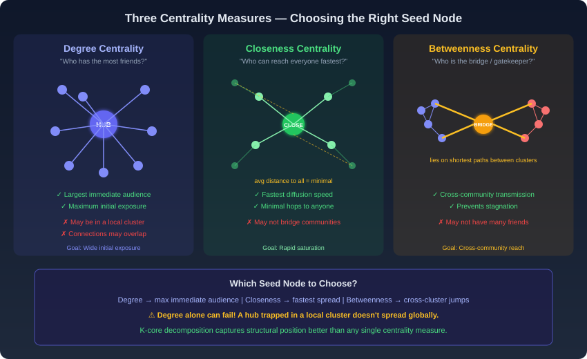
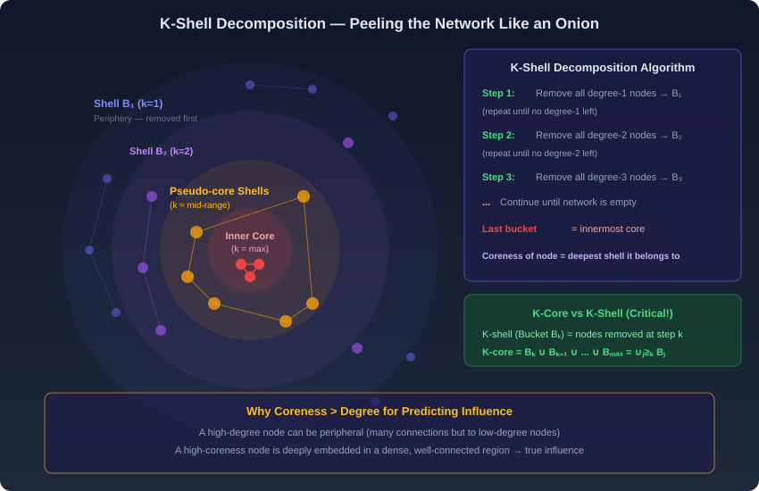
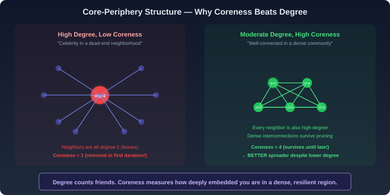
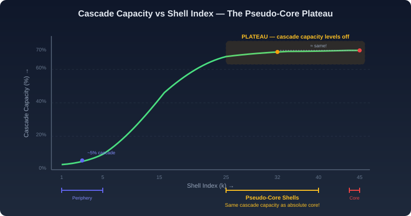

# Viral Diffusion & Influence Maximization — Plain Language Notes

> **What this covers:** How does content go "viral" on the internet? How do biological and social contagion differ? What makes one seed node better than another for triggering a massive cascade? How do degree, closeness, and betweenness centrality identify key influencers — and why do they sometimes fail? How does K-core decomposition reveal the true core of a network? What are pseudo-cores, and why are they the smartest targets for a marketing campaign? This file covers internet memes, the three pillars of virality, all three centrality measures, core-periphery structure, K-shell decomposition algorithm, cascade capacity, the pseudo-core plateau, and all three assignment case studies fully solved.

---

## Part 1 — Biological vs. Social Contagion (Recap & Extension)

### The Fundamental Divide

We already know from previous notes that biological and social contagion are fundamentally different. But this topic extends that distinction to explain why **internet memes** follow social — not biological — contagion rules.

| Feature | Biological Contagion (Disease) | Social Contagion (Ideas / Memes) |
|---|---|---|
| **Agency** | **None** — the individual cannot refuse infection | **Full choice** — the individual decides to adopt or reject |
| **Mechanism** | Pathogen physically enters the body | Person evaluates the idea, then consciously chooses |
| **Model** | SIR / SIS (probability-based) | Behavioral cascade (decision / threshold-based) |
| **Source identification** | Usually **cannot** identify who infected you | Usually **can** identify who introduced the idea |
| **Transmission process** | Involuntary, invisible, stochastic | Voluntary, visible, deliberate |
| **Speed modifier** | Depends on pathogen + contact network | Depends on content quality + network + platform design |

> **Key insight:** When we say a meme "goes viral," we're using a biological metaphor, but the mechanics are fundamentally social. People **choose** to share, like, and engage — unlike a virus that enters your body without permission.

---

### The Internet as a Catalyst

The internet has radically transformed social contagion by:

1. **Eliminating gatekeepers** — traditional media (TV, publishing, music labels) used to control what content reached audiences. The internet bypasses these entirely.
2. **Creating global reach instantly** — a video uploaded in a small town can reach millions within hours.
3. **Enabling measurable engagement** — likes, views, shares, and comments create **visible popularity metrics** that drive the rich-get-richer feedback loop.
4. **Platforms as accelerators** — WhatsApp, Twitter, Facebook, YouTube are purpose-built for cascading content through network connections.

**Example: Justin Bieber's discovery on YouTube**

```
Local talent uploads video → A few people watch and like it
→ Visible like/view count attracts more viewers (feedback loop)
→ The "rich get richer" — more views → more recommendations → more views
→ A talent manager discovers the video → mainstream career launch
→ Cumulative engagement elevated a local talent to a global icon
```

This is the **self-sustaining feedback loop** we studied in the Rich-Get-Richer phenomenon — applied to digital content. The internet didn't just allow Bieber to be discovered; it created a **decentralized, network-driven discovery process** that bypassed traditional industry gatekeepers entirely.

> **The term "internet meme":** Any image, video, text, or format that achieves viral status through network-driven sharing. The word "meme" (coined by Richard Dawkins) originally referred to a unit of cultural information that spreads through imitation. Internet memes are the digital realization of this concept.

---

## Part 2 — The Three Pillars of Viral Diffusion

### Why Most Content Fails

Achieving virality is extraordinarily difficult. Billions of users produce content simultaneously, all competing for a fundamentally **limited resource: human attention**. Most content dies immediately because:

- Users primarily engage with content filtered through **personal recommendations** (they trust their friends' shares) or **exceptional novelty** (something truly new catches attention)
- The transition from "ordinary post" to "viral phenomenon" requires overcoming **threshold effects** — just like a disease must breach $R_0 > 1$ to become an epidemic

### The Three Pillars

Viral success rests on three interdependent factors:

```
                    ┌─────────────────────┐
                    │   VIRAL SUCCESS     │
                    │  (massive cascade)  │
                    └─────────┬───────────┘
                              │
              ┌───────────────┼───────────────┐
              │               │               │
    ┌─────────▼──────┐ ┌─────▼──────┐ ┌──────▼─────────┐
    │   CONTENT      │ │  NETWORK   │ │   STRATEGIC    │
    │   QUALITY      │ │  TOPOLOGY  │ │   SEEDING      │
    │                │ │            │ │                │
    │ • Novelty      │ │ • Platform │ │ • Key nodes    │
    │ • Appeal       │ │   constant │ │ • Influencers  │
    │ • Format       │ │ • Node/edge│ │ • Super-       │
    │ • Relatability │ │   structure│ │   spreaders    │
    └────────────────┘ └────────────┘ └────────────────┘
```

#### Pillar 1: Content Quality and Novelty

The intrinsic appeal of the content determines its initial "infectiousness" — analogous to the probability $p$ in epidemic models:

- **Unique aesthetics** — visually striking images or videos
- **Innovative formats** — new meme templates, novel presentation styles
- **Emotional resonance** — humor, outrage, inspiration, surprise
- **Relatability** — "I've experienced this too" feeling

> **Think of it this way:** Content quality is like the pathogen's $p$ (transmission probability). Even with perfect network conditions, boring content won't spread — just as a low-$p$ pathogen won't cause an epidemic regardless of network density.

#### Pillar 2: Network Topology

The **architecture** of the social platform determines how information can flow:

- The underlying platform structure (Twitter's follower graph, Facebook's friend graph) remains constant — users can't change it
- But the **specific arrangement of nodes and edges** dictates whether a cascade can spread wide or gets trapped in a local cluster
- Dense clusters accelerate local spread; weak ties between clusters enable global reach
- **Network topology** is analogous to $k$ (contacts per person) in epidemic models

#### Pillar 3: Strategic Seeding through Key Nodes

The **most controllable factor** in a viral campaign is **where you start the cascade**:

- If you "infect" a random peripheral user, the cascade likely dies within their local cluster
- If you "infect" a highly influential individual — a **key node** — they act as a **super-spreader**, leveraging their connections to propel the content across the entire network
- A celebrity endorsement or a popular influencer's share can bypass local clusters entirely and project content into the global consciousness

> **The key question becomes:** How do you identify the *right* key nodes? This is where centrality measures and K-core decomposition enter the picture.

---

## Part 3 — Centrality Measures: Finding Key Nodes

### The Problem: Who Should We "Infect" First?

When launching a viral campaign with a limited budget, you can only afford to seed a small number of users. Which users should you choose? Three different centrality measures give three different answers, each prioritizing a different aspect of influence.

---

### Measure 1: Degree Centrality — "Who Has the Most Friends?"

**Definition:** The degree centrality of a node is simply the number of direct connections (edges) it has.

$$
C_D(u) = \deg(u) = \text{number of edges connected to } u
$$

**What it identifies:** **Hubs** — nodes with the maximum number of direct connections.

**Why it works:** Infecting a high-degree node gives the meme the **largest possible immediate audience**. If a person has 10,000 followers, one share reaches 10,000 people instantly.

**When it fails:**
- A hub might be surrounded by poorly connected nodes (leaves) in a **star topology** — the cascade reaches 10,000 people but then immediately dies because none of those people can spread it further
- A hub's connections might **overlap heavily** — the same people see the content through multiple paths, creating **redundant exposure** rather than **expanded reach**
- A high-degree node might be located in the network's **periphery** — it has many friends, but those friends are not well-connected to the rest of the network

> **Analogy:** A street performer in a busy square can shout loud enough for 1,000 people to hear. But if all those people are tourists passing through and never interact with locals, the message doesn't spread further.

---

### Measure 2: Closeness Centrality — "Who Can Reach Everyone Fastest?"

**Definition:** The closeness centrality of a node measures how "structurally close" it is to every other node in the network.

**Formula (average distance form):**

$$
C_C(u) = \frac{1}{N-1} \sum_{v \neq u} d(u, v)
$$

Where:
- $N$ = total number of nodes in the network
- $d(u, v)$ = length of the shortest path between nodes $u$ and $v$
- A **lower** value of $C_C(u)$ means the node is **more central** (closer to everyone)

> **Note:** Some textbooks define closeness as the **reciprocal** of the average distance, so higher = more central. Always check which convention is being used.

**What it identifies:** Nodes that are **structurally near the center** of the network — information originating from them reaches the entire population with **minimal delay**.

**Why it works:** High closeness means the node has short average paths to everyone. A cascade starting here **diffuses across the entire network in fewer steps** than one starting at a peripheral node.

**When it might not be enough:** A node can be "close to everyone" on average but might not sit on the critical bridges between distinct communities. It can reach everyone fast, but it might reach them all from the same cluster.

> **Analogy:** A person who lives at the geographic center of a country can reach any city quickly. But they might not control any critical highway junctions.

---

### Measure 3: Betweenness Centrality — "Who Is the Bridge / Gatekeeper?"

**Definition:** The betweenness centrality of a node measures how often it appears on the **shortest paths** between pairs of other nodes.

**What it identifies:** **Bridge nodes / gatekeepers** — individuals who sit between different communities or clusters. If you remove them, communities become disconnected.

**Why it works:** A node with high betweenness is the **conduit** through which information must pass to jump from one demographic, geographic, or social cluster to another. Without this node, a cascade gets stuck in a single community.

**Key property:** High-betweenness nodes might NOT have the most friends (low degree). A person can be the **only** bridge between two groups while having relatively few connections — but their structural position makes them **irreplaceable** for cross-community transmission.

**When it's especially valuable:** When the goal is not just wide exposure but **cross-community reach** — getting the meme to spread into multiple distinct groups, demographics, or regions.

> **Analogy:** An airport that's small but is the ONLY connection between two regions. It might handle fewer total passengers than a major hub, but every traveler between those regions MUST pass through it.

---

### Centrality Comparison Summary

| Centrality Measure | Question Answered | What It Finds | Optimizes For | Potential Weakness |
|---|---|---|---|---|
| **Degree** | Who has the most connections? | Hubs | Wide initial exposure | May be peripheral; overlapping audiences |
| **Closeness** | Who is closest to everyone? | Central communicators | Rapid saturation speed | May not bridge distinct communities |
| **Betweenness** | Who sits between communities? | Bridges / gatekeepers | Cross-community transmission | May have few direct connections |

> [!IMPORTANT]
> **For assignments:** The choice of which "key node" to infect depends on the campaign goal:
> - Want **maximum initial eyeballs**? → Degree Centrality (find the hub)
> - Want **fastest spread to the whole network**? → Closeness Centrality (find the center)
> - Want **cross-community reach**? → Betweenness Centrality (find the bridge)
> - Want the **best overall predictor of spreading power**? → **Coreness** (K-core decomposition) — this is better than ALL three individual centrality measures.



---

## Part 4 — Core-Periphery Structure

### The Architecture of Social Networks

Real social networks are NOT uniform. They have a **core-periphery structure**:

| Layer | Description | Size | Connectivity |
|---|---|---|---|
| **Core** | Small group of highly connected, influential individuals | **Tiny** (~0.5–3% of network) | **Dense** — core members are heavily connected to each other AND to the periphery |
| **Periphery** | The majority of the population | **Large** (~40–70% of network) | **Sparse** — peripheral members have few connections, mostly to other peripheral nodes |
| **Intermediate layers** | Between core and periphery | **Variable** | Graduated connectivity |

**Why core nodes are powerful for virality:**
1. **Internally cohesive** — core members are densely interconnected, so infecting one quickly infects the entire core
2. **Extensively linked to periphery** — core members connect outward to many peripheral regions, so information rapidly diffuses from center to edges
3. **Resilient** — dense internal connections mean the core survives even if individual nodes are removed

> **Think of it like a city:** The core is the downtown area with dense buildings, heavy traffic, and connections to every suburb. The periphery is the outer suburbs — spread out, few connections to each other, mostly connected through downtown.

---

## Part 5 — K-Core Decomposition: Peeling the Onion

### What Is a K-Core?

A **$K$-core** is a maximal subgraph in which **every node has a degree of at least $K$** (within that subgraph).

In simpler terms: a $K$-core is a group of people where every person in the group is connected to at least $K$ others who are also in the group.

| Property | Definition |
|---|---|
| **$K$-core** | Maximal subgraph where every node has degree $\geq K$ |
| **$K$-shell (Bucket $B_K$)** | The set of nodes that belong to the $K$-core but NOT the $(K+1)$-core |
| **Coreness of a node** | The highest $K$ such that the node belongs to the $K$-core (i.e., the deepest shell it reaches) |

### The Critical Relationship: K-Core = Union of Shells

This is the most commonly tested formula:

$$
\boxed{K\text{-core} = \bigcup_{j \geq K} B_j = B_K \cup B_{K+1} \cup B_{K+2} \cup \cdots \cup B_{\max}}
$$

A **K-shell** (bucket) contains ONLY the nodes removed at step $K$. The **K-core** contains those nodes PLUS all nodes in deeper shells.

> [!IMPORTANT]
> **K-shell ≠ K-core!** This is a critical distinction:
> - **$K$-shell** = nodes removed during iteration $K$ of the decomposition (just bucket $B_K$)
> - **$K$-core** = nodes that survived AT LEAST until iteration $K$ = $B_K \cup B_{K+1} \cup \cdots$
>
> The $K$-core is always a **superset** of the $K$-shell. The $K$-shell is a subset of the $K$-core.

---

### The K-Shell Decomposition Algorithm (Step by Step)

This is an **iterative pruning** process that peels away the network from outside in, like peeling an onion layer by layer:

```
ALGORITHM: K-Shell Decomposition
═════════════════════════════════════════════════

Step 1 — Find Shell B₁ (k=1):
    • Identify all nodes with degree = 1
    • Remove them from the network → put them in B₁
    • Removing these nodes may REDUCE degrees of their neighbors
    • Check again: any NEW nodes now have degree = 1?
    • If yes → remove those too → add to B₁
    • Repeat until NO nodes with degree ≤ 1 remain

Step 2 — Find Shell B₂ (k=2):
    • In the REMAINING network, identify nodes with degree = 2
    • Remove them → put in B₂
    • Again, check for cascading degree drops
    • Repeat until NO nodes with degree ≤ 2 remain

Step 3 — Find Shell B₃ (k=3):
    • Remove all degree-3 nodes → B₃
    • Cascade...

    ...continue for k = 4, 5, 6, ...

Final Step — The last bucket filled = INNERMOST CORE
    • These are the most deeply embedded nodes
    • They survived all previous pruning rounds
    • They have the highest coreness values

STOP when the network is completely empty.
```

**Key detail about the cascading effect:** When you remove a node with degree $K$, its neighbors lose one connection each. This might cause a neighbor's degree to drop TO $K$, making it eligible for removal in the SAME iteration. So each step involves repeated sub-iterations until no more nodes qualify.

### Worked Example

Consider this small network:

```
    A ── B ── C ── D
    │    │    │
    E    F    G ── H
                   │
                   I
```

**Iteration k=1:**
- Nodes with degree 1: E (connects only to A), I (connects only to H)
- Remove E and I → B₁ = {E, I}
- After removal: A now has degree 1 (only connects to B). Remove A → add to B₁
- After removing A: no new degree-1 nodes
- B₁ = {E, I, A}

**Iteration k=2:**
- Remaining: B, C, D, F, G, H
- Nodes with degree ≤ 2: D (degree 1 after losing nothing... actually D connects to C only = degree 1, should have been caught)
- Continuing the pruning... nodes with degree ≤ 2 in the remaining graph get removed iteratively
- This continues until only the densest connected subgraph remains

> **The big picture:** Each shell represents a "layer" of the network. The outer shells (low $K$) are the periphery — sparsely connected, easily breaks off. The inner shells (high $K$) are the core — densely interconnected, resilient to removal.



---

## Part 6 — Why Coreness Predicts Spreading Better Than Degree

### The Core Insight (Pun Intended)

**Degree** counts how many friends you have.
**Coreness** measures how deeply embedded you are within a **dense, well-connected region** of the network.

These are NOT the same thing, and the difference is crucial for understanding viral spreading:

| Scenario | Degree | Coreness | Spreading Power |
|---|---|---|---|
| Celebrity with 1M followers who are all casual observers (follow but don't engage) | **Very High** | **Low** (followers are leaves — degree 1) | **Limited** — cascade reaches many but dies immediately |
| Mid-level professional in a tight community where everyone actively engages | **Moderate** | **High** (embedded in dense subgraph) | **Excellent** — cascade sustains and spreads |

### Why Coreness Wins: Three Reasons

**Reason 1: Core nodes lie in densely connected regions.**
A node in a high $K$-core is surrounded by other high-degree nodes. When you infect it, the infection rapidly saturates the dense core region, which then acts as a "launchpad" that bombards the periphery from multiple directions simultaneously.

**Reason 2: High-degree nodes may still be peripheral.**
A node can have degree 1,000 but if all 1,000 neighbors have degree 1 (star topology), it has **coreness = 1**. It gets removed in the very first iteration of K-shell decomposition! Despite having many friends, it's structurally peripheral — its cascade dies after one hop.

**Reason 3: Coreness captures global structural position.**
Degree is a purely local measure (just count edges). Coreness is a semi-global measure — it tells you not just how many connections you have, but **how well-connected your connections are**, and how well-connected their connections are, recursively. It captures the "quality" of your neighborhood, not just its size.



> [!IMPORTANT]
> **For assignments:** When asked "Why can coreness predict spreading power better than degree?" the correct answers are:
> 1. Core nodes lie in densely connected regions
> 2. High-degree nodes may still be peripheral
> 3. Coreness captures global structural position
>
> The WRONG answer is "Coreness is always proportional to degree" — it is NOT. Coreness and degree can diverge dramatically (high degree + low coreness is entirely possible).

---

## Part 7 — The Pseudo-Core and the Cascade Capacity Plateau

### The Intuitive Expectation vs. Reality

**What you might expect:** The absolute innermost core (highest $K$-shell) should always produce the largest cascades. The deeper the shell, the bigger the cascade — a linear relationship.

**What actually happens:** As the shell index increases, cascade capacity rises sharply at first, then **levels off into a plateau**. Beyond a certain shell index, going deeper provides **no additional benefit**.

```
Cascade
Capacity
(%)
  │
70│                          ████████████████████
  │                     █████
60│                  ████
  │               ███
50│             ███
  │           ██
40│         ██
  │        █
30│      ██
  │     █
20│    █
  │   █
10│  █
  │ █
 0│█
  └──────────────────────────────────────────────
   1    5    10   15   20   25   30   35   40  45
                    Shell Index (k) →

   ← Periphery →   ← PSEUDO-CORES →   ← Core →
   (small cascades)  (same as core!)  (max cascade)
```

### What Are Pseudo-Cores?

**Pseudo-cores** = nodes in intermediate shells (not the absolute center, but close to it) whose cascade capacity **matches or nearly matches** that of the innermost core.

| Property | Innermost Core | Pseudo-Core Shells |
|---|---|---|
| **Shell index** | Maximum ($K_{\max}$) | Several steps below maximum |
| **Size** | Very small (often < 1% of network) | Larger (often 3-5% of network) |
| **Cascade capacity** | Maximum | **Nearly identical** to maximum |
| **Accessibility** | Extremely hard (celebrities, gated by cost/fame) | **Much more accessible** (mid-level influencers) |
| **Cost to target** | Very high (celebrity endorsement fees) | **Significantly lower** |

### Why Pseudo-Cores Are Strategically Superior

1. **Equal cascade capacity at lower cost:** A pseudo-core node triggers cascades just as large as a core node, but costs far less to engage
2. **More numerous:** The pseudo-core shells contain more nodes than the absolute core, giving marketers more options
3. **More accessible:** You don't need a celebrity's agent. Mid-level influencers are reachable and often more responsive.
4. **Same structural advantages:** Pseudo-core nodes are still deeply enough embedded in the network's dense regions to trigger self-sustaining cascades

> **Marketing strategy implication:** Instead of spending your entire budget on one celebrity in the innermost core, distribute it across several pseudo-core influencers. You get the same cascade reach at a fraction of the cost.



---

## Part 8 — Understanding the Independent Cascade Model

Several case studies reference the **independent cascade model**. Here's how it works:

```
ALGORITHM: Independent Cascade Model
═══════════════════════════════════════

INITIALIZATION:
  • Select a set of "seed" nodes → set them to ACTIVE (infected)
  • All other nodes are INACTIVE

EACH ITERATION (round):
  For each NEWLY activated node u (activated in the previous round):
    For each INACTIVE neighbor v of u:
      u gets ONE chance to activate v with probability p
      If successful → v becomes active
      (u can never try to activate v again)

  If NO nodes were newly activated → STOP

OUTPUT: The set of all activated nodes = the cascade
```

**Key properties:**
- Each active node gets **exactly one chance** to activate each of its inactive neighbors
- The process is **probabilistic** — different runs produce different cascades
- It **terminates** when no new activations occur in a round — this is what "adoption stabilizes" means
- It's similar to SIR (once activated, a node doesn't need to be activated again; once it's failed to activate a neighbor, it doesn't try again)

> [!IMPORTANT]
> **"Adoption stabilizes when no new users adopt in an iteration"** — this is the termination condition for the independent cascade model. NOT when core users adopt, NOT when all users are exposed, and NOT when peripheral users reject.

---

## Part 9 — Key Concepts Summary Table

| Concept | Definition | Why It Matters |
|---|---|---|
| **Internet meme** | Any digital content (image, video, text) that achieves viral status | The digital realization of social contagion |
| **Degree centrality** | Number of direct connections | Finds hubs with wide immediate reach |
| **Closeness centrality** | Average shortest distance to all other nodes: $\frac{1}{N-1}\sum d(u,v)$ | Finds nodes that can reach everyone fastest |
| **Betweenness centrality** | How often a node sits on shortest paths between others | Finds bridge nodes / gatekeepers between communities |
| **Core-periphery structure** | Dense center + sparse edges | Core nodes are the most powerful spreaders |
| **$K$-core** | Maximal subgraph where every node has degree $\geq K$ | $K\text{-core} = \bigcup_{j \geq K} B_j$ |
| **$K$-shell (Bucket $B_K$)** | Nodes removed at step $K$ (in $K$-core but NOT $(K+1)$-core) | One specific layer of the onion |
| **Coreness** | The highest $K$ for which a node is in the $K$-core | Better predictor of spreading than degree |
| **K-shell decomposition** | Iterative pruning: remove degree-$K$ nodes, cascade, repeat | Algorithm that reveals the onion layers |
| **Pseudo-core** | Intermediate shells with cascade capacity matching the core | Smart targets: same reach, lower cost |
| **Cascade capacity** | % of network infected when seeding from a given shell | Plateaus before reaching the absolute core |
| **Independent cascade model** | Probabilistic activation: one chance per edge per round | Standard model for simulating viral diffusion |

---

## Part 10 — Formulas Cheat Sheet

### Closeness Centrality

$$
C_C(u) = \frac{1}{N-1} \sum_{v \neq u} d(u, v)
$$

Lower value = more central (closer to everyone).

### K-Core Definition

$$
K\text{-core} = \bigcup_{j \geq K} B_j = B_K \cup B_{K+1} \cup \cdots \cup B_{\max}
$$

### K-Shell Decomposition

**Fundamental step:** Iteratively remove nodes with degree less than $K$ (accounting for cascading degree changes after each removal).

### Cascade Size Calculation

If seeding shell $K$ infects $X$% of $N$ users:

$$
\text{Users infected} = \frac{X}{100} \times N
$$

**Example:** 37% of 500,000 = $0.37 \times 500{,}000 = 185{,}000$

---

## Part 11 — Assignment Case Study Answers

### Case Study 1: Launching a Viral Meme on a Microblogging Platform

A meme campaign on a platform with 2 million users. K-core decomposition reveals shells from $k=1$ to $k=45$. The innermost core ($k=45$) contains 0.5% of users. Shells $k=30\text{–}35$ contain ~4% and show cascade capacity near the core's level. Peripheral nodes ($k \leq 5$) form ~40%.

**Key observations from the case study:**
- Highest-degree users are NOT always in the highest K-core
- Some users in $k=32$ shell trigger cascades nearly matching those from $k=45$ core
- Seeding peripheral users → small, localized cascades
- Seeding high-degree users → can underperform when those users are outside dense cores
- Seeding pseudo-core shells → near-core-level reach at lower cost
- Viral spread correlates more strongly with **coreness** than with **degree alone**

---

| # | Question | ✅ Correct Answer | Explanation |
|---|---|---|---|
| 1 | What is a K-core of a graph? | **A subgraph where every node has degree at least $k$** | Definition: a $K$-core is a maximal subgraph where every node maintains degree $\geq K$. NOT "nodes ranked by degree" (that's just degree sorting). NOT "a clique of size $k$" (a clique requires ALL nodes connected to ALL others). NOT "nodes with exactly $k$ links" (it's "at least $k$"). |
| 2 | The coreness of a node refers to: | **The highest k-core (deepest shell) it belongs to** | Coreness = the maximum $K$ such that the node is part of the $K$-core. It tells you how deep into the onion the node survives. NOT initial degree (coreness may differ from degree). NOT cascade size (that's a property of a simulation, not the node). NOT total neighbors (that's degree). |
| 3 | Why can coreness predict spreading power better than degree? (Select all correct) | **Core nodes lie in densely connected regions** + **High-degree nodes may still be peripheral** + **Coreness captures global structural position** | All three are correct — these are the three reasons explained in Part 6. ❌ "Coreness is always proportional to degree" is WRONG — they can diverge dramatically (star topology: high degree, low coreness). |
| 4 | Which seeding strategy is most effective under a limited marketing budget? | **Pseudo-core nodes** | Pseudo-core nodes achieve near-core-level cascade capacity at significantly lower cost and greater accessibility. Random peripheral nodes produce tiny cascades. Highest-degree nodes can fail (may be peripheral). Lowest-degree nodes have no reach. |
| 5 | Why can targeting only high-degree nodes fail? | **Degree ignores structural position in the network** | A high-degree node might have many connections to low-degree leaves — high degree but low coreness. Degree is a purely local measure that doesn't capture whether the node is embedded in a dense, well-connected region. ❌ "High-degree nodes always guarantee large cascades" is wrong. ❌ "All high-degree nodes are peripheral" is wrong (some ARE central). ❌ "Degrees are identical across nodes" is wrong (degree varies). |

> [!WARNING]
> **Trap — "A K-core is a clique of size k":** WRONG. A clique requires EVERY pair to be connected. A K-core only requires every node to have degree $\geq K$ — much weaker than a clique. A K-core can have non-adjacent pairs.

> [!WARNING]
> **Trap — "Coreness is always proportional to degree":** WRONG. The star topology counterexample proves this: the hub has the highest degree but coreness = 1 (removed in the first iteration because all neighbors have degree 1).

---

### Case Study 2: Core–Periphery Structure and Cascade Optimization

A professional network with 500,000 users. Highest K-core is $k=28$. Nodes with $k \geq 25$ represent 3% of network but are highly interconnected. Shells $k=18\text{–}22$ produce cascades nearly matching the core. Peripheral shells ($k \leq 4$) generate small cascades.

**Key data:**
- Seeding highest core ($k=28$) → infects ~40% of network
- Seeding shell $k=20$ → infects ~37% of network (nearly identical!)
- Seeding shell $k=3$ → infects only ~5%
- Removing high-coreness nodes → overall cascade size drops dramatically
- Removing high-degree nodes with LOW coreness → comparatively limited impact

---

| # | Question | ✅ Correct Answer | Explanation |
|---|---|---|---|
| 1 | Which nodes are the most effective spreaders? | **Highest-core nodes** | The data directly shows: highest core → 40% cascade, mid-core → 37%, peripheral → 5%. Highest-core nodes are the most effective. NOT peripheral, NOT random, NOT lowest-degree. |
| 2 | Which findings indicate that pseudo-cores exist? (Select all correct) | **Mid-level shells trigger large cascades** + **Some non-core shells achieve cascade sizes comparable to the core** | Both are correct — shell $k=20$ achieving 37% compared to the core's 40% is the definition of a pseudo-core. "Spreading depends on structural depth" is also true but describes a general property, not specifically pseudo-cores. ❌ "Peripheral nodes outperform core nodes" is never true in this data. |
| 3 | If 37% of 500,000 users are infected, how many users is that? | **185,000** | Straightforward: $0.37 \times 500{,}000 = 185{,}000$. |
| 4 | What is the fundamental step in K-core decomposition? | **Iteratively remove nodes with degree less than $k$** | The algorithm works by repeatedly removing nodes whose degree falls below the current threshold $K$, including cascading degree reductions. NOT computing shortest paths. NOT identifying highest-degree nodes (that's degree centrality). NOT removing random edges. |
| 5 | Why does removing high-coreness nodes significantly reduce cascade size? | **They anchor densely connected regions of the network** | High-coreness nodes are the structural backbone of the network's dense core. Removing them disintegrates the core, breaking the dense interconnections that sustain cascades. ❌ NOT "They are isolated" (opposite — they're highly connected). ❌ NOT "lowest degree" (they have high degree within their core). ❌ NOT "at the periphery" (they're at the center). |

> [!IMPORTANT]
> **Cascade calculation tip:** Always convert percentages to decimals before multiplying. 37% = 0.37. Then $0.37 \times 500{,}000 = 185{,}000$.

> [!WARNING]
> **Trap — "Iteratively remove nodes with degree less than $k$" vs "remove highest-degree nodes":** K-core decomposition removes nodes from the BOTTOM (lowest degree first), not the top. It prunes the periphery inward, not the core outward. The fundamental step is removing nodes below the threshold, not finding the maximum.

---

### Case Study 3: Diffusion of a New Feature in a Social Media Platform

A social media company launches a feature by seeding high-follower-count users. Despite initial visibility, adoption fails to penetrate less active communities. When they switch to pseudo-core users (moderate followers but structurally positioned across diverse communities), adoption spreads through weak ties into previously disconnected groups.

**Key observations:**
- High-degree users' audiences **overlapped significantly** → redundant exposure, not expanded reach  
- Pseudo-core users are embedded across **multiple communities** → diverse reach
- Pseudo-core seeding achieves cascades rivaling core-node seeding
- Diffusion stabilizes faster and reaches broader demographics with pseudo-core seeding
- Uses independent cascade model for simulation

---

| # | Question | ✅ Correct Answer | Explanation |
|---|---|---|---|
| 1 | Why did seeding high-degree users fail to produce wide adoption? | **Their audiences overlapped significantly** | The case study explicitly states: "high-degree users often share overlapping audiences, resulting in redundant exposure rather than expanded reach." This is the fundamental problem with degree-based seeding — many connections doesn't mean diverse connections. ❌ NOT "They lacked sufficient followers" (they had the MOST followers). ❌ NOT "The network lacked weak ties" (it did have them, but the seed nodes weren't positioned to use them). ❌ NOT "The feature quality was poor" (the feature was fine — the strategy was wrong). |
| 2 | Which factors explain why coreness is a better predictor of influence than degree? (Select all correct) | **Coreness captures position within the network hierarchy** + **Degree ignores redundancy in connections** + **Coreness reflects access to multiple shells and communities** | All three are correct: (1) coreness tells you WHERE you sit in the global structure, (2) degree counts connections but ignores whether they all go to the same people, (3) high-coreness nodes touch multiple layers and communities by definition. ❌ "Degree always correlates with cascade size" is WRONG — the entire case study demonstrates that degree-based seeding failed. |
| 3 | In the independent cascade simulations, adoption stabilizes when: | **No new users adopt in an iteration** | This is the termination condition of the independent cascade model: when a round produces zero new activations, the cascade has reached its final state. ❌ NOT "Core users adopt" (irrelevant — any user can be the last to adopt). ❌ NOT "Peripheral users reject" (rejection doesn't trigger termination). ❌ NOT "All users are exposed" (many users may be exposed but never adopt). |
| 4 | Which outcomes highlight the advantage of targeting pseudo-core users? (Select all correct) | **Faster diffusion across communities** + **Reduced redundancy in exposure** + **Larger and more diverse cascades** | All three are observed in the case study: (1) pseudo-core users bridge communities, so diffusion crosses community boundaries faster; (2) their audiences don't overlap as much, reducing redundancy; (3) the cascades are both larger and more demographically diverse. ❌ "Guaranteed adoption by all users" is WRONG — no strategy guarantees 100% adoption. The cascade model is probabilistic. |
| 5 | The company's revised strategy demonstrates that: | **Structural position outweighs follower count** | The entire lesson: a node's position in the network hierarchy (coreness) is a better predictor of influence than its raw number of connections (degree/follower count). ❌ NOT "Network size determines diffusion success" (same network, different strategies). ❌ NOT "Feature adoption depends only on visibility" (high-degree seeding provided maximum visibility but still failed). ❌ NOT "Peripheral users cannot influence adoption" (not tested; the point is about which central nodes work best). |

> [!CAUTION]
> **Trap — "Guaranteed adoption by all users":** No seeding strategy EVER guarantees 100% adoption. The independent cascade model is inherently probabilistic — each activation attempt has a probability of failure. Even the best seed nodes cannot guarantee that every user will adopt.

> [!IMPORTANT]
> **The overarching lesson across all three case studies:**
> - **Degree alone is insufficient.** A high-degree node may be peripheral, its connections may overlap, and its cascade may die quickly.
> - **Coreness captures structural depth.** It measures not just how many connections you have, but how well-connected your connections are.
> - **Pseudo-cores are the smart strategy.** They provide near-core-level cascade capacity at a fraction of the cost and with greater accessibility.
> - **The fundamental step of K-core decomposition is iterative pruning** — removing nodes with degree below the current threshold and cascading.

---

## Part 12 — Common Traps and Misconceptions

| ❌ Wrong Statement | ✅ Correct Understanding |
|---|---|
| "A K-core is a clique of size K" | K-core only requires minimum degree $K$; a clique requires ALL pairs connected. Much weaker condition. |
| "K-shell = K-core" | K-shell = just bucket $B_K$. K-core = $B_K \cup B_{K+1} \cup \cdots$ (union of that shell and all deeper shells). |
| "Coreness is always proportional to degree" | False. Star hub: degree = 1000, coreness = 1. Dense clique member: degree = 4, coreness = 4. |
| "High-degree nodes always guarantee large cascades" | False. If their connections overlap or are peripheral, the cascade dies after one hop. |
| "The innermost core is always the best target" | Technically true for cascade SIZE, but pseudo-cores achieve nearly the same size at far lower cost. For practical strategy, pseudo-cores win. |
| "Removing high-degree low-coreness nodes collapses the network" | False. Removing high-coreness nodes has a dramatically larger impact than removing high-degree-but-low-coreness nodes. |
| "K-core decomposition starts by removing highest-degree nodes" | False. It starts from the BOTTOM — removing degree-1 nodes first, then degree-2, etc. It peels from outside in. |
| "Adoption stabilizes when all users are exposed" | False. It stabilizes when NO NEW users adopt in an iteration. Many users may be exposed but never adopt. |
| "Social contagion is involuntary like biological contagion" | False. Social contagion involves conscious CHOICE. Biological is involuntary. |
| "More followers = more influence" | Not necessarily. Structural position (coreness) matters more than raw follower count. |

---

## Part 13 — Connections to Other Topics in This Course

| This topic | Connection to Viral Diffusion & Influence |
|---|---|
| **Rich Get Richer / Preferential Attachment** | The feedback loop (likes/views → more visibility → more likes/views) is the Rich-Get-Richer mechanism applied to content. Justin Bieber's YouTube discovery is a direct example. |
| **Strength of Weak Ties** | Pseudo-core users are effective precisely BECAUSE they bridge multiple communities through weak ties. Without weak ties, cascades stay stuck in one cluster. |
| **Community Detection** | Betweenness centrality identifies bridge nodes between communities — the same bridges identified by Girvan-Newman's community detection algorithm. |
| **Diffusion & Cascades** | Viral meme spreading follows the same cascade mechanics (threshold models, coordination games) studied in behavioral cascade theory. |
| **Epidemics (SIR/SIS)** | The biological analogy runs deep: $p$ ↔ content quality, $k$ ↔ network degree, $R_0$ ↔ whether a cascade sustains. But the independence of choice makes social different. |
| **Power Law** | The core-periphery structure and the distribution of coreness values follow power-law patterns — a few nodes in very deep shells, many in shallow shells. |
| **Small World Effect** | The platform's core-periphery structure is a consequence of small-world properties: dense local clusters (homophily) + rare long-range bridges (weak ties) create the concentric shell architecture. |

---

## Part 14 — Practice Questions (Self-Test)

1. **What is the difference between a K-core and a K-shell?**
   - Answer: A K-shell (bucket $B_K$) contains only the nodes removed at iteration $K$. A K-core = $\bigcup_{j \geq K} B_j$ = union of shell $B_K$ and all deeper shells. The K-core always contains the K-shell plus more.

2. **A network has shells from $B_1$ to $B_{10}$. A node is in shell $B_7$. What is its coreness?**
   - Answer: Coreness = 7 (the deepest shell it belongs to).

3. **A node has degree 500 but all 500 neighbors have degree 1. What is its coreness?**
   - Answer: Coreness = 1. In the first iteration of K-shell decomposition, all 500 neighbors (degree 1) are removed. This drops the hub's degree to 0, so it's also removed in B₁.

4. **If 40% of 2,000,000 users are infected, how many users is that?**
   - Answer: $0.40 \times 2{,}000{,}000 = 800{,}000$ users.

5. **Why are pseudo-cores preferred over the absolute innermost core for marketing campaigns?**
   - Answer: Pseudo-cores achieve nearly identical cascade capacity as the absolute core, but are more numerous, more accessible, and significantly cheaper to engage. Same viral reach at lower cost.

6. **In the independent cascade model, when does simulation stop?**
   - Answer: When an iteration produces zero new activations (no new users adopt in a round).
